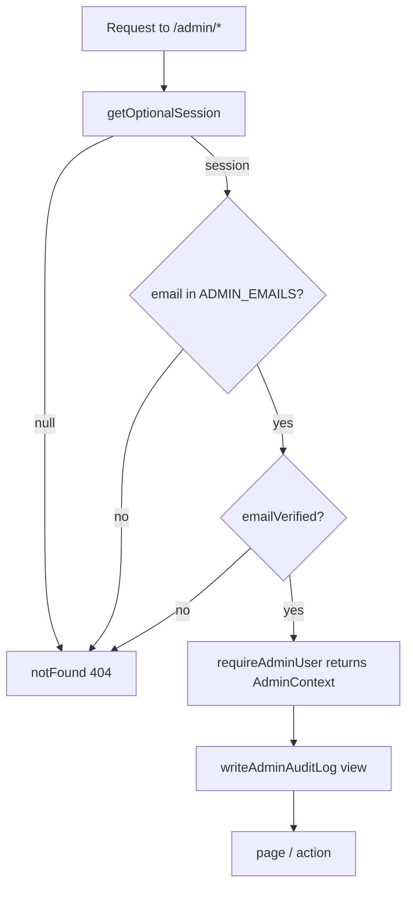
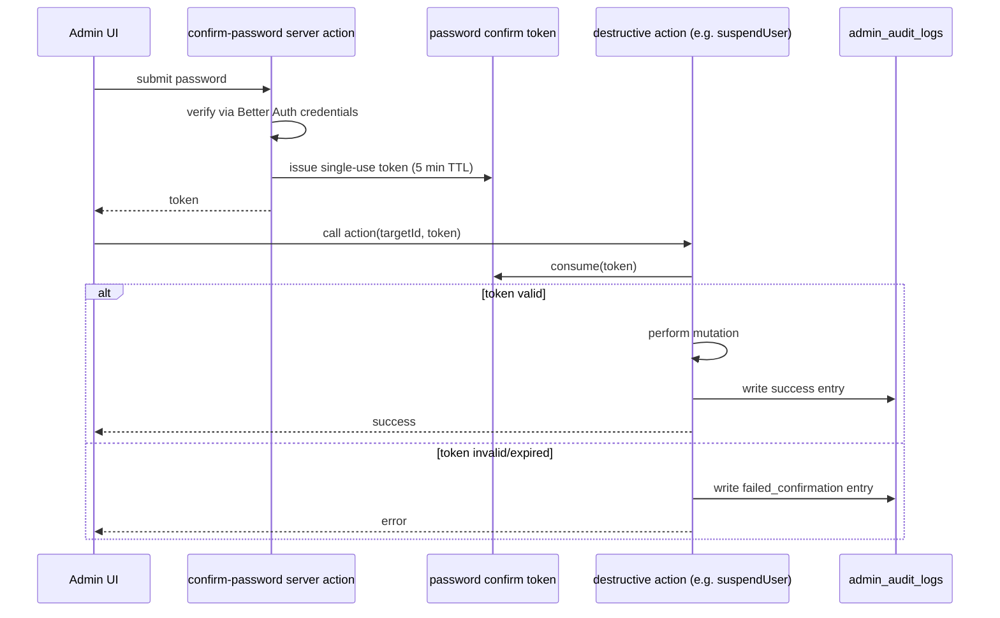
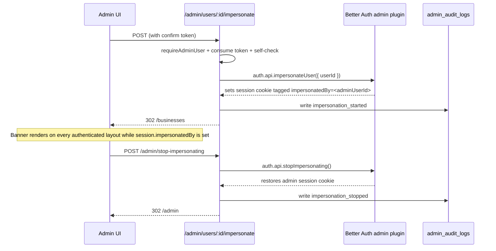

# Admin Console Design

## Overview

The Admin Console is an internal operations surface that lives at `/admin` on the main Requo domain. It gives a trusted operator (initially the product owner) read-only oversight of users, businesses, and subscriptions plus a small set of high-trust support mutations: force email verify, revoke sessions, suspend, hard delete, manual plan override, force-cancel, and user impersonation.

Access is gated by a composition of signals rather than a single role check:

1. A Better Auth session must exist on the request.
2. The signed-in user's verified email must be in the `ADMIN_EMAILS` environment allow-list.
3. Every action re-checks admin status server-side before reading or writing.

Destructive actions are gated a second time by a fresh password re-confirmation. Every view and action is recorded in the existing `admin_audit_logs` table, tagged with the originating admin even while impersonating another user.

### Design Decisions And Rationale

- **Env-driven allow-list, not a new role table.** v1 has a single operator and we want zero chance of an admin flag being toggled by an ordinary product mutation. Keeping the allow-list in `ADMIN_EMAILS` matches the existing `lib/env.ts` design and mirrors the "owner-led" positioning in `AGENTS.md`.
- **404 over 403 for unauthorized requests.** Returning 404 keeps `/admin` undiscoverable to scanners and leaks no information about the allow-list.
- **Reuse Better Auth admin plugin for impersonation primitives.** `better-auth/plugins/admin` already ships the `SessionWithImpersonatedBy` session shape and impersonation session duration option, which we wire into our existing Better Auth config rather than implementing session swapping by hand.
- **Route all plan mutations through `lib/billing/subscription-service.ts`.** The subscription service is the single write path for account subscriptions and keeps `businesses.plan` in sync on every owned business. The admin manual plan override and force-cancel call `activateSubscription` and `cancelSubscription` so we inherit the sync + cache revalidation behavior instead of writing to `account_subscriptions` directly.
- **Keep `app/admin/*` thin, own product logic in `features/admin/`.** Matches the repo layout rule in `AGENTS.md` and keeps queries, actions, validation, and UI colocated with the feature.
- **Record admin audit logs in a separate table, not the business-scoped `audit_logs`.** `admin_audit_logs` already exists and captures admin identity, IP, and user agent. Business-scoped `audit_logs` are already written by `writeAccountAuditLogsForUser` for destructive events that touch owned businesses; we reuse it from the admin action layer so owners still see "your account was acted on" entries.
- **Password re-confirmation via a short-lived token, not a modal-only check.** The confirmation server action returns a signed, TTL-bounded token that the destructive action must present. This survives a brief `router.refresh()` and makes the audit log's "confirmed vs unconfirmed" check explicit.

### Sources Consulted

- `lib/auth/config.ts` for existing Better Auth setup (email+password, rate limits, `databaseHooks`).
- `lib/billing/subscription-service.ts` for the single-write-path invariant and `syncOwnerBusinessPlans` behavior.
- `lib/db/schema/admin.ts` for the existing `admin_audit_logs` table.
- `lib/db/schema/auth.ts` for `user` and `session` shape (no existing `banned` column — added in Data Models).
- `features/audit/mutations.ts` for the `writeAccountAuditLogsForUser` fan-out pattern we reuse from admin mutations.
- Better Auth docs for the `admin` plugin's `SessionWithImpersonatedBy` shape and `impersonationSessionDuration` option: [Better Auth admin plugin](https://www.better-auth.com/docs/plugins/admin). Content rephrased for compliance with licensing restrictions.
- `DESIGN.md` for the shared wrappers (`DashboardPage`, `PageHeader`, `DashboardSection`, `DashboardTableContainer`, `DataListToolbar`) and token rules this feature must follow.

## Architecture

### Route Tree

```
app/admin/
  layout.tsx                     // admin gate + ImpersonationBanner fallback + nav shell
  loading.tsx                    // shared admin skeleton
  page.tsx                       // operations dashboard (Req 2)
  users/
    page.tsx                     // users list (Req 3)
    [userId]/
      page.tsx                   // user detail + actions (Req 3, 4)
      impersonate/
        route.ts                 // POST start impersonation (Req 8)
  businesses/
    page.tsx                     // businesses list (Req 5)
    [businessId]/
      page.tsx                   // business detail read-only (Req 5)
  subscriptions/
    page.tsx                     // subscriptions list + status filter (Req 6)
    [subscriptionId]/
      page.tsx                   // subscription detail + overrides (Req 6, 7)
  audit-logs/
    page.tsx                     // paginated audit log view (Req 10)
  stop-impersonating/
    route.ts                     // POST stop impersonation (Req 8.3)
```

`components/shell/impersonation-banner.tsx` (new, global) renders on any authenticated layout whenever `session.impersonatedBy` is set.

### Feature Module Layout

```
features/admin/
  access.ts            // isAdminEmail(), requireAdminUser()
  queries.ts           // dashboard counts, list queries, detail queries, audit log feed
  mutations.ts         // force-verify, revoke-sessions, suspend, unsuspend, delete, plan override, force-cancel, impersonate
  audit.ts             // writeAdminAuditLog(), wrapAdminRouteWithViewLog()
  confirm.ts           // issuePasswordConfirmToken(), consumePasswordConfirmToken()
  schemas.ts           // Zod schemas for mutation inputs + search/filter inputs
  navigation.ts        // nav items (Dashboard / Users / Businesses / Subscriptions / Audit)
  constants.ts         // ADMIN_ACTIONS, ADMIN_TARGET_TYPES, page sizes
  types.ts             // AdminUserRow, AdminBusinessRow, AdminSubscriptionRow, AdminAuditLogRow
  components/
    admin-shell.tsx
    admin-nav.tsx
    admin-dashboard.tsx
    admin-users-table.tsx
    admin-user-detail.tsx
    admin-user-actions.tsx
    admin-businesses-table.tsx
    admin-business-detail.tsx
    admin-subscriptions-table.tsx
    admin-subscription-detail.tsx
    admin-subscription-override-form.tsx
    admin-audit-table.tsx
    confirm-password-dialog.tsx
    impersonation-banner.tsx
```

### Access Gate Flow



The gate lives in `features/admin/access.ts` and is called from every page, route handler, and server action under `/admin`.

```ts
// features/admin/access.ts (sketch)
export async function requireAdminUser() {
  const session = await getOptionalSession();
  if (!session) notFound();

  const user = session.user;
  if (!user.emailVerified) notFound();
  if (!isAdminEmail(user.email)) notFound();

  return { session, user } as const;
}
```

### Destructive Action Flow



### Impersonation Flow



Every mutation performed during the impersonation session reads `session.impersonatedBy`; when set, audit writes record both the impersonator id (admin) and the impersonated id (target) in metadata.

## Components and Interfaces

### UI Components

All UI reuses shared wrappers from `DESIGN.md`. No new visual primitives are introduced.

| Component | Purpose | Reuses |
| --- | --- | --- |
| `AdminShell` | Layout wrapper with admin nav + page content | `DashboardPage`, `PageHeader` |
| `AdminNav` | Left rail / top tabs for Dashboard, Users, Businesses, Subscriptions, Audit | `components/shell/dashboard-navigation.tsx` conventions |
| `AdminDashboard` | Landing counts grid | `DashboardSection`, `Card`, `InfoTile` |
| `AdminUsersTable` | Users list with search + pagination | `DataListToolbar`, `DashboardTableContainer`, `Table`, `Badge` |
| `AdminUserDetail` | User profile summary + related entities | `DashboardDetailLayout`, `DashboardSection`, `Card` |
| `AdminUserActions` | Action cluster (verify, revoke, suspend, delete, impersonate) | `Button`, `DashboardActionsRow`, `ConfirmPasswordDialog` |
| `AdminBusinessesTable` | Businesses list with search + pagination | same list pattern |
| `AdminBusinessDetail` | Read-only business detail | `DashboardDetailLayout`, `DashboardSection` |
| `AdminSubscriptionsTable` | Subscriptions list with status filter | list pattern + `Select` filter |
| `AdminSubscriptionDetail` | Subscription + recent payment attempts + billing events | `DashboardDetailLayout`, `DashboardSection` |
| `AdminSubscriptionOverrideForm` | Plan override + force-cancel | `FormSection`, `FieldGroup`, `Field`, `FormActions`, `ConfirmPasswordDialog` |
| `AdminAuditTable` | Paginated audit log view with filters | list pattern, `meta-label`, `Badge` |
| `ConfirmPasswordDialog` | Re-confirm password before destructive action | `Dialog`, `Field`, `Input` |
| `ImpersonationBanner` | Persistent banner with Stop Impersonating control | `Alert` with `surface-warning` composition, shared button |

### Server Interfaces

Contracts live in `features/admin/queries.ts` and `features/admin/mutations.ts`.

```ts
// queries.ts
export async function getAdminDashboardCounts(): Promise<AdminDashboardCounts>;

export async function listAdminUsers(input: {
  search?: string;
  page: number;
  pageSize: number;
}): Promise<{ items: AdminUserRow[]; total: number }>;

export async function getAdminUserDetail(userId: string): Promise<AdminUserDetail | null>;

export async function listAdminBusinesses(input: {
  search?: string;
  page: number;
  pageSize: number;
}): Promise<{ items: AdminBusinessRow[]; total: number }>;

export async function getAdminBusinessDetail(businessId: string): Promise<AdminBusinessDetail | null>;

export async function listAdminSubscriptions(input: {
  status?: SubscriptionStatus;
  page: number;
  pageSize: number;
}): Promise<{ items: AdminSubscriptionRow[]; total: number }>;

export async function getAdminSubscriptionDetail(subscriptionId: string): Promise<AdminSubscriptionDetail | null>;

export async function listAdminAuditLogs(input: {
  adminUserId?: string;
  action?: string;
  targetType?: AdminTargetType;
  targetId?: string;
  page: number;
  pageSize: number;
}): Promise<{ items: AdminAuditLogRow[]; total: number }>;
```

```ts
// mutations.ts — server actions
export async function forceVerifyEmailAction(targetUserId: string, confirmToken: string): Promise<ActionResult>;
export async function revokeAllSessionsAction(targetUserId: string, confirmToken: string): Promise<ActionResult>;
export async function suspendUserAction(targetUserId: string, confirmToken: string): Promise<ActionResult>;
export async function unsuspendUserAction(targetUserId: string, confirmToken: string): Promise<ActionResult>;
export async function deleteUserAction(targetUserId: string, confirmToken: string): Promise<ActionResult>;
export async function manualPlanOverrideAction(input: ManualPlanOverrideInput, confirmToken: string): Promise<ActionResult>;
export async function forceCancelSubscriptionAction(subscriptionId: string, confirmToken: string): Promise<ActionResult>;
export async function startImpersonationAction(targetUserId: string, confirmToken: string): Promise<ActionResult>;
export async function stopImpersonationAction(): Promise<ActionResult>;

// confirm.ts
export async function issuePasswordConfirmTokenAction(password: string): Promise<ActionResult<{ token: string }>>;
```

Each action:
1. Calls `requireAdminUser()`.
2. Validates input with Zod schemas from `features/admin/schemas.ts`.
3. For destructive actions, calls `consumePasswordConfirmToken(confirmToken, { adminUserId, intendedAction, intendedTargetId })`.
4. Rejects self-targeting where applicable.
5. Runs the mutation (routing subscription changes through `subscription-service`).
6. Writes `admin_audit_logs` before returning.
7. Calls `revalidateTag()` for affected scopes (user + business billing tags via existing helpers).

### Better Auth Integration

`lib/auth/config.ts` gains the `admin` plugin:

```ts
import { admin } from "better-auth/plugins";

plugins: [
  nextCookies(),
  magicLink({ /* existing */ }),
  admin({
    adminRoles: [], // we do not use role-based admin; env allow-list is authoritative
    // allowImpersonatingAdmins: false (default) — prevents admin-on-admin impersonation
    impersonationSessionDuration: 60 * 60, // 1 hour
  }),
],
```

The plugin adds:
- `banned`, `banReason`, `banExpires` columns to `user` (used for suspend/unsuspend — see Data Models).
- `impersonatedBy` on session, which we surface in layouts to render the banner.
- `auth.api.impersonateUser`, `auth.api.stopImpersonating`, `auth.api.banUser`, `auth.api.unbanUser`, `auth.api.revokeUserSessions` server-side helpers.

We do NOT expose the plugin's client endpoints. Admin calls go through our own server actions so we can enforce the `ADMIN_EMAILS` gate and audit before invoking the plugin.

## Data Models

No new tables. Three existing tables are extended and reused.

### Reused: `admin_audit_logs`

Already defined in `lib/db/schema/admin.ts`. Every admin view and mutation writes a row here with:

- `action`: enum-style string. Values defined in `features/admin/constants.ts`:
  `"view.dashboard"`, `"view.users"`, `"view.user"`, `"view.businesses"`, `"view.business"`, `"view.subscriptions"`, `"view.subscription"`, `"view.audit-logs"`, `"user.force_verify_email"`, `"user.revoke_all_sessions"`, `"user.suspend"`, `"user.unsuspend"`, `"user.delete"`, `"subscription.manual_plan_override"`, `"subscription.force_cancel"`, `"impersonation.start"`, `"impersonation.stop"`, `"confirmation.failed"`.
- `targetType`: `"user" | "business" | "subscription" | "audit-log" | "dashboard"`.
- `targetId`: the primary id of the target, or `"-"` for dashboard/list views.
- `metadata`: JSON bag. For mutations performed while impersonating, always includes:
  - `impersonatedUserId`: the Target_User whose session is active.
  - Any mutation-specific fields (`fromPlan`, `toPlan`, `reason`, `previousStatus`).
- `ipAddress`, `userAgent`: extracted from request headers using the existing Better Auth `ipAddressHeaders` precedence.

### Reused And Extended: `user` (Better Auth admin plugin columns)

The `admin` plugin defines a Drizzle-compatible schema extension. We add the columns via a migration generated by `drizzle-kit`:

| Column | Type | Role |
| --- | --- | --- |
| `banned` | `boolean` default `false` | Suspension flag (Req 4.3, 4.4). Better Auth refuses sign-in when `banned = true`. |
| `banReason` | `text` nullable | Admin-supplied reason. |
| `banExpires` | `timestamp tz` nullable | Optional expiry; null = indefinite. |

The existing `user` Drizzle model in `lib/db/schema/auth.ts` is extended to include these columns so our queries can join and display suspension status without a second fetch.

### Reused And Extended: `session` (impersonation tag)

The admin plugin adds `impersonatedBy` (text nullable) to `session`. This column is read by the Next.js layout to render the impersonation banner and by every audit write to populate `metadata.impersonatedUserId`.

### Reused: `account_subscriptions`, `businesses`, `payment_attempts`, `billing_events`

All read-only in v1 except through `lib/billing/subscription-service.ts`:

- Plan override → `activateSubscription({ userId, plan, provider, currency, status: 'active' })` with the admin-supplied plan. The service keeps `businesses.plan` in sync across all owned businesses.
- Force-cancel → `cancelSubscription(userId)` which sets `status = 'canceled'` and `canceledAt = now()` via `updateSubscriptionStatus`. The service downgrades business plans through `syncOwnerBusinessPlans` when `resolveEffectivePlanFromSubscription` resolves to `"free"`.

### New (in-memory only): Password Confirmation Token

No new DB table. Tokens are opaque 32-byte random strings stored in-memory/cache with a 5-minute TTL. Implementation: signed + hashed token stored on the `verification` table (already used by Better Auth for short-lived tokens) with identifier `admin:confirm:{adminUserId}:{nonce}`. On consume we match identifier + value and delete the row atomically.

Token shape (signed, not stored verbatim):

```ts
type AdminConfirmToken = {
  adminUserId: string;
  nonce: string;       // uuid, single-use
  issuedAt: number;    // unix seconds
  expiresAt: number;   // issuedAt + 300
};
```

### Type Definitions

```ts
// features/admin/types.ts
export type AdminUserRow = {
  id: string;
  email: string;
  name: string;
  emailVerified: boolean;
  banned: boolean;
  banReason: string | null;
  createdAt: Date;
  lastSessionAt: Date | null;
};

export type AdminUserDetail = AdminUserRow & {
  subscription: {
    plan: BusinessPlan;
    status: SubscriptionStatus;
    currentPeriodEnd: Date | null;
  } | null;
  ownedBusinesses: Array<{ id: string; name: string; slug: string; plan: BusinessPlan }>;
  activeSessionCount: number;
  recentAuditLogs: AdminAuditLogRow[];
};

export type AdminBusinessRow = {
  id: string;
  name: string;
  slug: string;
  ownerEmail: string;
  plan: BusinessPlan;
  memberCount: number;
  createdAt: Date;
};

export type AdminSubscriptionRow = {
  id: string;
  userId: string;
  ownerEmail: string;
  plan: string;
  status: SubscriptionStatus;
  provider: BillingProvider;
  currentPeriodEnd: Date | null;
  canceledAt: Date | null;
};

export type AdminAuditLogRow = {
  id: string;
  adminUserId: string | null;
  adminEmail: string;
  action: AdminAction;
  targetType: AdminTargetType;
  targetId: string;
  metadata: Record<string, unknown> | null;
  ipAddress: string | null;
  userAgent: string | null;
  createdAt: Date;
};
```


## Correctness Properties

*A property is a characteristic or behavior that should hold true across all valid executions of a system — essentially, a formal statement about what the system should do. Properties serve as the bridge between human-readable specifications and machine-verifiable correctness guarantees.*

The Admin Console's core logic (access gate predicate, search/filter/ordering queries, single-use confirmation tokens, self-action guards, impersonation session tagging, and the subscription-service-mediated write path) is well-suited to property-based testing. Rendering-specific behaviors, database cascade deletes, and cache-directive configuration are covered by example/integration/smoke tests in the Testing Strategy instead.

### Property 1: Admin access gate rejects every non-qualifying request

*For any* request with session state `(sessionExists, email, emailVerified)` and any `ADMIN_EMAILS` value, `requireAdminUser()` returns an admin context if and only if `sessionExists = true` AND `emailVerified = true` AND `normalize(email)` is in `normalizeAllowList(ADMIN_EMAILS)`; in all other cases it triggers a 404.

**Validates: Requirements 1.1, 1.2, 1.3, 1.5, 1.6**

### Property 2: Email allow-list comparison is case-insensitive and whitespace-trimmed

*For any* email `E` present in `ADMIN_EMAILS` and *any* case/whitespace permutation `E'` of `E` (mixed case, leading/trailing whitespace, surrounding tabs), `isAdminEmail(E', ADMIN_EMAILS)` returns `true`; *for any* email whose normalized form does not appear in the normalized allow-list, it returns `false`.

**Validates: Requirements 1.4**

### Property 3: Subscription plan grouping sums to active total

*For any* set of `account_subscriptions` rows, the sum of `getAdminDashboardCounts().activeByPlan[p]` over all plans `p` equals the count of rows where `status = 'active'`.

**Validates: Requirements 2.2**

### Property 4: User search returns all and only substring matches

*For any* set of users and any search query `q`, `listAdminUsers({ search: q })` returns exactly the users `u` for which `lower(u.email)` contains `lower(q)` or `lower(u.name)` contains `lower(q)`.

**Validates: Requirements 3.2**

### Property 5: User list default ordering is createdAt descending

*For any* set of users, calling `listAdminUsers({})` with default parameters returns items whose `createdAt` values are monotonically non-increasing from first to last.

**Validates: Requirements 3.4**

### Property 6: Force email verify is idempotent and converges to verified

*For any* target user and *any* current `emailVerified` value, after `forceVerifyEmailAction(targetUserId, token)` completes successfully, the user's `emailVerified` is `true`, and a second invocation produces the same state.

**Validates: Requirements 4.1**

### Property 7: Revoke all sessions zeroes the target's session set

*For any* target user with *N* existing session rows (where `N ≥ 0`), after `revokeAllSessionsAction(targetUserId, token)` completes successfully, the user has zero session rows and the admin's own session is unaffected.

**Validates: Requirements 4.2**

### Property 8: Suspend then unsuspend is a round trip for authentication

*For any* user who can currently sign in, `suspendUserAction(userId, token)` followed by a sign-in attempt rejects the attempt; `unsuspendUserAction(userId, token)` followed by a sign-in attempt with the same credentials succeeds.

**Validates: Requirements 4.3, 4.4**

### Property 9: Destructive self-actions are rejected

*For any* admin user and *any* action `A` in `{ forceVerifyEmail, revokeAllSessions, suspend, delete, startImpersonation }`, invoking `A(admin.id, token)` where the target id equals the admin's own id returns an error and produces no state change on the admin's user, session, or subscription rows.

**Validates: Requirements 4.6, 8.5**

### Property 10: Business search returns all and only substring matches

*For any* set of businesses and any search query `q`, `listAdminBusinesses({ search: q })` returns exactly the businesses `b` for which `lower(b.name)` contains `lower(q)` or `lower(b.slug)` contains `lower(q)`.

**Validates: Requirements 5.2**

### Property 11: Subscription status filter is parity-preserving

*For any* set of `account_subscriptions` rows and any status value `s`, `listAdminSubscriptions({ status: s })` returns exactly the rows whose `status = s`.

**Validates: Requirements 6.3**

### Property 12: Manual plan override keeps subscription and owned businesses in sync

*For any* owner with *N* owned (non-deleted) businesses in any mixture of current plans and any target plan `P`, after `manualPlanOverrideAction({ userId, plan: P }, token)` completes successfully through `subscription-service`, `account_subscriptions.plan = P` for that user AND `businesses.plan = P` for every business with `ownerUserId = userId` and `deletedAt IS NULL`.

**Validates: Requirements 7.1, 7.3**

### Property 13: Force-cancel produces canceled status with canceledAt and preserves grace-period access

*For any* subscription currently in `active` or `past_due` status, after `forceCancelSubscriptionAction(subscriptionId, token)` completes successfully, the row has `status = 'canceled'` AND `canceledAt` within a small delta of the action time AND the effective plan resolved by `resolveEffectivePlanFromSubscription` matches the service's output for the updated row (plan until `currentPeriodEnd`, free after).

**Validates: Requirements 7.2, 7.3**

### Property 14: Subscription-service errors leave state unchanged

*For any* override or force-cancel action in which the subscription service throws, the admin action returns an error result AND the `account_subscriptions` row and every owned `businesses.plan` value are byte-identical to their pre-action values.

**Validates: Requirements 7.4**

### Property 15: Impersonation round trip restores the admin session and tags audit metadata

*For any* admin `A` and any target `T` with `T.id ≠ A.id`, after `startImpersonationAction(T.id, token)` the active session belongs to `T` and carries `impersonatedBy = A.id`; any mutation performed during that session writes audit rows whose metadata records both `A.id` and `T.id`; after `stopImpersonationAction()` the active session belongs to `A` again and no password prompt was required.

**Validates: Requirements 8.1, 8.3, 8.4, 10.3**

### Property 16: Starting a new impersonation cleans up the previous one

*For any* admin `A` currently impersonating target `T₁`, calling `startImpersonationAction(T₂.id, token)` where `T₂.id ≠ T₁.id` ends `T₁`'s impersonation session and leaves exactly one active impersonation session (for `T₂`) with `impersonatedBy = A.id`.

**Validates: Requirements 8.6**

### Property 17: Password confirmation tokens are single-use and short-lived

*For any* token issued by `issuePasswordConfirmTokenAction`, the first call to `consumePasswordConfirmToken(token, ...)` within 5 minutes of issue succeeds; *any* second consume of the same token AND *any* consume more than 5 minutes after issue fails, and in neither failure case does the associated destructive action execute.

**Validates: Requirements 9.4, 9.5**

### Property 18: Destructive actions require a valid confirmation token

*For any* destructive action invocation where the supplied `confirmToken` is absent, expired, or already-consumed, the action returns an error, performs no mutation, and writes an `admin_audit_logs` row with `action = 'confirmation.failed'` containing the intended action and target.

**Validates: Requirements 9.3**

### Property 19: Every admin operation produces a complete audit row

*For any* successful admin page view or mutation, exactly one `admin_audit_logs` row is written with non-null `adminUserId`, `adminEmail`, `action`, `targetType`, `targetId`, `ipAddress`, and `userAgent`; mutation rows additionally include mutation-specific `metadata`.

**Validates: Requirements 10.1, 10.2**

### Property 20: Audit write failure aborts the mutation

*For any* mutation in which the `admin_audit_logs` insert fails, the mutation returns an error AND the target's pre-mutation state is preserved on all tables the mutation would have touched.

**Validates: Requirements 10.4**

### Property 21: Audit log listing is filter-preserving and ordered

*For any* filter combination `{ adminUserId?, action?, targetType?, targetId? }`, `listAdminAuditLogs(filter)` returns exactly the rows matching every non-null filter field, ordered by `createdAt` descending.

**Validates: Requirements 10.5, 10.6**

## Error Handling

### Access and Authorization

- **Unauthenticated / non-admin / unverified requests** → `notFound()` at the page/handler boundary. No admin layout, nav, or content is rendered. No audit row is written (we cannot trust the requester's identity).
- **Session expired mid-request** → treated as unauthenticated; `notFound()` propagates. The client sees a standard 404, which triggers a redirect to login only if the user navigates to a protected route elsewhere.

### Password Re-confirmation

- **Missing token** → `{ error: "Confirm your password to continue." }` and no mutation. Audit row `confirmation.failed` with metadata `{ reason: "missing" }`.
- **Invalid token** → same error surface. Audit row `confirmation.failed` with `{ reason: "invalid" }`.
- **Expired token** → same error surface. Audit row `confirmation.failed` with `{ reason: "expired" }`.
- **Wrong password during issuance** → `{ error: "That password didn't match." }`. We throttle by reusing Better Auth's existing database-backed rate limiter under a custom rule `/admin/confirm` (5 attempts per 5 minutes per admin user id).

### Destructive Mutations

All destructive mutations follow the same envelope:

```ts
type ActionResult<T = void> =
  | { ok: true; data?: T; message?: string }
  | { ok: false; error: string; fieldErrors?: ActionFieldErrors };
```

- **Self-action attempt** → `{ ok: false, error: "You can't run this action on your own account." }`. No DB write. No audit row (reject before audit to match "no partial writes"; covered by Property 9).
- **Subscription-service failure** → rethrow caught, translated via `getUserSafeErrorMessage(err, "Couldn't update this subscription.")`. `lib/billing/subscription-service.ts` never partially writes because `syncOwnerBusinessPlans` runs inside the same request as the `account_subscriptions` update; on failure no business rows are touched and Drizzle's implicit auto-commit leaves either both written or neither.
- **Audit write failure after mutation** → We run the mutation and the audit write inside a single `db.transaction()`. If the audit insert throws, the whole transaction rolls back and the action returns `{ ok: false, error: "Couldn't record this action. No changes were made." }`. This satisfies Property 20 (Req 10.4).
- **Better Auth plugin errors** (impersonation failures, ban failures) → surfaced via `getUserSafeErrorMessage`; audit row recorded with `action.failed` metadata before returning.

### Listing and Dashboard

- **Individual count query failure on `/admin`** → the failing tile renders a `<Empty>`-style placeholder with a `Retry` button (server action re-runs just that count). Other tiles still show. Matches Req 2.4.
- **Search / pagination parse failure** → fall back to defaults (page 1, empty search). No error banner.

### Impersonation

- **Start impersonation on self** → reject with `{ ok: false, error: "You can't impersonate your own account." }`. No session change.
- **Start impersonation while another is active** → call `auth.api.stopImpersonating()` first, then `auth.api.impersonateUser({ userId })`. Two audit rows are written: `impersonation.stop` (for the previous target) and `impersonation.start` (for the new target).
- **Stop impersonation when not impersonating** → no-op; return `{ ok: true, message: "You weren't impersonating anyone." }`. Idempotent and safe.
- **Better Auth impersonation session creation failure** → admin session preserved; audit `impersonation.start` with `{ ok: false }` metadata; error surfaced to admin.

### Banner Rendering

- The impersonation banner reads `session.impersonatedBy`. If absent, the banner is not rendered. If present but the impersonated user no longer exists (race), the banner shows "Impersonating a deleted user" with only the Stop Impersonating control. Stop always works by clearing the cookie.

## Testing Strategy

### Dual Testing Approach

- **Property tests**: universal invariants (access gate, search, ordering, confirmation tokens, impersonation tagging, plan sync, audit fields). See properties 1–21.
- **Example / unit tests**: specific rendering, column presence, copy, toast content.
- **Integration tests**: DB-backed behavior that relies on cascade deletes, Better Auth session lifecycle, and the subscription service's multi-table writes.
- **Smoke tests**: cache directive configuration, route registration, read-only route absence.

### Property-Based Testing

Library: `fast-check` (add to devDependencies; consistent with the JS/TS ecosystem and works with Vitest). No PBT library is currently in the repo, so this is a new devDependency.

Configuration:

- Minimum 100 runs per property (`fc.assert(..., { numRuns: 100 })`).
- Seed logged on failure so counterexamples are reproducible.
- Shared generators live in `tests/unit/admin/generators.ts` and build on Drizzle row types:
  - `arbitraryUser`, `arbitraryAdminEmailList`, `arbitrarySubscriptionRow`, `arbitraryBusinessRow`, `arbitraryAuditLogRow`, `arbitrarySearchQuery`, `arbitraryConfirmationToken`.
- Each property test MUST be tagged with a design-doc reference comment.
- Tag format: `// Feature: admin-console, Property {number}: {property_text}`.

Mapping property number → test file → requirements:

| # | Test file | Requirements |
|---|-----------|--------------|
| 1 | `tests/unit/admin/access-gate.property.test.ts` | 1.1, 1.2, 1.3, 1.5, 1.6 |
| 2 | `tests/unit/admin/access-gate.property.test.ts` | 1.4 |
| 3 | `tests/integration/admin/dashboard.property.test.ts` | 2.2 |
| 4 | `tests/integration/admin/users-search.property.test.ts` | 3.2 |
| 5 | `tests/integration/admin/users-order.property.test.ts` | 3.4 |
| 6 | `tests/integration/admin/force-verify.property.test.ts` | 4.1 |
| 7 | `tests/integration/admin/revoke-sessions.property.test.ts` | 4.2 |
| 8 | `tests/integration/admin/suspend-round-trip.property.test.ts` | 4.3, 4.4 |
| 9 | `tests/unit/admin/self-action.property.test.ts` | 4.6, 8.5 |
| 10 | `tests/integration/admin/businesses-search.property.test.ts` | 5.2 |
| 11 | `tests/integration/admin/subscriptions-filter.property.test.ts` | 6.3 |
| 12 | `tests/integration/admin/plan-override.property.test.ts` | 7.1, 7.3 |
| 13 | `tests/integration/admin/force-cancel.property.test.ts` | 7.2, 7.3 |
| 14 | `tests/integration/admin/subscription-service-error.property.test.ts` | 7.4 |
| 15 | `tests/integration/admin/impersonation-round-trip.property.test.ts` | 8.1, 8.3, 8.4, 10.3 |
| 16 | `tests/integration/admin/impersonation-switch.property.test.ts` | 8.6 |
| 17 | `tests/unit/admin/confirm-token.property.test.ts` | 9.4, 9.5 |
| 18 | `tests/integration/admin/confirmation-failure.property.test.ts` | 9.3 |
| 19 | `tests/integration/admin/audit-complete.property.test.ts` | 10.1, 10.2 |
| 20 | `tests/integration/admin/audit-failure-rollback.property.test.ts` | 10.4 |
| 21 | `tests/integration/admin/audit-list.property.test.ts` | 10.5, 10.6 |

### Unit Tests (`tests/unit/admin/`)

- `normalize-email.test.ts` — concrete examples for `isAdminEmail` edge cases (empty string, comma-only list, unicode, trailing comma).
- `constants.test.ts` — `ADMIN_ACTIONS` and `ADMIN_TARGET_TYPES` are exhaustive.
- `schemas.test.ts` — Zod schemas for each mutation reject known-invalid payloads.

### Component Tests (`tests/components/admin/`)

- `admin-dashboard.test.tsx` — six tiles render, placeholder + retry appears when a count errors (Req 2.1, 2.4).
- `admin-users-table.test.tsx` — required columns present, suspended badge present when `banned = true` (Req 3.1).
- `admin-user-actions.test.tsx` — clicking suspend opens `ConfirmPasswordDialog`, disabled buttons for self (Req 4.6, 9.1).
- `admin-business-detail.test.tsx` — no mutation controls rendered (Req 5.4).
- `impersonation-banner.test.tsx` — rendered when `session.impersonatedBy` is set; absent otherwise (Req 8.2).
- `confirm-password-dialog.test.tsx` — submit-on-enter; wrong password shows error.

### Integration Tests (`tests/integration/admin/`)

In addition to the property tests above:

- `access-gate.integration.test.ts` — each admin route + server action returns 404 for unauthenticated, non-admin, and unverified-admin requests (Req 1.1–1.3, 1.6).
- `delete-user.integration.test.ts` — delete-user removes user row and cascades per existing schema. Verifies Better Auth's `deleteUser.beforeDelete` preflight path from `lib/auth/config.ts` fires (Req 4.5).
- `subscription-service-bypass.static.test.ts` — grep-style check that no file under `features/admin/**` imports `accountSubscriptions` for writes; subscription changes only go through `subscription-service` (Req 7.3).
- `subscription-service-error.integration.test.ts` — forces a service-layer error and asserts DB state is unchanged (Req 7.4; supports Property 14).
- `business-detail-readonly.integration.test.ts` — no `POST`/`PATCH`/`DELETE` admin routes under `/admin/businesses/[id]` (Req 5.4).

### Smoke Tests (`tests/unit/admin/` + static checks)

- `admin-dashboard-cache.smoke.test.ts` — the dashboard counts query calls `cacheLife` with `revalidate ≤ 60` (Req 2.3).
- Route-registration smoke: importing `features/admin/navigation.ts` lists exactly the 5 expected routes.

### E2E Smoke (`tests/e2e/admin.spec.ts`)

Keep Playwright coverage focused:

- Non-admin signed-in user visiting `/admin` sees the standard 404 page (Req 1.2).
- Admin lands on `/admin` and sees counts rendered.
- Admin suspends a seeded user → re-confirms password → sees success toast → seeded user's sign-in is rejected (Req 4.3, 4.7, 9.1, 9.2, 9.4).
- Admin starts impersonation → banner appears in `/businesses` → Stop Impersonating returns to `/admin` without a password prompt (Req 8.1, 8.2, 8.3).

### What We Are NOT Property-Testing And Why

- **Rendering of specific columns and copy** (Req 3.1, 5.1, 5.3, 6.1, 6.2, 8.2) — rendering is example-based; no universal invariant.
- **Cache `revalidate ≤ 60` directive** (Req 2.3) — single configuration value, smoke test only.
- **Cascade delete correctness** (Req 4.5) — PostgreSQL FK cascade is already tested by Drizzle and the schema; our integration test covers the Better Auth preflight path.
- **Per-route 404 behavior** (Req 1.1, 1.6) — finite enumeration of routes; integration examples are sufficient. Property 1 already covers the predicate.
- **Self-impersonation UI disabling** (Req 8.5 UI surface) — component test covers the button-disabled path; Property 9 covers the server side.

### Verification Checklist (tied to `AGENTS.md`)

Before merging this slice:

- `npm run check` (lint + typecheck) passes with no new raw palette utilities or `space-y-*` stacks in `features/admin/**` or `app/admin/**`.
- `npm run test` (unit + component) passes including all new property tests that do not require a database.
- `npm run test:integration` passes — covers DB-backed property tests, access gate, subscription service mediation, audit rollback, and impersonation.
- `npm run test:e2e:smoke` includes the four admin smoke cases above.
- `npm run build` — required because this change adds new routes, a new Better Auth plugin, and new middleware-adjacent gating.
