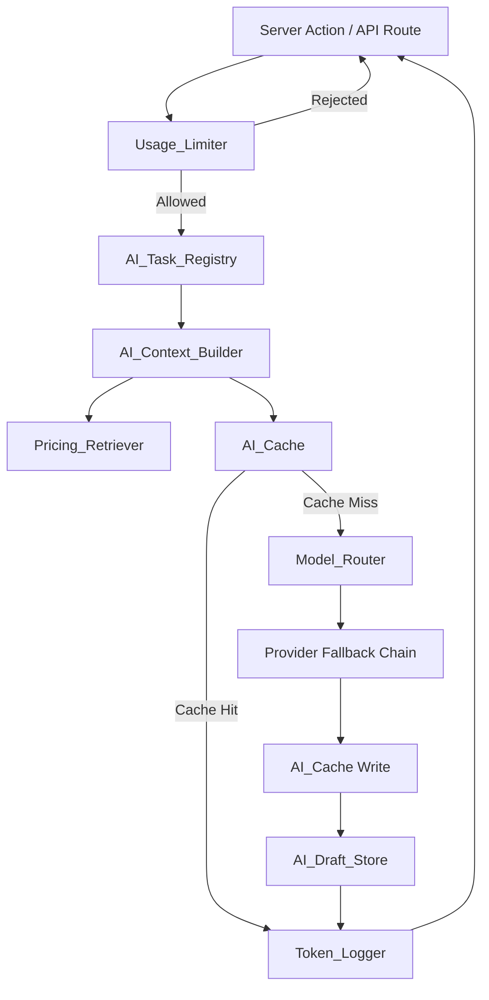
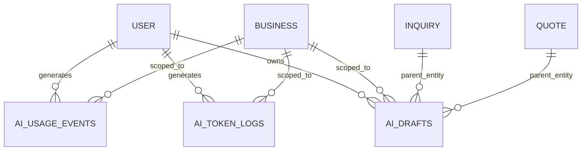

# Design Document: AI Cost Optimization

## Overview

This design describes the AI Cost and Token Optimization system for Requo. The system introduces a layered architecture that minimizes token usage, avoids redundant AI calls, enforces plan-based usage limits, caches repeated outputs, routes tasks to cost-appropriate models, and logs all AI usage for cost visibility.

The core principle: AI receives only the smallest useful context for each task. No full business data, no full pricing libraries, no full inquiry histories — ever.

The system integrates with the existing `lib/ai/` provider router and `features/ai/` orchestration layer, extending them with a task registry, context builder, caching, usage limiting, and token logging.

## Architecture



**Request flow:**
1. Server action validates input (Zod), checks business access, checks plan feature access
2. Usage_Limiter checks cooldown + monthly weighted quota (user-level and business-level)
3. AI_Task_Registry returns task config (tier, max tokens, temperature, required fields, cache TTL)
4. AI_Context_Builder assembles minimal context using only required fields, enforcing character budget
5. AI_Cache checks for a valid cached response (composite key from business, user, task, prompt version, model, source data versions)
6. On cache miss: Model_Router selects provider/model chain based on task quality tier, invokes AI
7. Response is cached, optionally persisted to AI_Draft_Store, and logged by Token_Logger
8. Result returned to caller

## Components and Interfaces

### 1. AI Task Registry (`features/ai/task-registry.ts`)

A TypeScript constant validated by Zod at build time. Each entry defines the complete configuration for one AI task type.

```typescript
import { z } from "zod";

const aiTaskTypes = [
  "inquiry_summary",
  "quote_draft",
  "followup_message",
  "quote_improvement",
  "form_suggestion",
  "business_memory_summary",
] as const;

type AiTaskType = (typeof aiTaskTypes)[number];

const taskConfigSchema = z.object({
  taskType: z.enum(aiTaskTypes),
  qualityTier: z.enum(["balanced", "cheap", "best", "coding"]),
  maxOutputTokens: z.number().int().min(256).max(16384),
  temperature: z.number().min(0.0).max(2.0),
  requiredContextFields: z.array(z.string().min(1)),
  cacheTTL: z.number().int().min(0).max(86400),
  priorityWeight: z.number().int().min(1).max(10),
  streamingPermitted: z.boolean(),
  maxContextCharacters: z.number().int().min(500).max(32000).default(4000),
});

type AiTaskConfig = z.infer<typeof taskConfigSchema>;

const AI_TASK_REGISTRY: Record<AiTaskType, AiTaskConfig> = {
  inquiry_summary: {
    taskType: "inquiry_summary",
    qualityTier: "cheap",
    maxOutputTokens: 256,
    temperature: 0.2,
    requiredContextFields: ["inquiryDetails", "customerName", "serviceCategory"],
    cacheTTL: 3600,
    priorityWeight: 1,
    streamingPermitted: false,
    maxContextCharacters: 2000,
  },
  quote_draft: {
    taskType: "quote_draft",
    qualityTier: "balanced",
    maxOutputTokens: 1024,
    temperature: 0.1,
    requiredContextFields: [
      "inquiryText", "customerName", "customerEmail",
      "pricingBlocks", "tonePreference", "businessMemorySummary",
    ],
    cacheTTL: 1800,
    priorityWeight: 3,
    streamingPermitted: true,
    maxContextCharacters: 6000,
  },
  followup_message: {
    taskType: "followup_message",
    qualityTier: "cheap",
    maxOutputTokens: 256,
    temperature: 0.4,
    requiredContextFields: ["inquiryText", "customerName", "tonePreference", "followUpReason"],
    cacheTTL: 900,
    priorityWeight: 1,
    streamingPermitted: false,
    maxContextCharacters: 2000,
  },
  quote_improvement: {
    taskType: "quote_improvement",
    qualityTier: "balanced",
    maxOutputTokens: 1024,
    temperature: 0.1,
    requiredContextFields: [
      "inquiryText", "customerName", "customerEmail",
      "pricingBlocks", "tonePreference", "businessMemorySummary",
      "existingQuoteDraft",
    ],
    cacheTTL: 900,
    priorityWeight: 2,
    streamingPermitted: true,
    maxContextCharacters: 8000,
  },
  form_suggestion: {
    taskType: "form_suggestion",
    qualityTier: "cheap",
    maxOutputTokens: 256,
    temperature: 0.3,
    requiredContextFields: ["businessType", "existingFields", "businessDescription"],
    cacheTTL: 7200,
    priorityWeight: 1,
    streamingPermitted: false,
    maxContextCharacters: 2000,
  },
  business_memory_summary: {
    taskType: "business_memory_summary",
    qualityTier: "balanced",
    maxOutputTokens: 1024,
    temperature: 0.2,
    requiredContextFields: ["memoryEntries", "businessName", "businessType"],
    cacheTTL: 3600,
    priorityWeight: 1,
    streamingPermitted: false,
    maxContextCharacters: 4000,
  },
};
```

**Interface:**
- `getTaskConfig(taskType: string): AiTaskConfig` — returns config or throws with valid types listed
- `validateInvocationPayload(taskType: AiTaskType, payload: Record<string, unknown>): void` — throws if required fields missing/empty

### 2. AI Context Builder (`features/ai/context-builder.ts`)

Assembles the minimum context for a task, enforcing a hard character budget.

**Interface:**
```typescript
type ContextBuilderInput = {
  taskType: AiTaskType;
  availableData: Record<string, string | null>;
};

type ContextBuilderOutput = {
  assembledContext: Record<string, string>;
  totalCharacters: number;
  omittedFields: string[];
  truncatedFields: string[];
};

function buildTaskContext(input: ContextBuilderInput): ContextBuilderOutput;
```

**Truncation algorithm:**
1. Retrieve `requiredContextFields` from registry (ordered by priority: first = highest)
2. Assemble all available fields
3. If total exceeds `maxContextCharacters`:
   - Remove fields from the end (lowest priority) until within budget
   - If removing the next field would bring total within budget, truncate it instead of fully removing
4. Never include fields not in `requiredContextFields`
5. If a required field is unavailable (null/empty), skip it without error

**Prompt construction rules:**
- No filler phrases ("You are a helpful assistant", "Please note that", "Here is your response")
- No conversational greetings or role-play framing
- System prompt budget: ≤800 tokens for simple tasks, ≤1600 tokens for complex tasks
- Simple structured tasks (inquiry_summary, form_suggestion, business_memory_summary) instruct JSON-only output

### 3. Pricing Retriever (`features/ai/pricing-retriever.ts`)

Matches inquiry text against pricing library entries using text similarity scoring.

**Interface:**
```typescript
type PricingRetrieverInput = {
  inquiryText: string;
  businessId: string;
  currency: string;
  maxResults?: number; // default 7
};

type PricingRetrieverOutput = {
  entries: DashboardQuoteLibraryEntry[];
  needsOwnerReview: boolean;
};

function retrieveRelevantPricing(input: PricingRetrieverInput): Promise<PricingRetrieverOutput>;
```

**Matching algorithm:**
1. Load pricing library for business filtered by currency
2. If fewer than 3 entries exist in the target currency, return all entries (no filtering)
3. Score each entry by text similarity (comparing inquiry text against entry name, description, and item descriptions)
4. Similarity scoring uses normalized token overlap (Jaccard-like) on lowercased, stemmed tokens
5. Filter entries scoring ≥ 0.3 on a 0-to-1 scale
6. If no entries pass threshold, return empty set with `needsOwnerReview: true`
7. Return top entries up to `maxResults` (default 7), minimum 1 when results exist
8. Never fabricate, interpolate, or modify pricing data — return verbatim library entries only

### 4. AI Cache (`features/ai/ai-cache.ts`)

Server-side caching layer using a deterministic composite key.

**Cache Key composition:**
```typescript
type CacheKeyComponents = {
  businessId: string;
  userId: string;
  taskType: AiTaskType;
  promptVersion: string;       // hash of the prompt template
  modelTier: AiQualityTier;
  sourceDataVersions: Record<string, string | null>; // field → version identifier
};
```

Version identifiers per source data type:
- Inquiry: `inquiry.updatedAt` ISO string
- Quote: `quote.updatedAt` ISO string
- Pricing library: SHA-256 hash of sorted entry IDs + updatedAt timestamps
- Business memory: SHA-256 hash of sorted memory entry IDs + updatedAt timestamps
- Absent optional components: stable null sentinel `"__null__"`

**Key generation:** SHA-256 of JSON-serialized sorted components → deterministic hex string.

**Storage:** In-memory Map with TTL enforcement (checked on read). Production can be upgraded to Redis without interface changes.

**Interface:**
```typescript
function getCachedOutput(key: CacheKeyComponents): Promise<CachedAiOutput | null>;
function setCachedOutput(key: CacheKeyComponents, output: CachedAiOutput, ttl: number): Promise<void>;
```

**Error handling:**
- Read failure → proceed with AI invocation, log warning
- Write failure → return AI output to caller, log warning

### 5. AI Draft Store (`lib/db/schema/ai-drafts.ts` + `features/ai/draft-store.ts`)

Database-backed persistence for generated AI drafts.

**Schema:**
```typescript
const aiDrafts = pgTable("ai_drafts", {
  id: text("id").primaryKey(),
  businessId: text("business_id").notNull().references(() => businesses.id, { onDelete: "cascade" }),
  userId: text("user_id").notNull().references(() => user.id, { onDelete: "cascade" }),
  entityId: text("entity_id").notNull(),
  entityType: text("entity_type").notNull(), // "inquiry" | "quote"
  taskType: text("task_type").notNull(),
  content: jsonb("content").notNull(),
  sourceDataTimestamp: timestamp("source_data_timestamp", { withTimezone: true }).notNull(),
  isStale: boolean("is_stale").notNull().default(false),
  lastAccessedAt: timestamp("last_accessed_at", { withTimezone: true }).notNull().defaultNow(),
  createdAt: timestamp("created_at", { withTimezone: true }).notNull().defaultNow(),
  updatedAt: timestamp("updated_at", { withTimezone: true }).notNull().defaultNow(),
}, (table) => [
  uniqueIndex("ai_drafts_entity_task_unique").on(table.entityId, table.taskType),
  index("ai_drafts_business_idx").on(table.businessId),
  index("ai_drafts_user_idx").on(table.userId),
  index("ai_drafts_last_accessed_idx").on(table.lastAccessedAt),
]);
```

**Interface:**
```typescript
function getDraft(entityId: string, taskType: AiTaskType): Promise<AiDraftRow | null>;
function saveDraft(params: SaveDraftParams): Promise<AiDraftRow>;
function markDraftStale(entityId: string, taskType: AiTaskType): Promise<void>;
function deleteDraftsForEntity(entityId: string): Promise<void>;
function cleanupExpiredDrafts(olderThanDays?: number): Promise<number>; // default 90
```

**Behavior:**
- `saveDraft` upserts — only one draft per (entityId, taskType) exists at any time
- On retrieval, updates `lastAccessedAt` and checks staleness against source entity `updatedAt`
- Cascade delete via FK when parent entity (inquiry/quote) is deleted
- Cleanup job deletes drafts with `lastAccessedAt` > 90 days ago

### 6. Usage Limiter (`lib/ai/usage-limiter.ts`)

Enforces monthly weighted usage limits and per-request cooldown.

**Plan limits:**
| Plan     | Monthly Units |
|----------|--------------|
| Free     | 10           |
| Pro      | 300          |
| Business | 2000         |

**Task weights:**
| Task Type                | Weight |
|--------------------------|--------|
| inquiry_summary          | 1      |
| followup_message         | 1      |
| form_suggestion          | 1      |
| business_memory_summary  | 1      |
| quote_improvement        | 2      |
| quote_draft              | 3      |

**Interface:**
```typescript
type UsageLimitCheck = {
  userId: string;
  businessId: string;
  taskType: AiTaskType;
  plan: BusinessPlan;
};

type UsageLimitResult =
  | { allowed: true }
  | { allowed: false; reason: "quota_exceeded" | "cooldown"; message: string };

function checkUsageLimit(input: UsageLimitCheck): Promise<UsageLimitResult>;
function recordUsage(userId: string, businessId: string, taskType: AiTaskType, weight: number): Promise<void>;
```

**Dual-scope tracking:**
- User-level: sum of weighted usage across all businesses owned by the user in the current month
- Business-level: sum of weighted usage for the specific business in the current month
- Request rejected if either scope meets or exceeds the plan limit

**Cooldown:**
- 3-second minimum between consecutive requests from the same user for the same task type
- Cooldown starts when a request is accepted for processing (not on cache hits)
- Rejection message includes remaining seconds (rounded up)
- Cooldown rejections do not deduct usage

**Monthly reset:**
- Usage is queried with a `WHERE createdAt >= startOfCurrentMonthUTC` filter
- No explicit reset job needed — the query window handles it naturally

### 7. Token Logger (`lib/ai/token-logger.ts`)

Records every AI invocation for cost monitoring and debugging.

**Schema:**
```typescript
const aiTokenLogs = pgTable("ai_token_logs", {
  id: text("id").primaryKey(),
  userId: text("user_id").notNull(),
  businessId: text("business_id").notNull(),
  taskType: text("task_type").notNull(),
  model: text("model").notNull(),
  provider: text("provider").notNull(),
  inputTokens: integer("input_tokens").notNull().default(0),
  outputTokens: integer("output_tokens").notNull().default(0),
  totalTokens: integer("total_tokens").notNull().default(0),
  estimatedCostCents: integer("estimated_cost_cents"), // null = unpriced
  cacheHit: boolean("cache_hit").notNull().default(false),
  latencyMs: integer("latency_ms").notNull(),
  status: text("status").notNull(), // "success" | "error"
  errorMessage: text("error_message"), // truncated to 1024 chars
  unpriced: boolean("unpriced").notNull().default(false),
  createdAt: timestamp("created_at", { withTimezone: true }).notNull().defaultNow(),
}, (table) => [
  index("ai_token_logs_user_idx").on(table.userId),
  index("ai_token_logs_business_idx").on(table.businessId),
  index("ai_token_logs_task_type_idx").on(table.taskType),
  index("ai_token_logs_created_at_idx").on(table.createdAt),
  index("ai_token_logs_provider_idx").on(table.provider),
]);
```

**Cost calculation:**
```typescript
const TOKEN_COST_TABLE: Record<string, { inputPerMillion: number; outputPerMillion: number }> = {
  "groq:llama-3.1-8b-instant": { inputPerMillion: 50, outputPerMillion: 80 },
  "groq:llama-3.3-70b-versatile": { inputPerMillion: 590, outputPerMillion: 790 },
  "cerebras:llama3.1-8b": { inputPerMillion: 10, outputPerMillion: 10 },
  "gemini:gemini-2.5-flash": { inputPerMillion: 150, outputPerMillion: 600 },
  "gemini:gemini-2.5-flash-lite": { inputPerMillion: 75, outputPerMillion: 300 },
  // ... additional entries
};
```

If no entry exists for the model/provider combination, cost is recorded as `null` and `unpriced: true`.

**Dual logging:**
- Database insert for queryable admin views (retained 90 days minimum)
- Structured JSON `console.info` line for server log aggregation

**Cache hit logging:**
- Cache hits are logged with `inputTokens: 0`, `outputTokens: 0`, `cacheHit: true`

### 8. Task-Aware Model Routing Integration

The existing `lib/ai/router.ts` already supports quality tiers. The integration point is:

1. AI_Task_Registry provides the `qualityTier` for each task type
2. The orchestration layer in `features/ai/` passes `qualityTier` on the `AiCompletionRequest`
3. The router's existing `generateWithFallback` / `streamWithFallback` uses the tier to select the model chain

**No changes to `lib/ai/router.ts` are needed.** The router already accepts `qualityTier` on the request and selects models accordingly.

The only new behavior: if a task config has no `qualityTier` (shouldn't happen with Zod validation, but defensively), the router defaults to `"balanced"` — which is already the existing fallback in `router.ts`.

### 9. Module Structure

```
lib/ai/
├── index.ts                    # Re-exports (existing)
├── config.ts                   # Provider/model config (existing)
├── router.ts                   # Fallback router (existing, unchanged)
├── types.ts                    # Provider-level types (existing)
├── errors.ts                   # Error utilities (existing)
├── usage-limiter.ts            # NEW: cooldown + monthly quota checks
├── token-logger.ts             # NEW: invocation logging + cost estimation
├── ai-cache.ts                 # NEW: deterministic cache layer
├── groq-provider.ts            # (existing)
├── cerebras-provider.ts        # (existing)
├── gemini-provider.ts          # (existing)
└── openrouter-provider.ts      # (existing)

features/ai/
├── types.ts                    # Feature-level types (existing, extended)
├── schemas.ts                  # Zod schemas (existing, extended)
├── actions.ts                  # Server actions (existing, extended)
├── task-registry.ts            # NEW: task config registry + validation
├── context-builder.ts          # NEW: minimal context assembly
├── pricing-retriever.ts        # NEW: text similarity pricing match
├── draft-store.ts              # NEW: draft persistence operations
├── prompts/                    # NEW: one file per task type prompt
│   ├── inquiry-summary.ts
│   ├── quote-draft.ts
│   ├── followup-message.ts
│   ├── quote-improvement.ts
│   ├── form-suggestion.ts
│   └── business-memory-summary.ts
├── quote-generator.ts          # (existing, refactored to use new modules)
├── quote-missing-info.ts       # (existing)
├── queries.ts                  # (existing)
├── access.ts                   # (existing)
├── api-route-handlers.ts       # (existing)
├── conversations.ts            # (existing)
├── surface-service.ts          # (existing)
└── components/                 # (existing)

lib/db/schema/
├── ai.ts                       # (existing, extended with ai_drafts + ai_token_logs + ai_usage_events)
```

**Placement rationale:**
- `usage-limiter.ts` in `lib/ai/` because it's shared infrastructure (importable from both `lib/` and `features/ai/`)
- `token-logger.ts` in `lib/ai/` because it's provider-level infrastructure
- `ai-cache.ts` in `lib/ai/` because it's a shared caching primitive
- `task-registry.ts` in `features/ai/` because it defines product-level task configurations
- `context-builder.ts` in `features/ai/` because it's orchestration logic
- `pricing-retriever.ts` in `features/ai/` because it's product-specific matching logic
- `draft-store.ts` in `features/ai/` because it's feature-level persistence
- Prompt templates in `features/ai/prompts/` — one file per task type, no duplication

## Data Models

### AI Usage Events (for Usage_Limiter)

```typescript
const aiUsageEvents = pgTable("ai_usage_events", {
  id: text("id").primaryKey(),
  userId: text("user_id").notNull(),
  businessId: text("business_id").notNull(),
  taskType: text("task_type").notNull(),
  weight: integer("weight").notNull(),
  createdAt: timestamp("created_at", { withTimezone: true }).notNull().defaultNow(),
}, (table) => [
  index("ai_usage_events_user_month_idx").on(table.userId, table.createdAt),
  index("ai_usage_events_business_month_idx").on(table.businessId, table.createdAt),
]);
```

### AI Cooldown Tracking

Cooldown is tracked in-memory (Map keyed by `userId:taskType` → last accepted timestamp). This is acceptable because:
- Cooldown is 3 seconds — short enough that server restarts don't matter
- Single-server deployment (Vercel serverless functions are stateless, but the 3s window is short enough that concurrent invocations on different instances are an acceptable edge case)
- If stricter enforcement is needed later, move to Redis

### AI Token Logs

See Token Logger section above for full schema.

### AI Drafts

See AI Draft Store section above for full schema.

### Relationships




## Correctness Properties

*A property is a characteristic or behavior that should hold true across all valid executions of a system — essentially, a formal statement about what the system should do. Properties serve as the bridge between human-readable specifications and machine-verifiable correctness guarantees.*

### Property 1: Task registry returns valid, complete configurations

*For any* valid TaskType, looking it up in the AI_Task_Registry should return a configuration entry where all fields are present and within their specified ranges: maxOutputTokens between 256 and 16384, temperature between 0.0 and 2.0, cacheTTL between 0 and 86400, priorityWeight between 1 and 10, streamingPermitted is boolean, qualityTier is one of the valid tiers, and requiredContextFields is a non-empty array of strings.

**Validates: Requirements 1.1, 1.2**

### Property 2: Invalid task types are rejected with descriptive errors

*For any* string that is not a valid TaskType, looking it up in the AI_Task_Registry should throw an error that contains the invalid value and lists all valid task types.

**Validates: Requirements 1.3**

### Property 3: Missing required context fields are rejected

*For any* valid TaskType and any invocation payload where at least one required context field (as defined in the registry) is missing or empty, the validation should reject with an error indicating which specific fields are missing.

**Validates: Requirements 1.5**

### Property 4: Context assembly includes only required fields

*For any* TaskType and any set of available data fields, the assembled context output should contain only field keys that appear in the registry's requiredContextFields list for that task type — no extra fields should ever be present.

**Validates: Requirements 2.1, 2.5**

### Property 5: Context assembly respects character budget

*For any* TaskType and any set of available data that exceeds the configured maxContextCharacters budget, the assembled context total character count should be less than or equal to the budget, and fields should be omitted in reverse priority order (last in the requiredContextFields list removed first).

**Validates: Requirements 2.2**

### Property 6: Unavailable context fields do not cause failures

*For any* TaskType and any combination of required fields where some are null or empty, the context builder should return a valid (possibly partial) context without throwing an error.

**Validates: Requirements 2.6**

### Property 7: Pricing retriever returns valid bounded results

*For any* inquiry text and pricing library with entries scoring above the 0.3 threshold, the result set should contain between 1 and 7 entries inclusive, ordered by descending similarity score.

**Validates: Requirements 3.1, 3.2**

### Property 8: Small pricing libraries bypass filtering

*For any* pricing library with fewer than 3 entries in the target currency, the Pricing_Retriever should return all available entries regardless of similarity score.

**Validates: Requirements 3.3**

### Property 9: Below-threshold pricing returns empty with review flag

*For any* inquiry text and pricing library where all entry similarity scores are below 0.3, the result should be an empty set with needsOwnerReview set to true.

**Validates: Requirements 3.4**

### Property 10: Pricing retriever returns only verbatim library entries

*For any* result from the Pricing_Retriever, every returned entry should be reference-equal (by ID) to an entry that exists in the original pricing library — no fabricated or interpolated entries.

**Validates: Requirements 3.5**

### Property 11: Cache key determinism and uniqueness

*For any* two sets of CacheKeyComponents, if all components are identical the generated keys should be equal; if any single component differs the generated keys should differ.

**Validates: Requirements 4.1, 4.3**

### Property 12: Cache round-trip within TTL

*For any* AI output stored in the cache, looking it up with the same CacheKeyComponents within the TTL window should return the exact same output.

**Validates: Requirements 4.2**

### Property 13: Cache entries expire after TTL

*For any* cached entry where the elapsed time since storage exceeds the configured TTL, a cache lookup should return null (cache miss).

**Validates: Requirements 4.4**

### Property 14: Cache hits logged with zero tokens

*For any* cache hit event, the Token_Logger entry should have inputTokens=0, outputTokens=0, totalTokens=0, and cacheHit=true.

**Validates: Requirements 4.7**

### Property 15: Draft store round-trip

*For any* generated draft, storing it via saveDraft and then retrieving by (entityId, taskType) should return content structurally equal to the original.

**Validates: Requirements 5.1**

### Property 16: Draft staleness detection

*For any* stored draft where the source entity's updatedAt timestamp is more recent than the draft's sourceDataTimestamp, the draft should be marked as stale.

**Validates: Requirements 5.5**

### Property 17: Only one draft per entity and task type

*For any* sequence of saveDraft calls for the same (entityId, taskType), querying should return only the most recently saved draft.

**Validates: Requirements 5.6**

### Property 18: Usage limit enforcement

*For any* plan and any accumulated weighted usage that meets or exceeds the plan's monthly limit (Free=10, Pro=300, Business=2000), the next request should be rejected with an error message containing the plan name and upgrade path.

**Validates: Requirements 6.1, 6.3**

### Property 19: Task weight accumulation

*For any* sequence of completed AI tasks, the total weighted usage should equal the sum of each task's defined weight (inquiry_summary=1, followup_message=1, form_suggestion=1, business_memory_summary=1, quote_improvement=2, quote_draft=3).

**Validates: Requirements 6.2**

### Property 20: Dual-scope usage tracking

*For any* AI request where either the user-level total OR the business-level total meets or exceeds the plan limit, the request should be rejected — both scopes are checked independently.

**Validates: Requirements 6.4**

### Property 21: Cache hits have no usage or cooldown side effects

*For any* request served entirely from cache, the user's and business's usage counters should remain unchanged, and no new cooldown window should be started for that user+taskType combination.

**Validates: Requirements 6.6, 7.4**

### Property 22: Cooldown enforcement

*For any* two requests from the same user for the same task type where the second arrives within 3 seconds of the first being accepted for processing, the second request should be rejected.

**Validates: Requirements 7.1**

### Property 23: Cooldown rejections do not consume quota

*For any* request rejected due to cooldown, the user's and business's usage counters should remain unchanged.

**Validates: Requirements 7.3**

### Property 24: Token log completeness

*For any* completed AI invocation (success or failure), the log entry should contain all required fields: userId, businessId, taskType, model, provider, inputTokens, outputTokens, totalTokens, cacheHit, latencyMs, status, and timestamp.

**Validates: Requirements 8.1**

### Property 25: Cost estimation correctness

*For any* AI invocation using a model/provider combination present in the cost table, the estimated cost should equal (inputTokens × inputRatePerMillion / 1_000_000) + (outputTokens × outputRatePerMillion / 1_000_000), converted to cents.

**Validates: Requirements 8.2**

### Property 26: Unpriced model handling

*For any* AI invocation using a model/provider combination NOT in the cost table, the log entry should have null estimatedCostCents and unpriced=true.

**Validates: Requirements 8.3**

### Property 27: Registry tier and token limit consistency

*For any* simple task type (inquiry_summary, followup_message, form_suggestion), the registry entry should have qualityTier="cheap" and maxOutputTokens ≤ 256. For any complex task type (quote_draft, quote_improvement, business_memory_summary), the registry entry should have qualityTier="balanced" and maxOutputTokens ≤ 1024.

**Validates: Requirements 9.1, 10.2, 10.3**

### Property 28: System prompts exclude filler phrases

*For any* task type, the constructed system prompt should not contain the phrases "You are a helpful assistant", "Please note that", "Here is your response", conversational greetings, or role-play framing.

**Validates: Requirements 9.3**

### Property 29: System prompt respects token budget

*For any* assembled system prompt, the estimated token count should be ≤ 800 for simple tasks and ≤ 1600 for complex tasks.

**Validates: Requirements 9.4**

### Property 30: Model router uses registry tier for fallback chain selection

*For any* task type, the Model_Router should receive the qualityTier from the AI_Task_Registry and use it to select the corresponding provider/model fallback chain. If all models in the chain fail with retryable errors, the router should exhaust the full chain (Groq → Cerebras → Gemini → OpenRouter) without escalating to a higher-cost tier.

**Validates: Requirements 10.1, 10.6**

## Error Handling

| Scenario | Behavior |
|----------|----------|
| Invalid task type | Reject immediately with error listing valid types |
| Missing required context fields | Reject before AI call with field names in error |
| Usage quota exceeded | Reject with plan name, current usage, and upgrade CTA |
| Cooldown active | Reject with remaining seconds (rounded up) |
| Cache read failure | Log warning, proceed with AI invocation |
| Cache write failure | Log warning, return AI output normally |
| AI provider failure (retryable) | Fallback to next model/provider in chain |
| AI provider failure (non-retryable) | Return error immediately, log via Token_Logger |
| All providers exhausted | Return user-facing error, log full chain failure |
| Draft regeneration failure | Retain existing draft, return error message |
| System prompt exceeds budget after truncation | Abort AI call, return error |
| Unknown model in cost table | Log with null cost, flag as "unpriced" |
| Draft entity deleted | Cascade delete via FK constraint |

**Error response shape** (consistent across all AI actions):
```typescript
type AiActionError = {
  error: string;        // User-facing message
  code?: string;        // Machine-readable code for client handling
  retryable?: boolean;  // Whether the client should offer retry
};
```

## Testing Strategy

### Property-Based Tests

**Library:** [fast-check](https://github.com/dubzzz/fast-check) (TypeScript PBT library, already compatible with Vitest)

**Configuration:**
- Minimum 100 iterations per property test
- Each test tagged with: `Feature: ai-cost-optimization, Property {N}: {title}`

**Target modules for PBT:**
- `features/ai/task-registry.ts` — Properties 1, 2, 3, 27
- `features/ai/context-builder.ts` — Properties 4, 5, 6, 28, 29
- `features/ai/pricing-retriever.ts` — Properties 7, 8, 9, 10
- `lib/ai/ai-cache.ts` — Properties 11, 12, 13, 14
- `features/ai/draft-store.ts` — Properties 15, 16, 17
- `lib/ai/usage-limiter.ts` — Properties 18, 19, 20, 21, 22, 23
- `lib/ai/token-logger.ts` — Properties 24, 25, 26
- Integration (registry + router) — Property 30

### Unit Tests (Example-Based)

- Quote context includes specific fields (Requirements 2.3, 2.4)
- Quote improvement includes existing draft (Requirement 2.4)
- Plan change mid-month applies new limit (Requirement 6.7)
- Cooldown rejection message format (Requirement 7.2)
- Task-specific tier override (Requirement 10.4)
- Fallback to "balanced" when no tier specified (Requirement 10.5)

### Edge Case Tests

- Cache read/write failures (Requirements 4.5, 4.6)
- Draft regeneration failure retains old draft (Requirement 5.4)
- System prompt exceeds budget after all truncation (Requirement 9.5)

### Integration Tests

- Monthly reset boundary (Requirement 6.5)
- Draft cleanup job removes 90-day-old drafts (Requirement 5.8)
- Token log persistence and admin query filters (Requirement 8.4)
- Draft cascade delete on entity deletion (Requirement 5.7)
- Full request flow: action → limiter → registry → context → cache → router → logger

### Test File Organization

```
tests/unit/features/ai/
├── task-registry.test.ts
├── context-builder.test.ts
├── pricing-retriever.test.ts
├── draft-store.test.ts

tests/unit/lib/ai/
├── ai-cache.test.ts
├── usage-limiter.test.ts
├── token-logger.test.ts

tests/integration/features/ai/
├── ai-cost-flow.test.ts
├── draft-lifecycle.test.ts
├── usage-tracking.test.ts
```
