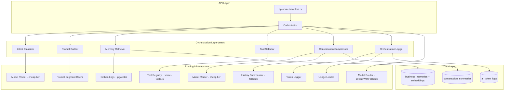
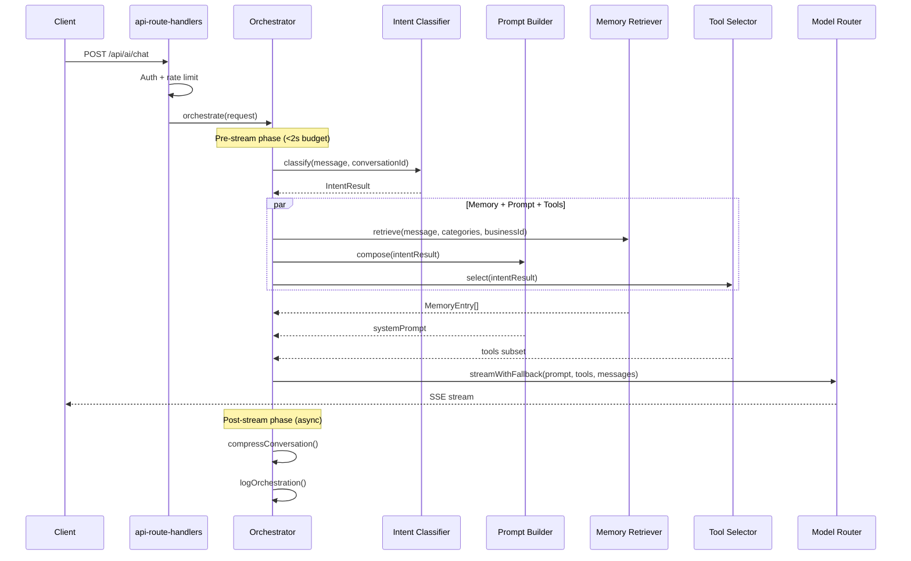

# Design Document: AI Orchestration System

## Overview

The AI Orchestration System is a conversational orchestration layer that sits between the existing dashboard assistant API route (`features/ai/api-route-handlers.ts`) and the Model Router (`lib/ai/router.ts`). It replaces the current inline streaming logic with a structured pipeline that:

1. **Classifies intent** using a cheap model call before the main generation
2. **Composes prompts dynamically** from modular segments based on intent
3. **Compresses conversations** to maintain context without excessive token usage
4. **Retrieves semantic memories** relevant to the current query
5. **Injects only relevant tools** based on classified intent
6. **Caches stable prompt segments** in memory to avoid redundant computation
7. **Logs orchestration metrics** for observability and cost tracking

The system integrates with all existing infrastructure without replacing it — the Model Router, Token Logger, Usage Limiter, AI Cache, and existing tool definitions remain unchanged. The orchestrator sits above them as a coordination layer.

### Design Rationale

The current `createAiChatRouteResponse` function in `api-route-handlers.ts` is a ~500-line monolith that handles auth, context building, model selection, streaming, and error recovery inline. This design extracts the "intelligence" into composable modules while preserving the existing streaming and fallback behavior.

Key decisions:
- **Cheap-tier intent classification** pays for itself by reducing tokens sent to the main model (fewer tools, fewer prompt segments, targeted memory)
- **Modular prompts** replace the current monolithic `getSurfaceInstructions` approach, enabling per-intent customization
- **Async compression** after stream completion avoids adding latency to the user experience
- **In-memory caching** (Map-based) matches the existing `ai-cache.ts` pattern — simple, no external dependencies

## Architecture



### Request Flow



## Components and Interfaces

### 1. Orchestrator (`features/ai/orchestrator/index.ts`)

The top-level coordinator. Replaces the inline logic in `createAiChatRouteResponse`.

```typescript
export type OrchestrateInput = {
  userId: string;
  businessId: string;
  conversationId: string;
  message: string;
  surface: "dashboard" | "inquiry" | "quote";
  entityId: string;
  businessSlug: string;
  conversationHistory: AiChatMessage[];
};

export type OrchestrateResult =
  | {
      ok: true;
      systemPrompt: string;
      tools: Record<string, Tool> | undefined;
      messages: CoreMessage[];
      onStreamComplete: (text: string, inputTokens: number, outputTokens: number) => Promise<void>;
    }
  | {
      ok: false;
      error: string;
      failedPhase: "intent_classification" | "memory_retrieval" | "prompt_composition" | "tool_selection";
    };

export async function orchestrate(input: OrchestrateInput): Promise<OrchestrateResult>;
```

### 2. Intent Classifier (`features/ai/orchestrator/intent-classifier.ts`)

Lightweight pre-classification using cheap-tier model.

```typescript
export type IntentCategory =
  | "data_query"
  | "quote_action"
  | "follow_up_action"
  | "analytics"
  | "general_question"
  | "memory_recall"
  | "workflow_guidance";

export type ToolCategory = "query_tools" | "action_tools";

export type MemoryCategory =
  | "business_rules"
  | "pricing_knowledge"
  | "customer_context"
  | "workflow_preferences";

export type IntentResult = {
  intent: IntentCategory;
  toolCategories: ToolCategory[];
  memoryCategories: MemoryCategory[];
  promptModules: string[]; // max 10, each <= 64 chars
};

export async function classifyIntent(
  message: string,
  conversationId: string,
): Promise<IntentResult>;
```

Internals:
- Uses `generateWithFallback` with `qualityTier: "cheap"`, max 128 output tokens, temperature 0.1
- System prompt ≤ 400 tokens with JSON output format
- Truncates message to 600 characters
- 60-second in-memory cache keyed by `message + conversationId`
- On failure/timeout (2s), returns default IntentResult: all tool categories, no memory, base modules only

### 3. Prompt Builder (`features/ai/orchestrator/prompt-builder.ts`)

Composes system prompts from modular segments.

```typescript
export type PromptModuleName =
  | "base_identity"
  | "formatting_rules"
  | "tool_usage_instructions"
  | "sales_support"
  | "quoting_guidance"
  | "follow_up_guidance"
  | "safety_constraints"
  | "analytics_guidance";

export type PromptBuildResult =
  | { ok: true; systemPrompt: string; includedModules: PromptModuleName[]; omittedModules: PromptModuleName[] }
  | { ok: false; error: string };

export function buildPrompt(
  intentResult: IntentResult,
  memoryContext: string | null,
  conversationSummary: string | null,
): PromptBuildResult;
```

Internals:
- Always includes `base_identity` (priority 1) and `safety_constraints` (priority 2)
- Remaining modules ordered by fixed priority rank
- Enforces 1600-token budget (using a fast character-based approximation: chars / 4)
- Omits lowest-priority modules first when over budget
- Logs omitted modules with reason
- Returns error if mandatory modules alone exceed budget

### 4. Conversation Compressor (`features/ai/orchestrator/conversation-compressor.ts`)

Maintains rolling summaries for long conversations.

```typescript
export type CompressionConfig = {
  messageThreshold: number; // default 10, min 6, max 50
  recentWindowSize: number; // default 6, min 2, max threshold - 1
};

export async function compressConversation(
  conversationId: string,
  messages: AiChatMessage[],
  config?: Partial<CompressionConfig>,
): Promise<void>;

export async function getConversationContext(
  conversationId: string,
  recentMessages: AiChatMessage[],
): Promise<{ summary: string | null; messages: AiChatMessage[] }>;
```

Internals:
- Triggers when message count > threshold
- Summarizes older messages (before recent window) into ≤ 200 words
- Uses cheap-tier model, max 256 tokens, temperature 0.3
- Stores summary in `conversation_summaries` table (new)
- Falls back to `summarizeDroppedMessages` from `lib/ai/history-summarizer.ts` on failure
- Runs asynchronously after stream completion (fire-and-forget with error logging)
- Deletes summary when conversation is deleted (cascade via FK)

### 5. Semantic Memory Retriever (`features/ai/orchestrator/memory-retriever.ts`)

Retrieves relevant business knowledge via embedding similarity.

```typescript
export type RetrievedMemory = {
  id: string;
  content: string;
  category: MemoryCategory;
  similarity: number;
};

export async function retrieveMemories(
  message: string,
  businessId: string,
  categories: MemoryCategory[],
): Promise<RetrievedMemory[]>;
```

Internals:
- Generates embedding for user message using existing `generateEmbedding`
- Queries `business_memories` filtered by businessId and category
- Uses existing `rankBySimilarity` for cosine similarity ranking
- Returns top 5 entries with similarity > 0.4
- Applies 800-token budget (entries in descending similarity order)
- Returns empty array if no categories requested or no entries found
- Target: < 500ms including embedding generation

### 6. Tool Selector (`features/ai/orchestrator/tool-selector.ts`)

Filters the full tool set based on intent.

```typescript
export type ToolMetadata = {
  name: string;
  category: "data_query" | "quote_management" | "follow_up_management" | "analytics" | "knowledge" | "customer_lookup";
  intentTriggers: IntentCategory[];
};

export function selectTools(
  intentResult: IntentResult,
  ctx: AiToolExecutionContext,
): Record<string, Tool> | undefined;
```

Internals:
- Tool metadata defined in `features/ai/tools/tool-metadata.ts`
- Maps tool categories to intent categories from IntentResult
- Calls `createDashboardTools(ctx)` and `createActionTools(ctx)` then filters by matching metadata
- Returns `undefined` if no tool categories specified (model called without tools)
- Target: < 50ms

### 7. Prompt Segment Cache (`features/ai/orchestrator/prompt-cache.ts`)

In-memory LRU cache for rendered prompt modules.

```typescript
export function getCachedSegment(moduleId: string, contentHash: string, params?: Record<string, string>): string | null;
export function setCachedSegment(moduleId: string, contentHash: string, rendered: string, params?: Record<string, string>): void;
```

Internals:
- Map-based, max 50 entries, LRU eviction
- Cache key: `moduleId + contentHash + JSON.stringify(sortedParams)`
- Invalidates on content hash mismatch
- No persistence across process restarts
- Bypasses cache on hash computation error

### 8. Orchestration Logger (`features/ai/orchestrator/orchestration-logger.ts`)

Structured observability for each orchestrated request.

```typescript
export type OrchestrationLogEntry = {
  conversationId: string;
  userId: string;
  businessId: string;
  intentCategory: IntentCategory;
  promptModulesIncluded: PromptModuleName[];
  promptModulesOmitted: PromptModuleName[];
  totalPromptTokens: number;
  toolsInjectedCount: number;
  memoryEntriesRetrieved: number;
  memoryRetrievalMs: number;
  intentClassificationMs: number;
  totalOrchestrationOverheadMs: number;
  model: string;
  provider: string;
  timestamp: string; // ISO-8601 UTC
  phaseDurations: {
    classification: number;
    memoryRetrieval: number;
    promptComposition: number;
    toolSelection: number;
    streamSetup: number;
  };
  status: "success" | "partial_failure";
  failedPhase?: string;
};

export function logOrchestration(entry: OrchestrationLogEntry): void;
export function createTimer(): { elapsed(): number };
```

Internals:
- Writes structured JSON via `console.info` (matches Token Logger pattern)
- Calls `logAiInvocation` for intent classification tokens with taskType `"intent_classification"`
- Calls `recordUsage` with weight 0.5 for classification usage
- Failed phase durations recorded as -1
- Timer utility measures wall-clock ms per phase

## Data Models

### New Table: `conversation_summaries`

```sql
CREATE TABLE conversation_summaries (
  id TEXT PRIMARY KEY,
  conversation_id TEXT NOT NULL UNIQUE REFERENCES ai_conversations(id) ON DELETE CASCADE,
  summary TEXT NOT NULL,
  message_count INTEGER NOT NULL,
  created_at TIMESTAMPTZ NOT NULL DEFAULT now(),
  updated_at TIMESTAMPTZ NOT NULL DEFAULT now()
);

CREATE INDEX conversation_summaries_conversation_id_idx ON conversation_summaries(conversation_id);
```

Drizzle schema (`lib/db/schema/ai.ts` extension):

```typescript
export const conversationSummaries = pgTable(
  "conversation_summaries",
  {
    id: text("id").primaryKey(),
    conversationId: text("conversation_id")
      .notNull()
      .unique()
      .references(() => aiConversations.id, { onDelete: "cascade" }),
    summary: text("summary").notNull(),
    messageCount: integer("message_count").notNull(),
    createdAt: timestamp("created_at", { withTimezone: true }).notNull().defaultNow(),
    updatedAt: timestamp("updated_at", { withTimezone: true }).notNull().defaultNow(),
  },
  (table) => [
    index("conversation_summaries_conversation_id_idx").on(table.conversationId),
  ],
);
```

### Extended Table: `business_memories`

The existing `business_memories` table already has an `embedding` JSONB column. For the orchestration system we add a `category` column:

```sql
ALTER TABLE business_memories ADD COLUMN category TEXT NOT NULL DEFAULT 'business_rules';
ALTER TABLE business_memories ADD CONSTRAINT business_memories_category_check
  CHECK (category IN ('business_rules', 'pricing_knowledge', 'customer_context', 'workflow_preferences'));
CREATE INDEX business_memories_business_category_idx ON business_memories(business_id, category);
```

### Extended Task Types

Add `"intent_classification"` to the `aiTaskTypes` array in `features/ai/task-registry.ts` for Token Logger integration. This task type uses:
- `qualityTier: "cheap"`
- `maxOutputTokens: 128`
- `temperature: 0.1`
- `cacheTTL: 60`
- `priorityWeight: 1`
- `streamingPermitted: false`
- `maxContextCharacters: 800`

### Prompt Module Files

New directory: `features/ai/prompts/modules/`

Each module is a standalone TypeScript file exporting a `const`:

```
features/ai/prompts/modules/base-identity.ts
features/ai/prompts/modules/safety-constraints.ts
features/ai/prompts/modules/formatting-rules.ts
features/ai/prompts/modules/tool-usage-instructions.ts
features/ai/prompts/modules/sales-support.ts
features/ai/prompts/modules/quoting-guidance.ts
features/ai/prompts/modules/follow-up-guidance.ts
features/ai/prompts/modules/analytics-guidance.ts
```

### Tool Metadata File

New file: `features/ai/tools/tool-metadata.ts`

Maps each tool name from `createDashboardTools` and `createActionTools` to a category and intent triggers.

### Intent Classification Cache

In-memory Map within `intent-classifier.ts`:
- Key: `SHA-256(message.slice(0, 600) + conversationId)`
- Value: `{ result: IntentResult, expiresAt: number }`
- TTL: 60 seconds
- No size limit needed (conversations are short-lived, entries auto-expire)

