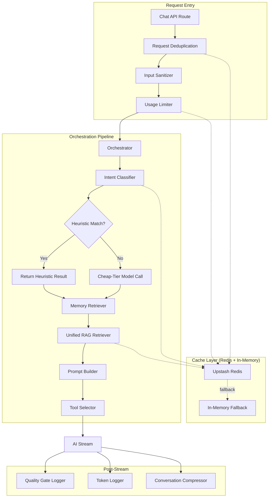

# Design Document: AI System Hardening

## Overview

This design covers a comprehensive hardening, optimization, and bug-fix pass on the Requo AI assistant system. The changes span five domains:

1. **Caching & Resilience** — Replace volatile in-memory Maps with Upstash Redis (with in-memory fallback) so caches survive serverless cold starts.
2. **Security** — Harden the input sanitizer with Unicode normalization, multilingual injection detection, memory content scanning, per-conversation lockout, and canary token leak detection.
3. **RAG & Memory** — Raise similarity thresholds, add confidence tiers, keyword boost, recency decay, consolidate retrievers, and cache query embeddings.
4. **Token & Cost Optimization** — Compress prompts, prune context by complexity, truncate tool outputs, deduplicate retrieval, batch DB queries, add heuristic intent pre-classification, and implement intent-aware token allocation.
5. **Quality & Reliability** — Fix the backfill embeddings bug, remove the regex fallback extractor, add quality gate logging, request deduplication, AI-based summarization, and token log retention.

All changes are additive or surgical modifications to existing modules. No new database tables are required (except a scheduled cleanup task for existing `ai_token_logs`). The architecture remains the same: Orchestrator → Intent Classifier → Memory Retriever → Prompt Builder → Tool Selector → Stream.

## Architecture



### Key Architectural Decisions

1. **Two-layer cache (Redis primary, in-memory fallback)** — Every Redis operation is wrapped in try/catch with a 2s timeout. On failure, the system degrades to in-memory Maps transparently. This ensures zero downtime from cache infrastructure issues.

2. **Unified RAG entry point** — The current dual-retriever pattern (orchestrator `memory-retriever.ts` + `features/memory/rag-retriever.ts`) is consolidated into a single function in `features/memory/rag-retriever.ts` that accepts optional category filters, applies all enhancements (threshold, tiers, keyword boost, recency decay), and respects token budgets.

3. **Heuristic-first intent classification** — A fast regex-based pre-classifier handles obvious intents (data queries, greetings) without an API call. The model-based classifier is only invoked for ambiguous messages.

4. **Non-blocking post-stream operations** — Quality gate logging, token logging, and conversation compression all run in `onFinish` callbacks without blocking the response stream.

## Components and Interfaces

### 1. Cache Layer (`lib/ai/cache-layer.ts` — new)

```typescript
interface CacheLayer {
  get<T>(key: string): Promise<T | null>;
  set<T>(key: string, value: T, ttlSeconds: number): Promise<void>;
  delete(key: string): Promise<void>;
  increment(key: string, ttlSeconds: number): Promise<number>;
}
```

- Wraps `@upstash/redis` REST client
- Falls back to `Map<string, { value: unknown; expiresAt: number }>` on Redis unavailability
- All operations are non-throwing (try/catch + console.warn)
- Connection timeout: 5s; per-operation timeout: 2s
- Dual-write on `set`: writes to both Redis and in-memory for same-instance reads
- On `get`: Redis-first; returns Redis value without touching in-memory map

### 2. Input Sanitizer (`lib/ai/input-sanitizer.ts` — modified)

```typescript
interface SanitizationResult {
  status: "clean" | "sanitized" | "rejected" | "locked";
  output: string;
  patterns: string[];
}

function sanitizeAiInput(input: string, conversationId?: string): Promise<SanitizationResult>;
function sanitizeMemoryContent(title: string, content: string): SanitizationResult;
```

Changes:
- Add `normalizeInput(input: string): string` — strips zero-width chars, applies NFKC
- Add multilingual rejection patterns (French, Spanish, German)
- Add `conversationId` parameter for lockout tracking via Cache Layer
- Add `sanitizeMemoryContent()` for RAG poisoning prevention
- Processing pipeline: strip zero-width → NFKC normalize → pattern match

### 3. Unified RAG Retriever (`features/memory/rag-retriever.ts` — modified)

```typescript
interface RetrievalOptions {
  businessId: string;
  queryText: string;
  topK?: number;              // default 3
  categories?: string[];      // optional category filter
  tokenBudget?: number;       // max tokens for combined output
}

interface RetrievedMemory {
  title: string;
  content: string;
  similarity: number;
  confidenceTier: "HIGH" | "MEDIUM" | "LOW";
  category?: string;
}

interface RetrievalResult {
  combinedText: string;
  memories: RetrievedMemory[];
  usedRag: boolean;
}
```

Scoring pipeline:
1. Generate query embedding (with cache lookup first)
2. Compute cosine similarity for each memory
3. Apply keyword boost (+0.1, capped at 1.0)
4. Apply recency decay (linear 0–30% over 365 days)
5. Apply similarity threshold (0.45, emergency fallback at 0.3)
6. Assign confidence tiers (HIGH ≥ 0.7, MEDIUM ≥ 0.55, LOW ≥ 0.45)
7. Filter by categories if specified
8. Truncate to token budget

### 4. Intent Classifier (`features/ai/orchestrator/intent-classifier.ts` — modified)

```typescript
// New heuristic patterns added before model call
const HEURISTIC_PATTERNS: Array<{ pattern: RegExp; result: IntentResult }>;

function classifyIntent(message: string, conversationId: string): Promise<IntentResult>;
```

Heuristic patterns cover:
- `data_query`: "how many", "list", "show me", "get", "count" + entity keywords
- `general_question`: greetings ("hello", "hi", "hey", "thanks")

### 5. Prompt Builder (`features/ai/orchestrator/prompt-builder.ts` — modified)

Changes:
- Accept `businessName` parameter for template injection into `base_identity`
- Embed canary token (HMAC-SHA256 of businessId + server secret, truncated to 16 chars)
- Add pricing hallucination guardrail when `pricingBlocks` is empty
- Token estimation: `Math.ceil(text.length / 4)` applied consistently

### 6. Tool Output Truncator (`lib/ai/tool-truncator.ts` — new)

```typescript
interface TruncationResult {
  output: string;
  truncated: boolean;
  originalLength: number;
}

function truncateToolOutput(output: string, isError: boolean): TruncationResult;
```

- Max 4000 characters of content
- Text mode: truncate at last complete line boundary
- JSON mode (starts with `{` or `[`): truncate at last complete key-value/element, close open brackets
- Error outputs are never truncated
- Appends `[truncated — showing first {n} chars of {total}]`

### 7. Request Deduplicator (`lib/ai/request-dedup.ts` — new)

```typescript
function checkDuplicate(conversationId: string, messageContent: string): Promise<boolean>;
```

- Key: SHA-256 hash of `${conversationId}:${messageContent}`
- TTL: 10 seconds in Cache Layer
- Returns `true` if duplicate (caller returns 409)

### 8. Quality Gate Logger (`lib/ai/quality-gate.ts` — new)

```typescript
interface QualityGateEvent {
  conversationId: string;
  userMessage: string;
  classifiedIntent: string;
  toolsAvailable: string[];
  responseSnippet: string;
}

function checkQualityGate(response: string, context: QualityGateEvent): void;
```

- Runs in `onFinish` callback (non-blocking)
- Detects uncertainty phrases: "I don't know", "I'm not sure", "I cannot find"
- Only logs when tools were injected (missed tool-use opportunity)

### 9. Token Log Retention (`features/ai/inngest/token-log-cleanup.ts` — new)

- Inngest scheduled function running daily
- Deletes `ai_token_logs` rows older than 90 days
- Batch size: 1000 rows per execution
- Logs deletion count

### 10. History Summarizer (`lib/ai/history-summarizer.ts` — modified)

```typescript
function summarizeConversation(messages: AiChatMessage[]): Promise<string>;
```

- Threshold: > 12 messages triggers AI summarization
- Uses cheap-tier model with 128 max output tokens
- 2s timeout with fallback to existing heuristic `summarizeDroppedMessages()`

## Data Models

### Cache Key Structures

| Consumer | Key Pattern | TTL | Scope |
|----------|-------------|-----|-------|
| Intent Classification | `intent:{hash(message+convId)}` | 60s | Per-conversation |
| AI Output Cache (personalized) | `ai:{sha256(components)}` | Caller-specified | Per-user |
| AI Output Cache (business-scoped) | `ai:biz:{sha256(components-no-userId)}` | Caller-specified | Per-business |
| Capacity Selector RPM | `cap:rpm:{modelId}` | 60s | Global |
| Capacity Selector RPD | `cap:rpd:{modelId}` | 86400s | Global |
| Usage Limiter Cooldown | `cool:{userId}:{taskType}` | 3s | Per-user |
| Injection Counter | `inj:{conversationId}` | 3600s | Per-conversation |
| Request Dedup | `dedup:{hash(convId+message)}` | 10s | Per-conversation |
| Query Embedding | `emb:{hash(text)}` | 300s | Global |

### Confidence Tier Thresholds

| Tier | Similarity Range |
|------|-----------------|
| HIGH | ≥ 0.70 |
| MEDIUM | ≥ 0.55 and < 0.70 |
| LOW | ≥ 0.45 and < 0.55 |
| Emergency Fallback | ≥ 0.30 (only when no memories pass 0.45) |

### Intent-to-Token Allocation Map

| Intent | maxOutputTokens |
|--------|----------------|
| data_query | 800 |
| general_question | 800 |
| quote_action | 2200 |
| follow_up_action | 2200 |
| analytics | 1400 |
| workflow_guidance | 1400 |
| memory_recall | 1400 |

### Recency Decay Formula

```
daysSinceUpdate = (now - memory.updatedAt) / (1000 * 60 * 60 * 24)
decayFactor = Math.min(daysSinceUpdate / 365, 1.0) * 0.30
effectiveScore = boostedScore * (1 - decayFactor)
```

## Correctness Properties

*A property is a characteristic or behavior that should hold true across all valid executions of a system — essentially, a formal statement about what the system should do. Properties serve as the bridge between human-readable specifications and machine-verifiable correctness guarantees.*

### Property 1: Cache layer never propagates exceptions

*For any* Redis operation (get, set, delete, increment) that throws any error (connection refused, timeout, parse error, network failure), the Cache Layer SHALL return a graceful fallback value (null for reads, void for writes) without propagating the exception to the caller.

**Validates: Requirements 1.2, 1.3, 1.5**

### Property 2: Cache writes are durable with correct TTL

*For any* key-value pair written to the Cache Layer with a specified TTL, reading that key before TTL expiration SHALL return the original value, and reading after TTL expiration SHALL return null.

**Validates: Requirements 1.4, 1.7**

### Property 3: Unicode normalization pipeline correctness

*For any* input string containing zero-width characters (U+200B, U+200C, U+200D, U+FEFF, U+00AD), the sanitizer output SHALL contain none of those characters, and the pattern matching SHALL operate on the NFKC-normalized form.

**Validates: Requirements 2.1, 2.2, 2.6**

### Property 4: Multilingual and homoglyph injection detection

*For any* injection keyword (e.g., "ignore previous instructions") expressed in English, French, Spanish, German, or using Cyrillic homoglyph substitutions, the Input Sanitizer SHALL return status "rejected" after NFKC normalization maps the input to its canonical ASCII form.

**Validates: Requirements 2.3, 2.4**

### Property 5: Input sanitizer performance bound

*For any* input string of up to 10,000 characters (including Unicode, zero-width characters, and multilingual text), the sanitizer SHALL complete processing in under 5ms.

**Validates: Requirements 2.5**

### Property 6: Memory content sanitization

*For any* memory title or content containing high-confidence injection patterns, the sanitizer SHALL reject the save. *For any* memory content containing only low-confidence patterns, the sanitizer SHALL strip those patterns and return the sanitized content with no injection patterns remaining.

**Validates: Requirements 3.1, 3.2, 3.3**

### Property 7: Injection lockout threshold

*For any* conversation where 3 or more injection attempts (status "rejected" or "sanitized") have been detected, all subsequent messages in that conversation SHALL be rejected with status "locked" regardless of their content.

**Validates: Requirements 4.1, 4.2**

### Property 8: Canary token determinism and detection

*For any* business ID, the canary token generated SHALL be deterministic (same business ID + secret always produces the same token). *For any* AI output containing the canary token string, the output filter SHALL redact the response.

**Validates: Requirements 5.1, 5.2, 5.3**

### Property 9: RAG retrieval threshold and confidence tiering

*For any* set of memories and query embedding, all memories returned by the retriever SHALL have an effective similarity score ≥ 0.45 (or exactly one memory ≥ 0.3 in the emergency fallback case when none exceed 0.45), and each returned memory SHALL be labeled with the correct confidence tier based on its score.

**Validates: Requirements 6.1, 6.2, 6.3, 6.4, 6.5**

### Property 10: Pricing hallucination guardrail

*For any* prompt composition where pricingBlocks is null, empty string, or the sentinel "- No saved pricing entries.", the composed system prompt SHALL contain instructions that unitPriceInCents must be 0 and that pricing requires manual review.

**Validates: Requirements 7.1, 7.2, 7.3**

### Property 11: Backfill processes only null embeddings

*For any* set of business memories where some have non-null embeddings and some have null embeddings, calling backfillMemoryEmbeddings SHALL only generate embeddings for the null-embedding subset, and the returned counts SHALL accurately reflect successes and failures.

**Validates: Requirements 8.1, 8.2, 8.3**

### Property 12: Tool description constraints

*For any* dashboard tool definition, its description SHALL be no more than 80 characters and SHALL contain a "Returns:" format hint.

**Validates: Requirements 10.1, 10.2**

### Property 13: Context pruning by message complexity

*For any* message classified as "simple", the Surface Service SHALL load only business identity and knowledge context (no inquiry/quote details, timelines, or follow-up lists). *For any* message classified as "complex", full context SHALL be loaded.

**Validates: Requirements 11.1, 11.2**

### Property 14: Single memory retrieval per request

*For any* dashboard chat request where pre-retrieved memories are passed to the Surface Service, the Surface Service SHALL not invoke retrieveRelevantMemories, ensuring at most one retrieval call per request.

**Validates: Requirements 12.2, 12.3**

### Property 15: Embedding cache round-trip

*For any* text string, after generating its embedding, requesting the same text's embedding within 300 seconds SHALL return the cached vector without calling the embedding provider.

**Validates: Requirements 13.1, 13.2**

### Property 16: Keyword boost scoring

*For any* query and memory where the memory content contains one or more exact case-insensitive keyword matches (excluding stop words) from the query, the memory's similarity score SHALL be boosted by exactly 0.1, capped at 1.0.

**Validates: Requirements 14.1, 14.2, 14.3**

### Property 17: Unified retriever consistency

*For any* retrieval call through the unified entry point (with or without category filters), the retriever SHALL apply the 0.45 threshold, confidence tiering, keyword boost, recency decay, and token budget consistently.

**Validates: Requirements 15.2, 15.3**

### Property 18: Tool output truncation preserves validity

*For any* tool output longer than 4000 characters that starts with `{` or `[`, the truncated result SHALL be valid parseable JSON. *For any* non-JSON tool output longer than 4000 characters, the truncated result SHALL end at a complete line boundary at or before 4000 characters. Error-flagged outputs SHALL never be truncated.

**Validates: Requirements 16.1, 16.2, 16.3, 16.4**

### Property 19: Heuristic intent classification avoids model calls

*For any* user message matching a heuristic pattern (count/list/show/get + entity keywords, or simple greetings), the Intent Classifier SHALL return a valid classification result without making any external model API call.

**Validates: Requirements 19.1, 19.2**

### Property 20: Business-scoped cache key exclusion

*For any* non-personalized task type (inquiry_summary, form_suggestion, business_memory_summary), the generated cache key SHALL be identical regardless of which userId is provided. *For any* personalized task type, different userIds SHALL produce different cache keys.

**Validates: Requirements 20.1, 20.2**

### Property 21: Batched usage query equivalence

*For any* user ID and business ID combination, the single batched usage query SHALL return the same user-total and business-total values as the two separate sequential queries.

**Validates: Requirements 21.1, 21.2**

### Property 22: Request deduplication determinism

*For any* conversation ID and message content, the deduplication key SHALL be deterministic. *For any* duplicate request within the 10-second window, the system SHALL reject it.

**Validates: Requirements 23.1, 23.2**

### Property 23: Intent-to-token allocation mapping

*For any* classified intent, the maxOutputTokens SHALL be set to the value defined in the allocation map (800 for data_query/general_question, 2200 for quote_action/follow_up_action, 1400 for analytics/workflow_guidance/memory_recall).

**Validates: Requirements 24.1, 24.2, 24.3**

### Property 24: Quality gate detection

*For any* AI response containing uncertainty phrases ("I don't know", "I'm not sure", "I cannot find") when tools were injected in the request, the system SHALL log a quality gate event containing the conversation ID, user message, intent, available tools, and response snippet.

**Validates: Requirements 25.1, 25.2**

### Property 25: Business name in composed prompt

*For any* business name passed to the Prompt Builder, the composed system prompt SHALL contain that business name in the base_identity section.

**Validates: Requirements 26.1, 26.2**

### Property 26: Recency decay formula correctness

*For any* memory with a known updatedAt timestamp, the recency decay SHALL follow the formula: `decayFactor = min(daysSinceUpdate / 365, 1.0) * 0.30`, applied after keyword boost and before threshold filtering, reducing the effective score by up to 30%.

**Validates: Requirements 28.1, 28.2, 28.3**

## Error Handling

### Cache Layer Failures
- All Redis operations wrapped in try/catch
- On connection failure: log warning, fall back to in-memory Map
- On per-operation timeout (2s): return null/void, log warning
- Never propagate exceptions to callers
- In-memory fallback is always available (zero-dependency)

### Input Sanitizer Errors
- Catastrophic regex backtracking: caught by existing try/catch, returns "rejected"
- NFKC normalization failure: fall back to raw input (fail-open for normalization, fail-closed for detection)
- Cache Layer unavailable for lockout counter: skip lockout check, log warning

### RAG Retriever Failures
- Embedding generation failure: fall back to returning all memories (existing behavior)
- All embedding providers fail: return empty result with `usedRag: false`
- Keyword boost or recency calculation error: skip that enhancement, use raw similarity

### AI Summarization Failures
- Model call timeout (2s): fall back to heuristic `summarizeDroppedMessages()`
- Model returns invalid output: fall back to heuristic
- All cheap-tier models unavailable: fall back to heuristic

### Tool Output Truncation Errors
- JSON parsing failure during smart truncation: fall back to line-boundary truncation
- Empty output: return as-is (no truncation needed)

### Request Deduplication Failures
- Cache Layer unavailable: skip dedup check, allow request through (fail-open)
- Hash computation failure: skip dedup check, log warning

### Usage Limiter Failures
- Database query failure: allow request through (fail-open), log error
- Batched query returns unexpected format: fall back to sequential queries

## Testing Strategy

### Property-Based Testing

This feature is well-suited for property-based testing across its pure-function components. The following modules have clear input/output behavior with universal properties:

- **Input Sanitizer** — Pure function with string input/output. Properties around normalization, detection, and performance.
- **RAG Scoring Pipeline** — Pure scoring functions (keyword boost, recency decay, threshold filtering, tier assignment).
- **Tool Output Truncator** — Pure function with string input/output. Properties around JSON validity and boundary correctness.
- **Cache Key Generation** — Pure function producing deterministic hashes.
- **Intent-to-Token Mapping** — Pure mapping function.
- **Canary Token Generation** — Pure deterministic function.

**PBT Library:** `fast-check` (already available in the project's test ecosystem via vitest)

**Configuration:**
- Minimum 100 iterations per property test
- Each test tagged with: `Feature: ai-system-hardening, Property {N}: {title}`

### Unit Tests (Example-Based)

- Dashboard prompt deduplication (Req 9): verify no repeated semantic instructions
- Tool description total character count (Req 10.3): verify < 4000 chars combined
- Public inquiry prompt compression (Req 27): verify ≤ 600 tokens, critical rules preserved
- Token budget enforcement (Req 17): verify 1600-token limit with sample compositions
- AI summarization threshold (Req 18.1): verify 12-message trigger
- Regex fallback removal (Req 29): verify `extractFieldsFromMessage` is not called
- Quality gate log fields (Req 25.2): verify all required fields present

### Integration Tests

- Cache Layer with Redis (Req 1.6): verify all consumers use the cache layer
- Orchestrator memory pass-through (Req 12.1): verify single retrieval on dashboard path
- Usage limiter batched query (Req 21): verify single DB query returns correct results
- Token log retention (Req 22): verify scheduled deletion of old entries
- Request deduplication (Req 23): verify 409 response on duplicate within window
- Heuristic classification caching (Req 19.3): verify cached with 60s TTL

### End-to-End Smoke Tests

- Full chat request with Redis available: verify response streams correctly
- Full chat request with Redis unavailable: verify graceful degradation
- Injection attempt sequence: verify lockout after 3 attempts
- Long conversation (>12 messages): verify AI summarization is attempted
