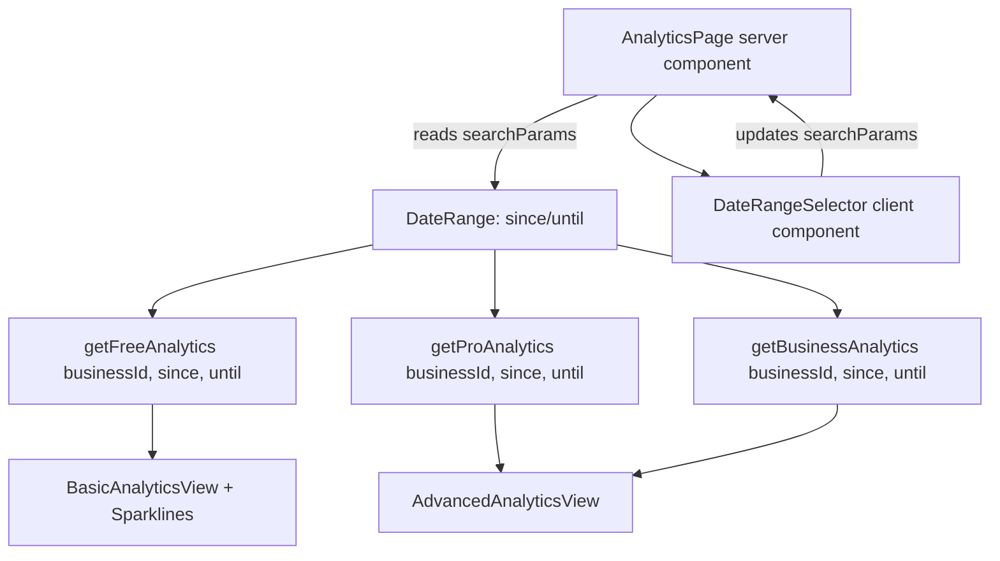

# Design Document: Analytics Enhancements

## Overview

This design covers 18 analytics enhancements organized into three priority tiers. The changes extend the existing tabbed Basic/Advanced analytics interface with new controls (date range selector, sparklines, timestamps), new metrics (referrer tracking, revenue forecast, pipeline velocity), performance optimizations (query consolidation, daily rollups), and advanced analytical features (drill-down, goals, cohort analysis, exports, scheduled reports, annotations, benchmarking).

All enhancements integrate with the existing architecture:
- Three query functions (`getFreeAnalytics`, `getProAnalytics`, `getBusinessAnalytics`) extended with date-range parameters
- `"use cache"` + `cacheTag` cross-request caching preserved
- Plan entitlements (`analyticsConversion`, `analyticsWorkflow`, `exports`) gate feature access
- Drizzle ORM with PostgreSQL for all data access
- Components in `features/analytics/components/`

### Priority Tiers

| Tier | Requirements | Scope |
|------|-------------|-------|
| Tier 1 (Immediate) | 1–3 | Date range, sparklines, timestamp |
| Tier 2 (High-impact) | 4–10 | Referrer, AI summary, revenue forecast, pipeline velocity, query consolidation, rollup table, drill-down |
| Tier 3 (Advanced) | 11–18 | Goals, cohort, digest email, export, UTM, scheduled reports, annotations, benchmarking |

## Architecture

### Data Flow with Date Range



### Component Architecture

```
AnalyticsPage (server component)
└── DashboardPage + PageHeader
    ├── DateRangeSelector (client, updates URL searchParams)
    ├── LastUpdatedTimestamp (server, reads cache metadata)
    └── AnalyticsTabbedDashboard (client, tab state)
        ├── BasicAnalyticsView
        │   └── MetricCard (with Sparkline, optional DrillDownLink)
        │       └── MiniSparkline (SVG, 7 points)
        ├── AdvancedAnalyticsView
        │   ├── AnalyticsProPanel
        │   │   ├── TrendChart (with AnnotationMarkers)
        │   │   ├── TopSourcesCard (referrer breakdown)
        │   │   ├── CampaignPerformanceCard (UTM)
        │   │   └── FormPerformanceTable
        │   └── AnalyticsBusinessPanel
        │       ├── AISummaryCard (replaces AI usage)
        │       ├── RevenueForecastCard
        │       ├── PipelineVelocityCard
        │       ├── GoalThresholdOverlay (per metric)
        │       └── CohortAnalysisSection
        └── AnalyticsToolbar
            ├── ExportButton (PDF/CSV)
            └── ScheduledReportSettings (sheet)
```

### URL-Driven Date Range

The date range is stored in URL search params (`?range=30d` or `?since=2024-01-01&until=2024-01-31`). This enables:
- Server-side data fetching scoped to the range
- Shareable URLs with preserved date context
- Browser back/forward navigation through date selections
- Cache key differentiation per range

### Caching Strategy Updates

Current cache keys are business-scoped only. With date ranges:
- Preset ranges (7d, 30d, 90d) use `cacheTag` with range suffix: `business:<id>:analytics:30d`
- Custom ranges bypass `"use cache"` and query directly (custom ranges are rarely repeated)
- Daily rollup table serves as the primary performance optimization for range queries
- AI summaries are cached per business with the default 30d range only

### New API Routes

| Route | Method | Purpose | Entitlement |
|-------|--------|---------|-------------|
| `/api/business/[slug]/analytics/export` | POST | Generate PDF/CSV export | `exports` |
| `/api/business/[slug]/analytics/goals` | GET/PUT | Read/write goal thresholds | `analyticsConversion` |
| `/api/business/[slug]/analytics/annotations` | GET/POST/PUT/DELETE | CRUD annotations | `analyticsConversion` |
| `/api/business/[slug]/analytics/scheduled-reports` | GET/POST/PUT/DELETE | Manage scheduled report config | `analyticsWorkflow` |
| `/api/cron/analytics-rollup` | POST | Daily rollup computation (Vercel cron) | internal |
| `/api/cron/analytics-digest` | POST | Weekly digest email dispatch (Vercel cron) | internal |
| `/api/cron/analytics-scheduled-reports` | POST | Scheduled report dispatch (Vercel cron) | internal |
| `/api/cron/analytics-benchmarks` | POST | Monthly benchmark aggregation (Vercel cron) | internal |

## Components and Interfaces

### DateRangeSelector

```typescript
"use client";

type DateRangePreset = "7d" | "30d" | "90d" | "custom";

type DateRangeSelectorProps = {
  currentPreset: DateRangePreset;
  customSince?: string; // ISO date
  customUntil?: string; // ISO date
  onRangeChange: (preset: DateRangePreset, since?: string, until?: string) => void;
};
```

Uses `useRouter` + `useSearchParams` to update URL. Renders shadcn `ToggleGroup` for presets and a `Popover` with `Calendar` for custom range. Validates start < end and range ≤ 365 days client-side.

### MiniSparkline

```typescript
type MiniSparklineProps = {
  points: number[]; // exactly 7 values
  direction: "up" | "down" | "flat";
  height?: number; // default 24
};
```

Pure SVG component. Renders a polyline with stroke color mapped from direction:
- `up` → `var(--color-success)`
- `down` → `var(--color-destructive)`
- `flat` → `var(--color-muted-foreground)`

No interactivity, no labels — purely visual trend indicator.

### AISummaryCard

```typescript
type AISummaryCardProps = {
  summary: string | null; // null = unavailable
};
```

Displays a single sentence. Falls back to "Summary unavailable." when null. Generated server-side during cache refresh using the AI provider with a structured prompt containing current metrics and deltas.

### RevenueForecastCard

```typescript
type RevenueForecastCardProps = {
  forecastCents: number | null; // null = insufficient data
  pendingQuoteCount: number;
  historicalAcceptanceRate: number;
  averageQuoteValueCents: number;
};
```

Formula: `pendingQuoteCount × historicalAcceptanceRate × averageQuoteValueCents`

### PipelineVelocityCard

```typescript
type PipelineVelocityCardProps = {
  medianDays: number | null; // null = insufficient data (< 3 points)
};
```

### TopSourcesCard

```typescript
type TopSourcesCardProps = {
  sources: Array<{ domain: string; count: number }>;
  totalViews: number;
};
```

Renders top 5 referrer domains as a horizontal bar chart with percentage labels.

### GoalThresholdOverlay

```typescript
type GoalThresholdOverlayProps = {
  currentValue: number;
  targetValue: number;
  metricType: "rate" | "count";
};
```

Renders a thin progress bar beneath the metric value. Color logic:
- `≥ target` → success color
- `< 50% of target` → destructive color
- otherwise → muted/warning color

### DrillDownLink

```typescript
type DrillDownLinkProps = {
  href: string; // pre-built filtered list URL
  enabled: boolean; // false for rate/percentage metrics
};
```

Wraps MetricCard content in a `Link` when `enabled=true`.

### ExportButton

```typescript
type ExportButtonProps = {
  businessSlug: string;
  dateRange: { since: string; until: string };
};
```

Renders a dropdown with PDF/CSV options. Triggers POST to export route. Streams file download.

### CohortAnalysisSection

```typescript
type CohortRow = {
  cohortMonth: string; // "2024-01"
  totalCustomers: number;
  returnedIn3Months: number;
  returnedIn6Months: number;
  returnedIn12Months: number;
};

type CohortAnalysisSectionProps = {
  cohorts: CohortRow[];
};
```

Renders a retention matrix table with color-coded cells (higher retention = stronger color).

### AnnotationMarker

```typescript
type Annotation = {
  id: string;
  date: string;
  label: string;
  color?: string;
};

type AnnotationMarkerProps = {
  annotations: Annotation[];
  chartWidth: number;
  dateRange: { since: string; until: string };
};
```

Renders vertical dashed lines at annotation positions on the trend chart with tooltip on hover.

## Data Models

### New Tables

#### `analytics_daily_rollups`

```typescript
export const analyticsDailyRollups = pgTable(
  "analytics_daily_rollups",
  {
    id: text("id").primaryKey(),
    businessId: text("business_id").notNull().references(() => businesses.id, { onDelete: "cascade" }),
    date: date("date").notNull(),
    formViews: integer("form_views").notNull().default(0),
    uniqueVisitors: integer("unique_visitors").notNull().default(0),
    inquirySubmissions: integer("inquiry_submissions").notNull().default(0),
    quotesSent: integer("quotes_sent").notNull().default(0),
    quotesAccepted: integer("quotes_accepted").notNull().default(0),
    quotesRejected: integer("quotes_rejected").notNull().default(0),
    revenueCents: integer("revenue_cents").notNull().default(0),
    createdAt: timestamp("created_at", { withTimezone: true }).notNull().defaultNow(),
    updatedAt: timestamp("updated_at", { withTimezone: true }).notNull().defaultNow(),
  },
  (table) => [
    uniqueIndex("analytics_daily_rollups_business_date_idx").on(table.businessId, table.date),
    index("analytics_daily_rollups_date_idx").on(table.date),
  ],
);
```

#### `analytics_goal_thresholds`

```typescript
export const analyticsGoalThresholds = pgTable(
  "analytics_goal_thresholds",
  {
    id: text("id").primaryKey(),
    businessId: text("business_id").notNull().references(() => businesses.id, { onDelete: "cascade" }),
    metricKey: text("metric_key").notNull(), // e.g., "formConversionRate", "quoteAcceptanceRate"
    targetValue: doublePrecision("target_value").notNull(),
    createdAt: timestamp("created_at", { withTimezone: true }).notNull().defaultNow(),
    updatedAt: timestamp("updated_at", { withTimezone: true }).notNull().defaultNow(),
  },
  (table) => [
    uniqueIndex("analytics_goal_thresholds_business_metric_idx").on(table.businessId, table.metricKey),
  ],
);
```

#### `analytics_annotations`

```typescript
export const analyticsAnnotations = pgTable(
  "analytics_annotations",
  {
    id: text("id").primaryKey(),
    businessId: text("business_id").notNull().references(() => businesses.id, { onDelete: "cascade" }),
    date: date("date").notNull(),
    label: text("label").notNull(),
    color: text("color"), // optional hex color
    createdBy: text("created_by").notNull().references(() => users.id),
    createdAt: timestamp("created_at", { withTimezone: true }).notNull().defaultNow(),
    updatedAt: timestamp("updated_at", { withTimezone: true }).notNull().defaultNow(),
  },
  (table) => [
    index("analytics_annotations_business_date_idx").on(table.businessId, table.date),
  ],
);
```

#### `analytics_scheduled_reports`

```typescript
export const analyticsScheduledReports = pgTable(
  "analytics_scheduled_reports",
  {
    id: text("id").primaryKey(),
    businessId: text("business_id").notNull().references(() => businesses.id, { onDelete: "cascade" }),
    recipientEmails: text("recipient_emails").array().notNull(), // max 5
    schedule: text("schedule").notNull(), // "daily" | "weekly" | "monthly"
    timezone: text("timezone").notNull().default("UTC"),
    enabled: boolean("enabled").notNull().default(true),
    lastSentAt: timestamp("last_sent_at", { withTimezone: true }),
    createdAt: timestamp("created_at", { withTimezone: true }).notNull().defaultNow(),
    updatedAt: timestamp("updated_at", { withTimezone: true }).notNull().defaultNow(),
  },
  (table) => [
    index("analytics_scheduled_reports_business_idx").on(table.businessId),
  ],
);
```

#### `analytics_benchmarks`

```typescript
export const analyticsBenchmarks = pgTable(
  "analytics_benchmarks",
  {
    id: text("id").primaryKey(),
    industryCategory: text("industry_category").notNull(),
    sizeTier: text("size_tier").notNull(), // "small" | "medium" | "large"
    metricKey: text("metric_key").notNull(),
    medianValue: doublePrecision("median_value").notNull(),
    businessCount: integer("business_count").notNull(),
    computedAt: timestamp("computed_at", { withTimezone: true }).notNull().defaultNow(),
  },
  (table) => [
    uniqueIndex("analytics_benchmarks_category_size_metric_idx").on(
      table.industryCategory, table.sizeTier, table.metricKey
    ),
  ],
);
```

### Schema Modifications

#### `analytics_events` — add metadata column

```typescript
// Add to existing analyticsEvents table:
metadata: jsonb("metadata"), // stores referrer, UTM params, etc.
```

The `metadata` JSONB column stores event-specific context:
```typescript
type AnalyticsEventMetadata = {
  referrer?: string;       // document.referrer or "direct"
  utmSource?: string;
  utmMedium?: string;
  utmCampaign?: string;
};
```

#### `analytics_event_type` enum — extend

Add new event type value: no changes needed. Referrer and UTM data attach to existing `inquiry_form_viewed` and `quote_public_viewed` events via the metadata column.

#### `businesses` — add fields for digest/benchmark config

```typescript
// Add to businesses table:
analyticsDigestEnabled: boolean("analytics_digest_enabled").notNull().default(true),
industryCategory: text("industry_category"), // for benchmarking
```

### Updated Type Definitions

```typescript
// Extended query function signatures
export async function getFreeAnalytics(
  businessId: string,
  since?: Date,
  until?: Date,
): Promise<FreeAnalyticsData>;

export async function getProAnalytics(
  businessId: string,
  since?: Date,
  until?: Date,
): Promise<ProAnalyticsData>;

export async function getBusinessAnalytics(
  businessId: string,
  since?: Date,
  until?: Date,
): Promise<BusinessAnalyticsData>;

// New types
export type SparklineData = number[]; // 7 points

export type ReferrerSource = {
  domain: string;
  count: number;
};

export type RevenueForecast = {
  forecastCents: number | null;
  pendingQuoteCount: number;
  historicalAcceptanceRate: number;
  averageQuoteValueCents: number;
};

export type PipelineVelocity = {
  medianDays: number | null;
  dataPointCount: number;
};

export type CohortRow = {
  cohortMonth: string;
  totalCustomers: number;
  returnedIn3Months: number;
  returnedIn6Months: number;
  returnedIn12Months: number;
};

export type BenchmarkComparison = {
  metricKey: string;
  businessValue: number;
  medianValue: number;
  position: "above" | "average" | "below";
};
```


## Correctness Properties

*A property is a characteristic or behavior that should hold true across all valid executions of a system—essentially, a formal statement about what the system should do. Properties serve as the bridge between human-readable specifications and machine-verifiable correctness guarantees.*

### Property 1: Date range validation

*For any* pair of dates (start, end), the date range validator SHALL accept the pair if and only if start < end AND the difference in days is ≤ 365. All other pairs SHALL be rejected.

**Validates: Requirements 1.4**

### Property 2: Query scoping to date range

*For any* valid date range [since, until] and any business, all records included in analytics query results SHALL have their relevant timestamp within the [since, until] window.

**Validates: Requirements 1.5**

### Property 3: Sparkline interpolation

*For any* array of daily metric values (length ≥ 1) within a date range, the sparkline interpolation function SHALL produce exactly 7 numeric points representing evenly-spaced intervals across the range, where each point is the average of values falling within that interval.

**Validates: Requirements 2.2, 2.5**

### Property 4: Staleness warning threshold

*For any* cache age value in seconds, the warning state SHALL be active if and only if age > 900 (15 minutes).

**Validates: Requirements 3.3**

### Property 5: Referrer normalization

*For any* referrer string, the normalization function SHALL return "direct" if the string is empty, null, or has the same origin as the application host. For all other non-empty referrer strings, it SHALL extract and return the domain portion.

**Validates: Requirements 4.1, 4.3**

### Property 6: Revenue forecast computation

*For any* tuple (pendingCount ≥ 0, 0 ≤ acceptanceRate ≤ 1, avgValueCents ≥ 0), the revenue forecast SHALL equal pendingCount × acceptanceRate × avgValueCents. When pendingCount is 0 or acceptanceRate cannot be computed (no historical data), the forecast SHALL return null.

**Validates: Requirements 6.2, 6.3**

### Property 7: Pipeline velocity calculation

*For any* set of inquiry→acceptance duration pairs (filtered to only include inquiries with accepted quotes within the selected range), when the set has ≥ 3 elements, the pipeline velocity SHALL equal the statistical median of those durations in days. When fewer than 3 elements exist, it SHALL return null.

**Validates: Requirements 7.1, 7.2, 7.3**

### Property 8: Consolidated trend query equivalence

*For any* business and valid date range, the consolidated single-query trend results SHALL produce identical values to executing 4 separate trend queries (form views, inquiries, quotes sent, accepted) independently.

**Validates: Requirements 8.1, 8.2**

### Property 9: Daily rollup idempotence

*For any* business and date, executing the rollup process multiple times SHALL result in exactly one row in `analytics_daily_rollups` with the correct aggregated values. The operation is idempotent: rollup(rollup(x)) = rollup(x).

**Validates: Requirements 9.3**

### Property 10: Daily rollup round-trip

*For any* business and date where raw analytics events exist, the values stored in the `analytics_daily_rollups` row SHALL exactly match the counts produced by directly aggregating the raw `analytics_events` table for that business and date.

**Validates: Requirements 9.5**

### Property 11: Drill-down count equivalence

*For any* countable metric card and date range, applying the drill-down filters to the corresponding list query SHALL produce a result count equal to the metric card's displayed value.

**Validates: Requirements 10.2**

### Property 12: Goal threshold color classification

*For any* pair (currentValue, targetValue) where targetValue > 0: the indicator color SHALL be "success" when currentValue ≥ targetValue, "destructive" when currentValue < targetValue × 0.5, and "warning" otherwise.

**Validates: Requirements 11.3, 11.4**

### Property 13: Cohort bucketing and return rate

*For any* set of customers with inquiry histories, each customer SHALL be assigned to exactly the cohort of their first inquiry month. The return rate for each cohort at interval N months SHALL equal count(customers who submitted a new inquiry within N months of their first) / total cohort size.

**Validates: Requirements 12.1, 12.2**

### Property 14: Digest metric deltas

*For any* two weekly metric snapshots (current, prior), the digest delta for each metric SHALL equal current_value - prior_value, and the direction SHALL be "up" if delta > 0, "down" if delta < 0, and "flat" if delta = 0.

**Validates: Requirements 13.2**

### Property 15: Export completeness

*For any* analytics data snapshot and export format (CSV or PDF), the export output SHALL contain every metric key-value pair from the snapshot, the business name, the date range (since and until), and the generation timestamp.

**Validates: Requirements 14.2, 14.4**

### Property 16: UTM parameter capture

*For any* set of UTM parameters (utm_source, utm_medium, utm_campaign) present on a tracked URL, all non-null values SHALL be stored in the event metadata JSONB column. When no UTM parameters are present, the UTM fields in metadata SHALL be null.

**Validates: Requirements 15.1, 15.3**

### Property 17: Scheduled report recipient validation

*For any* list of email address strings, the validation SHALL accept if and only if the list length is ≤ 5 AND every string in the list matches a valid email format. Invalid emails or lists exceeding 5 SHALL be rejected.

**Validates: Requirements 16.1, 16.5**

### Property 18: Annotation position calculation

*For any* annotation with a date within the visible chart range [since, until], the marker x-position SHALL be proportional to (annotationDate - since) / (until - since) relative to the chart width.

**Validates: Requirements 17.4**

### Property 19: Benchmark group threshold

*For any* comparison group, benchmark data SHALL be displayed if and only if the group contains ≥ 10 businesses. Groups with fewer than 10 businesses SHALL suppress benchmark display to preserve anonymity.

**Validates: Requirements 18.4**

### Property 20: Benchmark position classification

*For any* pair (businessValue, groupMedian), the position SHALL be "above" when businessValue > groupMedian × 1.1, "below" when businessValue < groupMedian × 0.9, and "average" otherwise.

**Validates: Requirements 18.6**

## Error Handling

| Scenario | Behavior |
|----------|----------|
| Invalid date range (start > end, > 365 days) | Client-side validation prevents submission. Server returns 400 with descriptive message. |
| Custom range with missing dates | Fall back to 30-day default. |
| Query function throws | Error boundary renders fallback UI. Metrics show "—" instead of crashing. |
| AI summary generation fails | Card displays "Summary unavailable." (Req 5.4) |
| Revenue forecast with no data | Card displays "Insufficient data" (Req 6.3) |
| Pipeline velocity with < 3 points | Card displays "Insufficient data" (Req 7.3) |
| Rollup cron fails mid-execution | Partial rollups are upserted — next run completes remaining. No duplicate rows due to unique constraint. |
| Export generation timeout | Return 504 with retry suggestion. PDF generation has 30s timeout. |
| Scheduled report with invalid recipient | Reject at configuration time (Req 16.5). Skip delivery for emails that hard-bounce. |
| Benchmark group too small (< 10) | Suppress benchmark display entirely for that metric (Req 18.4) |
| Cohort analysis with < 3 months history | Section hidden with note: "Cohort analysis requires at least 3 months of data." |
| Rate limit on export endpoint | 5 exports per hour per business. Return 429 with retry-after header. |
| Entitlement check fails | Feature-specific components render `PremiumContentBlur` or are hidden. No error state. |
| Digest email send failure (Resend) | Log error, retry once after 5 minutes. Mark as failed after retry. |

### Error Propagation Strategy

- **Query-level errors**: Caught by React error boundaries per analytics section. One section failing doesn't crash the entire page.
- **Cron job errors**: Logged to application monitoring. Partial progress is saved (daily rollups are per-business, one failure doesn't block others).
- **Client-side validation errors**: Shown inline below form controls. No server round-trip for obviously invalid input.
- **API route errors**: Standard error response format with `{ error: string, code: string }` body.

## Testing Strategy

### Property-Based Testing

PBT applies to this feature because it contains significant pure computation logic (date validation, interpolation, statistical calculations, normalization functions, classification logic) with clear input/output behavior and large input spaces.

**Library**: `fast-check` (already available in the project's test dependencies via vitest)

**Configuration**: Minimum 100 iterations per property test.

**Tag format**: `Feature: analytics-enhancements, Property {number}: {title}`

Property tests target:
- Date range validation logic (Property 1)
- Sparkline interpolation function (Property 3)
- Staleness threshold check (Property 4)
- Referrer normalization (Property 5)
- Revenue forecast formula (Property 6)
- Pipeline velocity median (Property 7)
- Goal threshold color logic (Property 12)
- Cohort bucketing (Property 13)
- Metric delta calculation (Property 14)
- Annotation position math (Property 18)
- Benchmark classification (Property 19, 20)

### Unit Tests (Example-Based)

- DateRangeSelector renders presets and responds to clicks
- MiniSparkline renders correct SVG path
- AISummaryCard fallback when null
- DrillDownLink disabled for rate metrics
- ExportButton dropdown with PDF/CSV options
- MetricCard with goal overlay rendering
- Annotation marker tooltip content

### Integration Tests

- Daily rollup cron produces correct aggregates matching raw events (Properties 9, 10)
- Consolidated trend query matches separate queries (Property 8)
- Drill-down filter count matches metric value (Property 11)
- Referrer and UTM data persists in metadata JSONB
- Scheduled report email content matches analytics view (Property 17 validation)
- Export endpoint generates valid CSV/PDF files (Property 15)
- Entitlement gating for all tier-restricted features

### E2E Smoke Tests (Playwright)

- Select different date ranges → data updates
- Click metric card → navigates to filtered list
- Set goal threshold → progress indicator appears
- Create annotation on trend chart → marker renders
- Export CSV → file downloads with correct content
- Toggle digest email preference → setting persists
