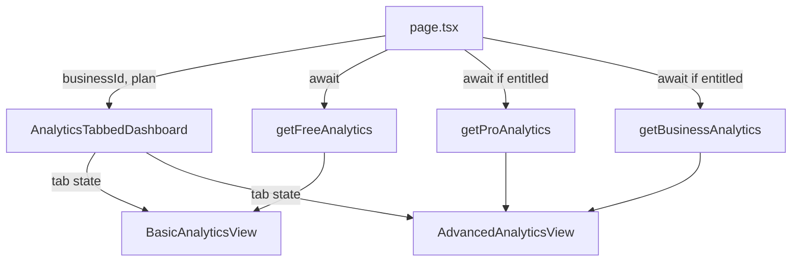

# Design Document: Analytics Redesign

## Overview

Replace the vertically stacked three-section analytics layout with a tabbed interface that separates "Basic" (all plans) from "Advanced" (paid plans). The redesign is a UI-only change — existing query functions, types, and caching remain untouched.

The current `AnalyticsDashboard` renders all three tiers (free, pro, business) stacked vertically with section headings and `Suspense` boundaries. The new design collapses this into two tabs:

- **Basic** — renders `FreeAnalyticsData` metrics in a responsive card grid (available to all plans)
- **Advanced** — combines pro performance analytics and business operations analytics into a single gated view

Users switch between views using a `Tabs` component (desktop) or a `Select` combobox (mobile < 640px). Free-plan users who select "Advanced" see `PremiumContentBlur` instead of live data.

## Architecture

### Component Tree

```
AnalyticsPage (server component - page.tsx)
└── DashboardPage + PageHeader (shared wrappers)
    └── AnalyticsTabbedDashboard (client component - tab state)
        ├── AnalyticsNavSelector (Tabs | Select based on viewport)
        ├── BasicAnalyticsView (server component, always rendered)
        │   └── AnalyticsFreePanel (existing)
        └── AdvancedAnalyticsView (server component, conditionally rendered)
            ├── [if gated] PremiumContentBlur
            └── [if accessible]
                ├── AnalyticsProPanel (existing - Performance section)
                └── AnalyticsBusinessPanel (existing - Operations section)
```

### Data Flow



### Rendering Strategy

The page server component fetches data upfront based on entitlements:
1. `getFreeAnalytics` is always called (needed for Basic view)
2. `getProAnalytics` and `getBusinessAnalytics` are called only when `hasFeatureAccess` passes
3. Data is passed as props to the client-shell `AnalyticsTabbedDashboard`
4. Tab switching is purely client-side — no re-fetches on tab change (Req 5.6)

Both views are rendered in the DOM but only the active tab is visible (CSS display toggle or conditional rendering within the client component). This satisfies the 300ms switching requirement without network round-trips.

## Components and Interfaces

### AnalyticsTabbedDashboard (Client Component)

```typescript
"use client";

type AnalyticsTabbedDashboardProps = {
  basicContent: React.ReactNode;
  advancedContent: React.ReactNode;
  defaultTab?: "basic" | "advanced";
};
```

Responsibilities:
- Manages active tab state (`"basic" | "advanced"`)
- Renders `AnalyticsNavSelector` for tab/combobox switching
- Shows/hides content panels based on active tab
- Defaults to "basic" on initial load (Req 1.4)
- No-ops when selecting the already-active tab (Req 1.5)

### AnalyticsNavSelector (Client Component)

```typescript
type AnalyticsNavSelectorProps = {
  activeTab: "basic" | "advanced";
  onTabChange: (tab: "basic" | "advanced") => void;
};
```

Responsibilities:
- Renders shadcn/ui `Tabs` (TabsList + TabsTrigger) at ≥ 640px
- Renders shadcn/ui `Select` (combobox) at < 640px
- Uses a media query or container query for responsive fallback
- Labels: "Basic" and "Advanced" in that order (Req 1.1)
- Active state uses distinct visual treatment (Req 1.3)

### BasicAnalyticsView

Wraps existing `AnalyticsFreePanel` within a responsive grid container:
- 1 column < 640px
- 2 columns 640px–1024px  
- 3+ columns > 1024px (Req 2.4)

No entitlement check — always accessible (Req 2.2).

### AdvancedAnalyticsView

Server component that either renders:
- `PremiumContentBlur` with skeleton placeholder + upgrade CTA (free plan)
- Pro + Business panels (paid plans)

Entitlement checks:
- Performance section: `hasFeatureAccess(plan, "analyticsConversion")`
- Operations section: `hasFeatureAccess(plan, "analyticsWorkflow")`

### Existing Components (Reused As-Is)

| Component | Purpose |
|-----------|---------|
| `AnalyticsFreePanel` | Metric cards for free-tier data |
| `AnalyticsProPanel` | Trend charts, funnel, form table |
| `AnalyticsBusinessPanel` | Workflow timing, alerts, follow-ups, revenue, AI |
| `PremiumContentBlur` | Paywall overlay with upgrade action |
| `DashboardPage` / `PageHeader` | Shared layout wrappers |

## Data Models

No new data models are introduced. The feature consumes existing types directly:

| Type | Source | Used In |
|------|--------|---------|
| `FreeAnalyticsData` | `features/analytics/types` | BasicAnalyticsView |
| `ProAnalyticsData` | `features/analytics/types` | AdvancedAnalyticsView |
| `BusinessAnalyticsData` | `features/analytics/types` | AdvancedAnalyticsView |
| `BusinessPlan` | `lib/plans/plans` | Entitlement checks |

Query functions remain unchanged:
- `getFreeAnalytics(businessId)` — retains `"use cache"` + `hotBusinessCacheLife` + `getBusinessAnalyticsCacheTags`
- `getProAnalytics(businessId)` — same caching
- `getBusinessAnalytics(businessId)` — same caching

No transformation layer is added between query results and component props (Req 6.2).

## Error Handling

| Scenario | Behavior |
|----------|----------|
| Query function throws | Page renders error boundary / error indication without crashing (Req 2.5, 6.4). Use React error boundary or try/catch in the server component with a graceful fallback UI. |
| Zero analytics events | Metrics render as `0` or `0.0%` — no empty/error state (Req 2.3, 3.5) |
| Entitlement check fails (free plan) | Advanced tab shows `PremiumContentBlur` with upgrade CTA (Req 3.2, 4.3) |
| Subscription changes mid-session | Reflected on next full page load via cache revalidation (Req 4.4) |
| Slow data loading (> 3s) | `Suspense` boundaries with skeleton fallbacks for advanced sections (Req 3.6) |

Error propagation from query functions is preserved — no wrapping or suppression (Req 6.4).

## Testing Strategy

### Why Property-Based Testing Does Not Apply

This feature is a **UI layout refactor** with no new business logic, data transformations, parsers, or algorithms. The work involves:
- Swapping a stacked layout for tabs (rendering)
- Client-side tab state management (trivial toggle)
- Entitlement gating (calling existing `hasFeatureAccess`)
- Responsive breakpoint behavior (CSS/media queries)

There is no meaningful "for all inputs X, property P(X) holds" statement to make. The inputs are fixed data shapes from existing queries, and the outputs are rendered React trees. PBT would add cost without finding bugs that example-based tests miss.

### Testing Approach

**Component Tests** (Vitest + Testing Library):
1. `AnalyticsTabbedDashboard` renders Basic view by default
2. Clicking "Advanced" tab switches to Advanced content
3. Selecting already-active tab causes no re-render
4. Mobile viewport renders Select instead of Tabs
5. Free plan shows `PremiumContentBlur` in Advanced view
6. Pro plan shows Performance + Operations sections
7. Error state renders fallback UI without crashing

**Integration Tests** (existing suite — no modification needed):
- Verify analytics queries continue to work with same signatures
- Verify cache tags and cache life are preserved
- Verify business-scoped data isolation

**E2E Smoke Test** (Playwright):
1. Navigate to analytics page → Basic tab active, metrics visible
2. Switch to Advanced tab → content changes without page reload
3. Free-plan user sees upgrade prompt on Advanced tab
4. Responsive: mobile viewport shows combobox selector

### Test Configuration
- Component tests use `vitest` with `@testing-library/react`
- No property-based testing library needed
- Tests focus on user-visible behavior, not implementation details
