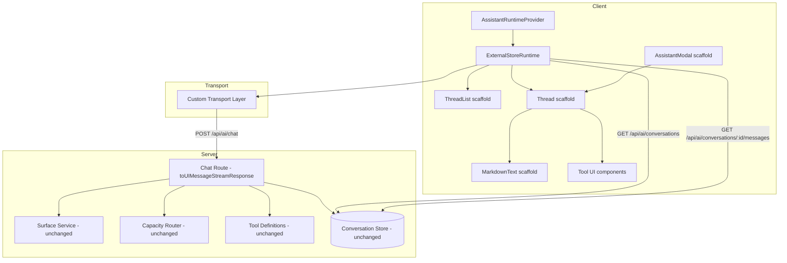

# Design Document: Assistant UI Migration

## Overview

This design migrates Requo's AI assistant from a custom SSE streaming protocol and bespoke chat UI to [assistant-ui](https://www.assistant-ui.com/) (`@assistant-ui/react`, `@assistant-ui/react-ai-sdk`, `@assistant-ui/react-markdown`). The migration replaces:

1. **Custom SSE stream encoding/decoding** — replaced by `toUIMessageStreamResponse()` from Vercel AI SDK, which assistant-ui natively consumes.
2. **Custom chat panel components** (`ai-chat-panel.tsx`, `ai-chat-popover.tsx`, `assistant-full-page.tsx`) — replaced by assistant-ui's Thread, ThreadList, and AssistantModal primitives wrapped in scaffold components.
3. **Custom message rendering and streaming logic** — replaced by assistant-ui's built-in incremental rendering and `@assistant-ui/react-markdown`.
4. **Custom conversation state management** — replaced by `ExternalStoreRuntime` backed by the existing Conversation_Store (PostgreSQL via Drizzle).

All server-side logic (capacity router, surface context builder, tool definitions, DB schema, access control) is preserved unchanged. The migration boundary is the streaming wire format and client-side rendering layer.

### Key Design Decisions

| Decision | Choice | Rationale |
|----------|--------|-----------|
| Runtime adapter | `ExternalStoreRuntime` (not AI SDK runtime) | Requo already owns conversation state in PostgreSQL; ExternalStoreRuntime lets us keep that store as source of truth while rendering through assistant-ui |
| Stream format | `toUIMessageStreamResponse()` | Native format for assistant-ui; eliminates custom SSE parser; produced by Vercel AI SDK's `streamText()` already in use |
| Tool UI registration | `makeAssistantToolUI` | Component-based registration per tool name; clean separation; supports action confirmation pattern |
| Markdown rendering | `@assistant-ui/react-markdown` | First-party integration with assistant-ui message parts; GFM support; customizable components |
| Thread list | `ExternalStoreThreadListAdapter` | Multi-thread support backed by existing `/api/ai/conversations` endpoint |

## Architecture



### Data Flow

1. User types message → Composer submits → `ExternalStoreRuntime.onNew()` is called
2. Transport layer sends POST to `/api/ai/chat` with surface metadata
3. Chat route validates, authenticates, builds context, streams via `toUIMessageStreamResponse()`
4. assistant-ui runtime receives UI message stream → incremental token rendering in Thread
5. On stream completion, transport updates local message state → ExternalStoreRuntime re-renders
6. Conversation history loaded from existing CRUD endpoints on mount and thread switch

## Components and Interfaces

### Runtime Provider (`features/ai/components/assistant-runtime-provider.tsx`)

```typescript
"use client";

import { useExternalStoreRuntime, AssistantRuntimeProvider } from "@assistant-ui/react";
import type { ThreadMessageLike, AppendMessage } from "@assistant-ui/react";
import type { ReactNode } from "react";
import type { AiSurface, AiMessage, AiConversation } from "@/features/ai/types";

type AssistantRuntimeProviderProps = {
  children: ReactNode;
  surface: AiSurface;
  entityId: string;
  businessSlug: string;
  businessId: string;
  userId: string;
  hasAccess: boolean;
};

// Converts Conversation_Store messages to assistant-ui format
function convertMessage(message: AiMessage): ThreadMessageLike {
  return {
    id: message.id,
    role: message.role,
    content: [{ type: "text", text: message.content }],
    createdAt: new Date(message.createdAt),
    status: mapMessageStatus(message.status),
  };
}

function mapMessageStatus(status: AiMessage["status"]): ThreadMessageLike["status"] {
  switch (status) {
    case "completed": return { type: "complete" };
    case "generating": return { type: "running" };
    case "failed": return { type: "incomplete", reason: "error" };
  }
}
```

### Transport Layer (`features/ai/transport.ts`)

```typescript
"use client";

import type { AiSurface } from "@/features/ai/types";

export type ChatTransportConfig = {
  surface: AiSurface;
  entityId: string;
  businessSlug: string;
  conversationId: string | null;
};

export async function sendChatMessage(config: ChatTransportConfig, message: string): Promise<Response> {
  const response = await fetch("/api/ai/chat", {
    method: "POST",
    headers: { "Content-Type": "application/json" },
    body: JSON.stringify({
      message,
      surface: config.surface,
      entityId: config.entityId,
      businessSlug: config.businessSlug,
      conversationId: config.conversationId,
    }),
  });

  if (!response.ok) {
    // Propagate typed errors for assistant-ui error handling
    const errorBody = await response.json().catch(() => ({ error: "Unknown error" }));
    throw new TransportError(response.status, errorBody.error);
  }

  return response; // Stream body consumed by assistant-ui
}

export class TransportError extends Error {
  constructor(public status: number, message: string) {
    super(message);
    this.name = "TransportError";
  }
}
```

### Chat Route Migration (`app/api/ai/chat/route.ts`)

The route handler changes only the response encoding:

```typescript
// Before (custom SSE):
// controller.enqueue(encodeStreamEvent({ type: "delta", value: chunk }));
// controller.enqueue(encodeStreamEvent({ type: "done", truncated: false }));

// After (Vercel AI SDK native):
import { streamText, toUIMessageStreamResponse } from "ai";

// ... (all existing auth, access control, context building, model selection unchanged)

const result = streamText({
  model: wrappedModel,
  system: systemPrompt,
  messages: aiMessages,
  tools,
  maxRetries: 0,
  stopWhen: tools ? stepCountIs(5) : undefined,
  temperature: 0.2,
  maxOutputTokens,
  abortSignal: AbortSignal.timeout(30_000),
  onFinish: async ({ text, usage }) => {
    // Persist completed assistant message (existing logic)
    await updateAiAssistantMessage({
      conversationId: authorizedConversation.id,
      messageId: assistantMessage.id,
      content: text,
      provider,
      model,
      status: "completed",
      metadata: { latencyMs: Date.now() - startedAt, ...usage },
    });
  },
});

return toUIMessageStreamResponse(result);
```

### Scaffold Components (`components/assistant-ui/`)

| File | Purpose |
|------|---------|
| `thread.tsx` | Wraps Thread primitive with Requo design tokens |
| `thread-list.tsx` | Wraps ThreadList with conversation entry rendering |
| `markdown-text.tsx` | Configures `@assistant-ui/react-markdown` with GFM + Requo typography |
| `tool-fallback.tsx` | Renders unrecognized tool calls as read-only JSON card |
| `assistant-modal.tsx` | Wraps AssistantModal for collapsible side-panel variant |

### Tool UI Components (`features/ai/components/tool-ui/`)

| File | Tools Handled |
|------|---------------|
| `action-tool-ui.tsx` | `draft_quote`, `draft_inquiry`, `schedule_follow_up`, `update_inquiry_status` |
| `data-tool-ui.tsx` | `list_inquiries`, `get_quote_details`, `search_inquiries`, etc. |

Registration pattern:

```typescript
import { makeAssistantToolUI } from "@assistant-ui/react";

export const DraftQuoteToolUI = makeAssistantToolUI({
  toolName: "draft_quote",
  render: ({ args, result, status }) => {
    // Renders confirmation card with payload summary
    // Shows "Confirm" button → calls /api/ai/actions on click
    // Shows loading state while executing
    // Shows success/error state after completion
  },
});
```

### Surface Detection Hook (`features/ai/hooks/use-ai-surface.ts`)

```typescript
"use client";

import { usePathname } from "next/navigation";
import type { AiSurface } from "@/features/ai/types";

type SurfaceResolution = {
  surface: AiSurface;
  entityId: string;
};

export function useAiSurface(businessId: string): SurfaceResolution {
  const pathname = usePathname();
  
  // Match: /businesses/<slug>/inquiries/<id>
  const inquiryMatch = pathname.match(/\/businesses\/[^/]+\/inquiries\/([^/]+)/);
  if (inquiryMatch) return { surface: "inquiry", entityId: inquiryMatch[1] };
  
  // Match: /businesses/<slug>/quotes/<id>
  const quoteMatch = pathname.match(/\/businesses\/[^/]+\/quotes\/([^/]+)/);
  if (quoteMatch) return { surface: "quote", entityId: quoteMatch[1] };
  
  // Default: dashboard scoped to business
  return { surface: "dashboard", entityId: businessId };
}
```

## Data Models

No schema changes. The existing data model is preserved:

### Existing Tables (unchanged)

```
ai_conversations
├── id: uuid (PK)
├── userId: uuid (FK → users)
├── businessId: uuid (FK → businesses)
├── surface: enum("inquiry" | "quote" | "dashboard")
├── entityId: text
├── title: text | null
├── isDefault: boolean
├── lastMessageAt: timestamp | null
├── createdAt: timestamp
└── updatedAt: timestamp

ai_messages
├── id: uuid (PK)
├── conversationId: uuid (FK → ai_conversations)
├── role: enum("user" | "assistant" | "system")
├── content: text
├── provider: text | null
├── model: text | null
├── status: enum("completed" | "generating" | "failed")
├── metadata: jsonb
├── createdAt: timestamp
└── updatedAt: timestamp
```

### Message Format Mapping

| Conversation_Store field | assistant-ui ThreadMessageLike field |
|--------------------------|--------------------------------------|
| `id` | `id` |
| `role` | `role` |
| `content` | `content[0].text` (TextContentPart) |
| `status: "completed"` | `status: { type: "complete" }` |
| `status: "generating"` | `status: { type: "running" }` |
| `status: "failed"` | `status: { type: "incomplete", reason: "error" }` |
| `createdAt` | `createdAt` (Date) |
| `metadata` | Mapped to tool-call parts when applicable |

### Thread List Adapter Shape

```typescript
type ExternalStoreThreadListAdapter = {
  threads: Array<{ id: string; title: string; lastMessageAt: Date | null }>;
  currentThreadId: string | null;
  onSwitchThread: (threadId: string) => void;
  onNewThread: () => void;
  onDeleteThread: (threadId: string) => void;
};
```


## Correctness Properties

*A property is a characteristic or behavior that should hold true across all valid executions of a system — essentially, a formal statement about what the system should do. Properties serve as the bridge between human-readable specifications and machine-verifiable correctness guarantees.*

### Property 1: Surface detection resolves correctly for all valid URL paths

*For any* URL path matching the pattern `/businesses/<slug>/inquiries/<id>`, the surface detector SHALL return `{ surface: "inquiry", entityId: <id> }`. *For any* URL path matching `/businesses/<slug>/quotes/<id>`, it SHALL return `{ surface: "quote", entityId: <id> }`. *For any* URL path not matching either pattern, it SHALL return `{ surface: "dashboard", entityId: businessId }`.

**Validates: Requirements 1.2, 8.1, 8.2**

### Property 2: Message format mapping preserves all fields

*For any* valid `AiMessage` from the Conversation_Store (with role in `["user", "assistant", "system"]`, status in `["completed", "generating", "failed"]`, content as any string, and createdAt as a valid ISO timestamp), the `convertMessage` function SHALL produce a `ThreadMessageLike` where: the `id` matches, the `role` matches, the text content equals the original `content`, the `createdAt` is the same instant, and the `status` maps correctly (`completed` → `{ type: "complete" }`, `generating` → `{ type: "running" }`, `failed` → `{ type: "incomplete", reason: "error" }`).

**Validates: Requirements 1.5**

### Property 3: Transport request contains required metadata and excludes sensitive fields

*For any* message string of 1–6000 characters and valid transport config (surface, entityId, businessSlug, conversationId), the transport request body SHALL contain `message`, `surface`, `entityId`, `businessSlug`, and `conversationId` fields, and SHALL NOT contain any field named `systemPrompt`, `surfaceInstructions`, `modelConfig`, `apiKey`, or `tools`.

**Validates: Requirements 2.1, 2.2, 2.6**

### Property 4: Chat route rejects invalid request bodies

*For any* request body that fails `aiChatRequestSchema` validation (missing required fields, invalid surface values, message exceeding length, etc.), the Chat_Route SHALL return HTTP 400. *For any* request body that passes `aiChatRequestSchema` validation with a valid session, the Chat_Route SHALL NOT return HTTP 400 for schema reasons.

**Validates: Requirements 3.10**

### Property 5: Conversation list ordering is correct

*For any* array of conversations with `lastMessageAt` timestamps, the ThreadList display order SHALL be sorted by `lastMessageAt` descending, with conversations having null `lastMessageAt` appearing at the top sorted by `createdAt` descending.

**Validates: Requirements 5.1**

### Property 6: Text truncation preserves prefix and respects length limits

*For any* string, truncating to N characters SHALL produce output of length ≤ N, and if the original string length ≤ N, the output SHALL equal the original. If the original string length > N, the output SHALL be a prefix of the original (up to N-3 characters) followed by "...".

**Validates: Requirements 5.6, 5.7**

### Property 7: Markdown HTML sanitization strips disallowed tags

*For any* markdown string containing HTML tags, the rendered output SHALL not contain `<script>`, `<iframe>`, `<object>`, `<embed>`, `<form>`, `<input>`, `<style>`, or `<link>` elements. Safe text content within those tags SHALL be preserved.

**Validates: Requirements 9.7**

## Error Handling

### Transport Layer Errors

| HTTP Status | Error Type | User-Facing Behavior |
|-------------|-----------|---------------------|
| 401 | Unauthenticated | Display "session expired" message, disable composer |
| 403 | No plan access | Display upgrade prompt, disable composer |
| 429 | Rate limited | Display "too many requests, retry in 60s", disable composer temporarily |
| 400 | Validation error | Display "request was invalid" message |
| Network error | Connection lost | Display connection error, preserve partial content |
| Stream abort | Connection dropped | Preserve any partially received content, show error |

### Runtime Provider Errors

| Condition | Behavior |
|-----------|----------|
| No authenticated session | Render primitives in disabled state (`isDisabled: true`) |
| Database query failure | Show error indication, set `isSendDisabled: true` |
| Empty conversation history | Initialize empty thread (no error) |
| Surface context build failure | Server returns error in stream, displayed as failed message |

### Tool UI Errors

| Condition | Behavior |
|-----------|----------|
| Tool execution fails (non-2xx) | Show error card with reason + "Retry" button |
| Network error during tool execution | Show connection error + "Retry" button |
| Unrecognized tool name | Render `tool-fallback.tsx` with tool name and JSON args |

### Chat Route Errors

| Condition | Response |
|-----------|----------|
| All fallback models exhausted | Persist assistant message with `status: "failed"`, include error in stream |
| Stream error (non-rate-limit) | Persist partial content with `status: "failed"` |
| Rate limit during stream | Try next model; if all fail, persist `status: "failed"` |
| `buildAiSurfaceContext()` returns null | Return error in stream, do not call AI provider |

## Testing Strategy

### Property-Based Tests (fast-check, minimum 100 iterations each)

Property-based testing applies to the pure logic layers of this migration:

- **Surface URL parsing** — pure function with large input space (any URL path)
- **Message format conversion** — pure transformation with varied input shapes
- **Transport request construction** — pure function building request body
- **Request body validation** — schema validation with random inputs
- **Conversation sorting** — pure ordering logic
- **Text truncation** — pure string manipulation
- **HTML sanitization** — security-critical content transformation

Each property test will use `fast-check` with minimum 100 iterations and reference its design property:

```typescript
// Tag format example:
// Feature: assistant-ui-migration, Property 1: Surface detection resolves correctly
```

### Unit Tests (example-based)

- Transport error propagation (401, 403, 429, 400 scenarios)
- Runtime provider disabled state when unauthenticated
- Thread list fallback title derivation
- Tool UI confirmation flow (pending → success / error)
- Panel open/close session state persistence

### Component Tests

- Thread rendering with markdown content
- Composer input constraints (4000 char limit, Enter/Shift+Enter)
- Tool UI card rendering for each action tool
- Tool UI data display for read-only tools
- AssistantModal toggle behavior
- ThreadList entry rendering

### Integration Tests

- Chat route authentication enforcement
- Chat route business-scoping validation
- Chat route rate limiting
- Stream format verification (`toUIMessageStreamResponse()` content-type)
- Message persistence during streaming
- Conversation CRUD operations through runtime

### End-to-End Tests

- Send message and receive streamed response
- Switch between conversations
- Create and delete conversations
- Tool call confirmation flow
- Panel collapse/expand across navigation

### What Is NOT Tested with PBT

- UI rendering and layout (component tests instead)
- Server-side AI model routing (existing integration tests)
- External API behavior (mocked in integration tests)
- Session/timing requirements (integration tests)
- Tool execution side effects (example-based mocks)
