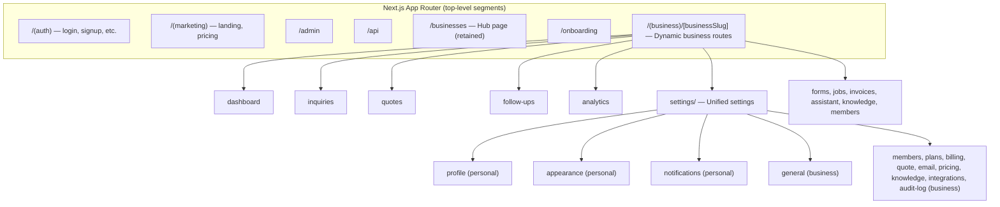

# Design Document: Business Routing Refactor

## Overview

This design covers promoting business slugs to top-level route segments (`/acme/dashboard` instead of `/businesses/acme/dashboard`), introducing an enhanced Attio-style business switcher dropdown, a dedicated new business creation page, a unified settings area consolidating personal and business settings, and navigation cleanup.

The refactor is primarily a **routing and UI shell change** — it does not alter underlying business logic, billing, or data models. The key architectural challenge is disambiguating top-level dynamic `[businessSlug]` segments from reserved static routes (auth, marketing, api, etc.) without a middleware file (the project currently has none).

### Design Decisions

1. **Catch-all via route group + `params` lookup** — Use a top-level `app/(business)/[businessSlug]/` route group rather than middleware-based rewriting. Next.js App Router's file-system routing naturally resolves static segments before dynamic ones, giving reserved routes priority.
2. **Reserved slug allowlist in shared constant** — A single `RESERVED_ROUTE_SEGMENTS` set in `lib/routing/reserved-segments.ts` is used at slug validation time (DB writes) and at route resolution time (404 logic).
3. **Legacy redirects via route handlers** — Place `app/businesses/[slug]/[...path]/route.ts` catch-all redirect handlers that issue 308s to the new `/${slug}/...` paths. Similarly for `/account/...` → `/${slug}/settings/...`.
4. **Unified settings as nested layout** — The settings area lives inside `app/(business)/[businessSlug]/settings/` with a dedicated `SettingsSidebar` layout that groups personal and business items.
5. **Business switcher enhancement in-place** — The existing `BusinessSwitcher` component in `components/shell/dashboard-shell.tsx` is extended with additional menu actions rather than replaced.

## Architecture



### Route Resolution Order

Next.js resolves routes by file-system precedence:
1. Static segments and route groups (`(auth)`, `(marketing)`, `admin`, `api`, `businesses`, `onboarding`, `invite`, `account`, `verify-email`, `(public)`) match first.
2. The dynamic `(business)/[businessSlug]` segment matches only if no static segment matched.
3. Inside the `[businessSlug]` layout, the server looks up the slug in the database. If not found → 404.

### Legacy Redirect Strategy

| Legacy Path | Redirect Target | HTTP Code |
|---|---|---|
| `/businesses/:slug/*` | `/:slug/*` | 308 |
| `/account/profile` | `/:activeSlug/settings/profile` | 308 |
| `/account/security` | `/:activeSlug/settings/security` | 308 |
| `/account/billing` | `/:activeSlug/settings/billing` | 308 |

The `:activeSlug` is resolved from `user_recent_businesses` (most recent `lastOpenedAt`), falling back to the user's first business alphabetically by slug.

## Components and Interfaces

### 1. Reserved Segments Module

**File:** `lib/routing/reserved-segments.ts`

```typescript
export const RESERVED_ROUTE_SEGMENTS = new Set([
  "login", "signup", "forgot-password", "reset-password", "check-email",
  "pricing", "privacy", "terms", "refund-policy",
  "onboarding", "admin", "api", "invite", "account", "verify-email",
  "businesses", "quote", "inquire", "not-found",
  // Well-known paths
  ".well-known",
]) as ReadonlySet<string>;

export function isReservedRouteSegment(segment: string): boolean {
  return RESERVED_ROUTE_SEGMENTS.has(segment);
}
```

### 2. Business Slug Validation (Enhanced)

**File:** `features/businesses/validation.ts` (new)

Extends the existing `createBusinessSchema` to reject reserved segments:

```typescript
import { isReservedRouteSegment } from "@/lib/routing/reserved-segments";

export function validateBusinessSlug(slug: string): { valid: boolean; error?: string } {
  if (!publicSlugRegex.test(slug)) {
    return { valid: false, error: "Slug must contain only lowercase letters, numbers, and hyphens." };
  }
  if (isReservedRouteSegment(slug)) {
    return { valid: false, error: "This slug is unavailable — it conflicts with a system route." };
  }
  return { valid: true };
}
```

### 3. Enhanced Business Switcher

**File:** `components/shell/dashboard-shell.tsx` (modified `BusinessSwitcher`)

New dropdown menu structure:

```
┌─────────────────────────────┐
│ Switch business             │
├─────────────────────────────┤
│ ✓ Acme Plumbing  /acme  owner │
│   Beta Corp      /beta  staff  │
│   [Locked] Gamma /gamma owner │
├─────────────────────────────┤
│ + New business              │
├─────────────────────────────┤
│ ⚙ Business settings        │
│ 👤 Account settings         │
│ 👥 Invite team members      │
├─────────────────────────────┤
│ ↩ Sign out                  │
└─────────────────────────────┘
```

Props remain the same (`currentBusiness`, `memberships`). Additional actions use existing route helpers updated for new path structure.

### 4. New Business Creation Page

**File:** `app/(business)/[businessSlug]/new-business/page.tsx` or `app/businesses/new/page.tsx`

**Decision:** Place at `app/businesses/new/page.tsx` since it's accessed from the hub and doesn't require an active business context.

Components:
- `CreateBusinessForm` (existing, reused from `features/businesses/components/create-business-form.tsx`)
- `UpgradePrompt` (existing, shown when quota exceeded)
- Page wraps these in a standalone layout similar to the hub page header.

### 5. Unified Settings Layout

**File:** `app/(business)/[businessSlug]/settings/layout.tsx`

```typescript
// Renders a two-column layout:
// Left: SettingsSidebar with Personal + Business groups
// Right: children (active settings page)
```

**Navigation helper:** `features/settings/navigation.ts`

```typescript
export function getUnifiedSettingsNavigation(slug: string): SettingsNavigationGroup[] {
  return [
    {
      label: "Personal",
      items: [
        { href: `/${slug}/settings/profile`, label: "Profile", icon: "user" },
        { href: `/${slug}/settings/appearance`, label: "Appearance", icon: "palette" },
        { href: `/${slug}/settings/notifications`, label: "Notifications", icon: "bell" },
      ],
    },
    {
      label: "Business",
      items: [
        { href: `/${slug}/settings/general`, label: "General", icon: "building" },
        { href: `/${slug}/settings/members`, label: "Members", icon: "users" },
        { href: `/${slug}/settings/plans`, label: "Plans", icon: "credit-card" },
        { href: `/${slug}/settings/billing`, label: "Billing", icon: "receipt" },
        { href: `/${slug}/settings/quote`, label: "Quote defaults", icon: "file-text" },
        { href: `/${slug}/settings/email`, label: "Email", icon: "mail" },
        { href: `/${slug}/settings/pricing`, label: "Pricing", icon: "tag" },
        { href: `/${slug}/settings/knowledge`, label: "Knowledge", icon: "book" },
        { href: `/${slug}/settings/integrations`, label: "Integrations", icon: "plug" },
        { href: `/${slug}/settings/audit-log`, label: "Audit log", icon: "scroll" },
      ],
    },
  ];
}
```

### 6. Route Path Helpers (Updated)

**File:** `features/businesses/routes.ts` — Update `getBusinessPath` to return `/${slug}` instead of `/businesses/${slug}`.

```typescript
export function getBusinessPath(slug: string) {
  return `/${slug}`;
}
```

All downstream helpers (`getBusinessDashboardPath`, `getBusinessSettingsPath`, etc.) automatically resolve correctly since they compose on `getBusinessPath`.

### 7. Legacy Redirect Route Handlers

**File:** `app/businesses/[slug]/[...path]/route.ts`

```typescript
import { redirect } from "next/navigation";

export async function GET(
  _request: Request,
  { params }: { params: Promise<{ slug: string; path: string[] }> }
) {
  const { slug, path } = await params;
  redirect(`/${slug}/${path.join("/")}`, 308);
}
```

**File:** `app/account/[...path]/route.ts` (for legacy account redirects)

Resolves active business slug from session + recent businesses, then redirects.

## Data Models

No schema changes are required. The existing `businesses` table already has:
- `slug` column with unique index and format check constraint (`^[a-z0-9-]+$`)
- `user_recent_businesses` table for resolving most-recently-active business

The only data-layer addition is a validation check against `RESERVED_ROUTE_SEGMENTS` in the business creation/update mutation paths (`features/businesses/mutations.ts`).

## Correctness Properties

*A property is a characteristic or behavior that should hold true across all valid executions of a system — essentially, a formal statement about what the system should do. Properties serve as the bridge between human-readable specifications and machine-verifiable correctness guarantees.*

### Property 1: Legacy business URL redirect computation

*For any* valid business slug and any valid sub-path, the legacy redirect from `/businesses/${slug}/${subpath}` SHALL produce a 308 redirect to `/${slug}/${subpath}` with an identical path suffix.

**Validates: Requirements 1.3**

### Property 2: Reserved path segments take priority over business slugs

*For any* segment in the reserved route segments set, attempting to resolve it as a business slug SHALL fail, and the router SHALL serve the reserved route content regardless of whether a business with that slug exists in the database.

**Validates: Requirements 1.5, 1.6**

### Property 3: Non-existing, non-reserved slugs return 404

*For any* URL segment that is not in the reserved segments set and does not match an existing business slug in the database, the router SHALL return a 404 Not Found response.

**Validates: Requirements 1.7**

### Property 4: Slug collision rejection on create/update

*For any* reserved route segment, attempting to create or update a business with that segment as slug SHALL be rejected with an error indicating the slug is unavailable.

**Validates: Requirements 1.8**

### Property 5: Business switcher renders complete membership list

*For any* list of business memberships (up to 50), the business switcher dropdown SHALL render an entry for each membership containing the business name, slug, member role, and a checkmark indicator on the currently active business.

**Validates: Requirements 2.2**

### Property 6: Quota exceeded blocks business creation

*For any* user whose owned business count equals or exceeds their plan's business limit, the new business page SHALL display an upgrade prompt and SHALL NOT render the creation form.

**Validates: Requirements 3.5**

### Property 7: Invalid business creation input produces field-level errors

*For any* combination of invalid form inputs (name outside 2–80 characters, missing currency, or missing template), the creation form SHALL display inline error messages for each invalid field without navigating away.

**Validates: Requirements 3.6**

### Property 8: Slug generation produces valid URL-safe slugs

*For any* valid business name (2–80 characters), the auto-generated slug SHALL match the pattern `^[a-z0-9-]+$`, be derived from the lowercased name, and not exceed 64 characters.

**Validates: Requirements 3.7**

### Property 9: Account settings legacy redirect uses active business

*For any* account settings path (profile, security, billing) and any authenticated user, the redirect SHALL target `/${mostRecentSlug}/settings/${section}` using the user's most recently opened business, falling back to the first business alphabetically by slug when no recent business exists.

**Validates: Requirements 4.7, 4.8**

### Property 10: Sidebar contains exactly the specified workflow links

*For any* rendered business dashboard sidebar, the main navigation SHALL contain exactly these items in order: Dashboard, Inquiries, Quotes, Follow-ups, Analytics, Forms, Jobs, Invoices, Assistant, Knowledge — with no standalone Settings link.

**Validates: Requirements 5.1, 5.2, 5.5**

## Error Handling

| Scenario | Handling |
|---|---|
| Business slug not found in DB | Return 404 via `notFound()` in the `[businessSlug]` layout |
| User not a member of business | Redirect to `/businesses` hub (existing `getAppShellContext` behavior) |
| Reserved slug collision on create | Return field-level validation error: "This slug is unavailable" |
| Legacy redirect with no session | Redirect to login (existing `requireSession` behavior) |
| Account redirect with no businesses | Redirect to `/onboarding` (existing behavior for zero-business users) |
| Business creation quota exceeded | Show `UpgradePrompt` component with plan info |
| Business creation server error | Show toast error, preserve form inputs via action state |
| Sign out action failure | Show error toast, remain on current page |

## Testing Strategy

### Property-Based Tests (fast-check)

- **Library:** `fast-check` (already available in the project's test dependencies or easily addable)
- **Minimum iterations:** 100 per property
- **Tag format:** `Feature: business-routing-refactor, Property {N}: {title}`

Properties to implement as PBT:
1. Legacy URL redirect computation (pure function: input slug+path → output URL)
2. Reserved segment priority (set membership check)
3. Slug collision rejection (validation function)
4. Slug generation (pure transformation: name → slug pattern)
5. Account settings redirect computation (pure function: path+slug → target URL)

### Unit Tests (Vitest)

- Business switcher renders all memberships with correct data
- Business switcher shows locked badge for locked businesses
- Business switcher includes all required action items
- New business page shows upgrade prompt when quota exceeded
- New business form validates inputs and shows field errors
- Settings navigation helper returns correct groups and items
- Sidebar renders exactly 10 workflow links with no settings link

### Integration Tests

- Business creation with reserved slug is rejected at DB mutation level
- Legacy `/businesses/:slug/dashboard` issues 308 to `/:slug/dashboard`
- Legacy `/account/profile` issues 308 to `/:slug/settings/profile`
- Non-member accessing `/:slug/dashboard` is redirected to hub
- Non-existing slug at `/:slug/dashboard` returns 404

### E2E Tests (Playwright)

- Sign in → navigate to business via new URL → verify dashboard renders
- Business switcher → switch business → verify navigation
- Business switcher → create new business → verify form and redirect
- Settings area → navigate personal and business sections
- Legacy URL → verify redirect to new URL
