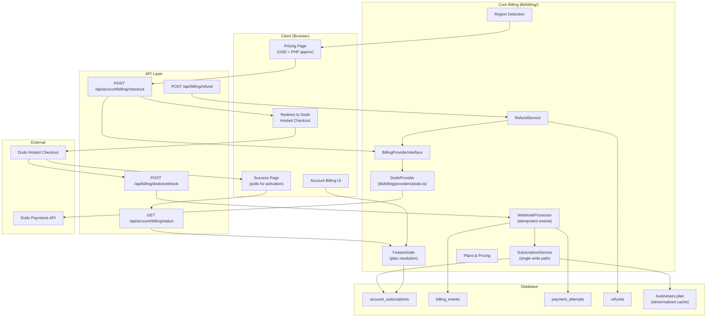

# Design Document

## Overview

Migrate Requo's billing system from Paddle to Dodo Payments. The migration is a full provider swap: remove all Paddle code, reset the billing database, implement Dodo Payments as the sole provider behind a provider-agnostic abstraction, and wire up hosted checkout with Adaptive Currency support for Philippines users.

The system retains the existing account-scoped subscription model (one `account_subscriptions` row per user, all owned businesses inherit the plan via the denormalized `businesses.plan` column). The `lib/billing/subscription-service.ts` single write path is preserved. The checkout flow changes from Paddle's inline/overlay model to Dodo's hosted checkout (external redirect → success/cancel URL).

Key architectural changes:

1. **Provider abstraction** — A `BillingProviderInterface` in `lib/billing/providers/interface.ts` defines the contract. `lib/billing/providers/dodo.ts` implements it. The subscription service and webhook processor consume only the interface.
2. **Hosted checkout** — No client-side SDK. The checkout API creates a Dodo session and returns a redirect URL. A new success page polls for webhook confirmation.
3. **Adaptive Currency** — Philippines users see approximate PHP pricing on the marketing page (hardcoded indicative rate). Dodo handles actual PHP conversion at checkout. The schema adds a `PHP` value to `billing_currency` and an `adaptiveCurrency` boolean flag.
4. **Database reset** — A migration script drops all billing tables, recreates them with updated enums (`"dodo"` instead of `"paddle"`, `"PHP"` added to currency), and removes the deprecated `business_subscriptions` table.

Everything lives under existing locations:

- `lib/billing/` — types, plans, region, subscription service, webhook processor, provider abstraction, provider implementations
- `lib/billing/providers/` — `interface.ts` (new), `dodo.ts` (new), `paddle.ts` (deleted)
- `lib/db/schema/subscriptions.ts` — updated enums and table definitions
- `app/api/billing/dodo/webhook/route.ts` — new webhook handler
- `app/api/account/billing/checkout/route.ts` — rewritten for Dodo hosted checkout
- `app/(checkout)/account/billing/checkout/` — success page with polling
- `features/billing/` — updated actions, queries, types, components
- `components/marketing/pricing-page.tsx` — PHP approximation display
- `scripts/` — database reset migration script

## Architecture

### Layered view



### Provider abstraction

The `BillingProviderInterface` defines five methods that any billing provider must implement:

1. `createCheckoutSession` — Creates a hosted checkout and returns a redirect URL or error.
2. `cancelSubscription` — Cancels a subscription at end of period.
3. `requestRefund` — Initiates a full refund for a payment.
4. `verifyWebhookSignature` — Validates incoming webhook authenticity.
5. `parseWebhookEvent` — Normalizes a verified webhook payload into a typed event structure.

The subscription service, webhook processor, and refund service consume only this interface. A factory function `getBillingProvider("dodo")` returns the concrete implementation. This allows adding a second provider in the future without modifying consuming code.

### Checkout flow (hosted redirect)

```
User clicks "Subscribe" on pricing page
  → Client calls POST /api/account/billing/checkout { plan, interval }
  → Server validates session, checks existing subscription
  → Server calls DodoProvider.createCheckoutSession(...)
  → Dodo API returns { payment_link }
  → Server returns { checkoutUrl: payment_link }
  → Client redirects browser to Dodo hosted checkout
  → User completes payment on Dodo's page
  → Dodo redirects to /account/billing/checkout?session_id=xxx
  → Success page polls GET /api/account/billing/status every 3s
  → Webhook arrives → SubscriptionService.activateSubscription(...)
  → Poll detects active status → shows confirmation
```

The cancel flow redirects back to the pricing page with no side effects.

### Webhook processing

The webhook route at `app/api/billing/dodo/webhook/route.ts`:

1. Reads raw body and signature header (`webhook-signature` or per Dodo docs).
2. Calls `DodoProvider.verifyWebhookSignature(rawBody, signature)`.
3. On failure → 401.
4. Calls `DodoProvider.parseWebhookEvent(rawBody)` to get a normalized event.
5. Checks `billing_events` for duplicate `providerEventId` → 200 if duplicate.
6. Inserts `billing_events` row with status `"processing"`.
7. Dispatches to handler based on event type.
8. On success → marks event `"processed"`, returns 200.
9. On failure → marks event `"failed"` with error message, returns 500.
10. On unrecognized event → marks `"ignored"`, returns 200.

Event type mapping:

| Dodo Event | Handler |
|---|---|
| `subscription.active`, `subscription.renewed` | `activateSubscription` |
| `subscription.cancelled` | `updateSubscriptionStatus("canceled")` |
| `subscription.expired` | `expireSubscription` |
| `subscription.past_due`, `subscription.on_hold` | `updateSubscriptionStatus("past_due")` |
| `subscription.created`, `subscription.updated` | Record event, no state change unless status warrants |
| `payment.succeeded` | Record payment attempt (succeeded) |
| `payment.failed` | Record payment attempt (failed) |
| `refund.succeeded` | Update refund row → "approved", cancel subscription |
| `refund.failed` | Update refund row → "failed" |

User resolution: The checkout session passes `metadata.userId` which Dodo includes in webhook payloads. The webhook processor reads this to identify the target user.

### Adaptive Currency

- Region detection uses `x-vercel-ip-country` → `cf-ipcountry` headers. If country is `"PH"`, region is `"PH"`.
- Pricing page shows a hardcoded PHP approximation below USD prices (e.g., "Approx. ₱350/month. Final PHP amount shown at checkout.").
- The exchange rate is a constant in `lib/billing/adaptive-currency.ts`, updated manually.
- At checkout, Dodo's Adaptive Currency feature handles the actual PHP conversion. No separate PHP products are created.
- When a webhook reports `currency: "PHP"`, the subscription row stores `billingCurrency: "PHP"` and `adaptiveCurrency: true`.
- Feature gating is currency-agnostic — same plan access regardless of payment currency.

### Subscription state management

No changes to the core state machine. The subscription service continues to:

- Resolve effective plan: `active`/`past_due` → stored plan; `canceled` with future `currentPeriodEnd` → stored plan; otherwise → `"free"`.
- Sync `businesses.plan` on every status change.
- Enforce active business limits on plan changes.

The only additions are:

- `adaptiveCurrency` boolean column on `account_subscriptions`.
- `"PHP"` added to `billing_currency` enum.
- `"dodo"` replaces `"paddle"` in `billing_provider` enum.

### Feature gating

Feature gates remain provider-independent and local-only (no external API calls). The existing `getEffectivePlanForUser`, `resolveEffectivePlanFromSubscription`, and plan entitlement checks continue to work unchanged. New helper functions are added for the requirements:

- `getCurrentPlan(userId)` — alias for `getEffectivePlanForUser`.
- `hasActiveSubscription(userId)` — checks status is `"active"` or `"past_due"`.
- `canCreateBusiness(userId)` — checks business count vs plan limit.
- `canUseFeature(userId, featureKey)` — checks plan entitlements map.
- `canAccessBillingFeature(userId)` — checks if subscription row exists.
- `canRequestRefund(userId)` — checks for recent succeeded payment without pending/approved refund.

### Refund processing

The refund service is rewritten to use the Dodo Payments refund API instead of Paddle adjustments:

1. Eligibility checks remain the same (ownership, 30-day window, no duplicate, succeeded status).
2. On pass → calls `DodoProvider.requestRefund(providerPaymentId, reason)`.
3. On success → inserts refund row with status `"pending"` and provider refund ID.
4. `refund.succeeded` webhook → updates to `"approved"`, cancels subscription.
5. `refund.failed` webhook → updates to `"failed"`.

The refund table schema changes slightly: `providerAdjustmentId` becomes `providerRefundId`, `providerTransactionId` becomes `providerPaymentId`, and an `amount`/`currency` pair is added.

## Components and Interfaces

### `lib/billing/providers/interface.ts` (new)

```ts
import type { BillingInterval, PaidPlan } from "@/lib/billing/types";

export type CheckoutSessionParams = {
  plan: PaidPlan;
  interval: BillingInterval;
  userId: string;
  userEmail: string;
  successUrl: string;
  cancelUrl: string;
};

export type CheckoutSessionResult =
  | { type: "redirect"; url: string }
  | { type: "error"; message: string };

export type CancelSubscriptionResult = boolean;

export type RefundResult =
  | { type: "ok"; refundId: string; status: "pending" }
  | { type: "error"; message: string };

export type NormalizedEventType =
  | "subscription.activated"
  | "subscription.canceled"
  | "subscription.updated"
  | "subscription.expired"
  | "subscription.past_due"
  | "payment.succeeded"
  | "payment.failed"
  | "refund.succeeded"
  | "refund.failed"
  | "ignored";

export type NormalizedWebhookEvent = {
  eventId: string;
  eventType: NormalizedEventType;
  rawEventType: string;
  payload: {
    userId?: string;
    subscriptionId?: string;
    customerId?: string;
    plan?: string;
    currency?: string;
    status?: string;
    currentPeriodStart?: Date;
    currentPeriodEnd?: Date;
    paymentId?: string;
    amount?: number;
    refundId?: string;
  };
};

export interface BillingProviderInterface {
  createCheckoutSession(params: CheckoutSessionParams): Promise<CheckoutSessionResult>;
  cancelSubscription(providerSubscriptionId: string): Promise<CancelSubscriptionResult>;
  requestRefund(providerPaymentId: string, reason: string): Promise<RefundResult>;
  verifyWebhookSignature(rawBody: string, signatureHeader: string): boolean;
  parseWebhookEvent(rawBody: string): NormalizedWebhookEvent;
}
```

### `lib/billing/providers/dodo.ts` (new)

```ts
import type {
  BillingProviderInterface,
  CheckoutSessionParams,
  CheckoutSessionResult,
  CancelSubscriptionResult,
  RefundResult,
  NormalizedWebhookEvent,
} from "./interface";

export class DodoProvider implements BillingProviderInterface {
  private apiKey: string;
  private webhookSecret: string;
  private environment: "test_mode" | "live_mode";
  private productIds: Record<string, string>;

  constructor(config: DodoProviderConfig) { /* ... */ }

  async createCheckoutSession(params: CheckoutSessionParams): Promise<CheckoutSessionResult> { /* ... */ }
  async cancelSubscription(providerSubscriptionId: string): Promise<CancelSubscriptionResult> { /* ... */ }
  async requestRefund(providerPaymentId: string, reason: string): Promise<RefundResult> { /* ... */ }
  verifyWebhookSignature(rawBody: string, signatureHeader: string): boolean { /* ... */ }
  parseWebhookEvent(rawBody: string): NormalizedWebhookEvent { /* ... */ }
}
```

### `lib/billing/providers/index.ts` (new)

```ts
import type { BillingProviderInterface } from "./interface";
import type { BillingProvider } from "@/lib/db/schema/subscriptions";

export function getBillingProvider(provider: BillingProvider): BillingProviderInterface;
```

### `lib/billing/types.ts` (updated)

```ts
export type BillingRegion = "global" | "PH";

export type PlanPricing = {
  USD: number; // cents
  PHP?: number; // centavos (approximate, for display only)
};
```

### `lib/billing/region.ts` (updated)

```ts
export function getBillingRegion(headers: Headers): BillingRegion;
export function getBillingRegionFromCountry(countryCode: string | null | undefined): BillingRegion;
export function getDefaultCurrency(region: BillingRegion): BillingCurrency;
export function getDefaultProvider(region: BillingRegion): BillingProvider;
export function isPhilippinesRegion(region: BillingRegion): boolean;
```

### `lib/billing/adaptive-currency.ts` (new)

```ts
/** Hardcoded indicative USD→PHP exchange rate for display purposes only. */
export const USD_TO_PHP_RATE = 56.5; // Updated manually

export function getPhpApproximation(usdCents: number): number; // Returns whole pesos
export function formatPhpApproximation(pesos: number): string; // "₱350"
export function getPhpDisclaimer(pesos: number, interval: "monthly" | "yearly"): string;
```

### `lib/billing/feature-gate.ts` (new)

```ts
export async function getCurrentPlan(userId: string): Promise<BusinessPlan>;
export async function hasActiveSubscription(userId: string): Promise<boolean>;
export async function canCreateBusiness(userId: string): Promise<boolean>;
export async function canUseFeature(userId: string, featureKey: string): Promise<boolean>;
export async function canAccessBillingFeature(userId: string): Promise<boolean>;
export async function canRequestRefund(userId: string): Promise<boolean>;
```

### `lib/db/schema/subscriptions.ts` (updated)

```ts
// Enum changes
export const billingProviders = ["dodo"] as const;
export const billingCurrencies = ["USD", "PHP"] as const;
export const refundStatuses = ["pending", "approved", "failed"] as const;

// account_subscriptions additions
adaptiveCurrency: boolean("adaptive_currency").notNull().default(false),

// business_subscriptions — REMOVED entirely

// refunds table — updated columns
providerRefundId: text("provider_refund_id"),
providerPaymentId: text("provider_payment_id").notNull(),
amount: integer("amount").notNull(),
currency: billingCurrencyEnum("currency").notNull(),
// Removed: providerTransactionId, providerAdjustmentId, subscriptionId, businessId, requestedByUserId

// billing_events additions
status: text("status").notNull().default("processing"), // "processing" | "processed" | "failed" | "ignored"
errorMessage: text("error_message"),
// Removed: businessId
```

### `lib/env.ts` (updated)

```ts
// Removed: PADDLE_API_KEY, PADDLE_WEBHOOK_SECRET, PADDLE_PRO_PRICE_ID, etc.
// Added:
DODO_API_KEY: emptyToUndefined(z.string().min(1)),
DODO_WEBHOOK_SECRET: emptyToUndefined(z.string().min(1)),
DODO_ENVIRONMENT: emptyToUndefined(z.enum(["test_mode", "live_mode"])).default("test_mode"),
DODO_PRO_PRODUCT_ID: emptyToUndefined(z.string().min(1)),
DODO_BUSINESS_PRODUCT_ID: emptyToUndefined(z.string().min(1)),
DODO_PRO_YEARLY_PRODUCT_ID: emptyToUndefined(z.string().min(1)),
DODO_BUSINESS_YEARLY_PRODUCT_ID: emptyToUndefined(z.string().min(1)),
NEXT_PUBLIC_APP_URL: emptyToUndefined(z.url()),

// Removed: isPaddleConfigured
// Added:
export const isDodoConfigured = Boolean(
  env.DODO_API_KEY &&
  (env.DODO_PRO_PRODUCT_ID || env.DODO_BUSINESS_PRODUCT_ID ||
   env.DODO_PRO_YEARLY_PRODUCT_ID || env.DODO_BUSINESS_YEARLY_PRODUCT_ID)
);
```

### `app/api/billing/dodo/webhook/route.ts` (new)

```ts
export async function POST(request: Request): Promise<Response>;
// Signature verification → deduplication → dispatch → response
```

### `app/api/account/billing/checkout/route.ts` (rewritten)

```ts
export async function POST(request: Request): Promise<Response>;
// Auth check → validate plan/interval → check existing sub → create Dodo session → return URL
```

### `app/(checkout)/account/billing/checkout/page.tsx` (rewritten)

```ts
// Success page: reads session_id from searchParams, polls for activation
export default function CheckoutSuccessPage({ searchParams }): JSX.Element;
```

### `features/billing/actions.ts` (updated)

```ts
// Removed: createCheckoutAction (Paddle transaction creation)
// Updated: cancelSubscriptionAction (uses provider interface)
// Kept: getCheckoutStatusAction (for polling)
// Removed: getPendingCheckoutAction, cancelPendingQrCheckoutAction, cleanupExpiredPendingAction
```

### `features/billing/components/` (updated)

```ts
// Removed: paddle-provider.tsx, inline-paddle-checkout-page.tsx
// Removed: plan-selection-sheet.tsx (inline checkout plan switching)
// Updated: billing page components to remove Paddle references
```

### `components/marketing/pricing-page.tsx` (updated)

```ts
// Added: PHP approximation display when region is PH
// Added: PricingPhpNote component for disclaimer text
```

### `scripts/billing-reset.ts` (new)

```ts
// Drops billing tables, recreates with updated enums, reseeds
export async function resetBillingSchema(): Promise<void>;
```

## Data Models

### Schema changes

```sql
-- Drop and recreate billing_provider enum
DROP TYPE IF EXISTS billing_provider CASCADE;
CREATE TYPE billing_provider AS ENUM ('dodo');

-- Drop and recreate billing_currency enum
DROP TYPE IF EXISTS billing_currency CASCADE;
CREATE TYPE billing_currency AS ENUM ('USD', 'PHP');

-- Drop and recreate refund_status enum
DROP TYPE IF EXISTS refund_status CASCADE;
CREATE TYPE refund_status AS ENUM ('pending', 'approved', 'failed');

-- account_subscriptions: add adaptive_currency column
ALTER TABLE account_subscriptions ADD COLUMN adaptive_currency BOOLEAN NOT NULL DEFAULT false;

-- billing_events: add status and error_message columns, remove business_id
ALTER TABLE billing_events ADD COLUMN status TEXT NOT NULL DEFAULT 'processing';
ALTER TABLE billing_events ADD COLUMN error_message TEXT;
ALTER TABLE billing_events DROP COLUMN IF EXISTS business_id;

-- refunds: restructure for Dodo
-- (full table recreate in reset script)

-- Drop deprecated table
DROP TABLE IF EXISTS business_subscriptions;
```

### TypeScript type changes

```ts
// lib/db/schema/subscriptions.ts
export type BillingProvider = "dodo";
export type BillingCurrency = "USD" | "PHP";
export type RefundStatus = "pending" | "approved" | "failed";

// account_subscriptions row type gains:
adaptiveCurrency: boolean;

// billing_events row type gains:
status: "processing" | "processed" | "failed" | "ignored";
errorMessage: string | null;

// refunds row type changes:
// - providerRefundId replaces providerAdjustmentId
// - providerPaymentId replaces providerTransactionId
// - amount and currency added
// - subscriptionId, businessId, requestedByUserId removed
```

### Dodo product ID mapping

```ts
// lib/billing/providers/dodo.ts
function getProductId(plan: PaidPlan, interval: BillingInterval): string {
  const map = {
    "pro:monthly": env.DODO_PRO_PRODUCT_ID,
    "pro:yearly": env.DODO_PRO_YEARLY_PRODUCT_ID,
    "business:monthly": env.DODO_BUSINESS_PRODUCT_ID,
    "business:yearly": env.DODO_BUSINESS_YEARLY_PRODUCT_ID,
  };
  return map[`${plan}:${interval}`] ?? "";
}
```

## Correctness Properties

### Property 1: Provider interface error containment

For any `BillingProviderInterface` method call that encounters a network error, provider API error, or timeout, the implementation returns a structured error result (never throws an unhandled exception). The caller can always pattern-match on the result type without try/catch.

**Validates: Requirements 4.8**

### Property 2: Webhook idempotency

For any webhook event with a given `providerEventId`, processing the event N times (N ≥ 1) produces the same final state in `account_subscriptions` and `billing_events` as processing it exactly once. The second and subsequent deliveries are detected via the unique constraint on `billing_events.providerEventId` and return HTTP 200 without side effects.

**Validates: Requirements 7.3, 7.4**

### Property 3: Subscription state resolution consistency

For any `account_subscriptions` row with a given `status` and `currentPeriodEnd`, `resolveEffectivePlanFromSubscription` returns the same plan regardless of billing currency, adaptive currency flag, or provider. Specifically: `"active"` and `"past_due"` → stored plan; `"canceled"` with future `currentPeriodEnd` → stored plan; `"canceled"` with past `currentPeriodEnd` → `"free"`; all other statuses → `"free"`.

**Validates: Requirements 8.6, 9.8**

### Property 4: Business plan sync after every subscription mutation

For any call to `activateSubscription`, `updateSubscriptionStatus`, `cancelSubscription`, or `expireSubscription`, the `businesses.plan` column on ALL businesses owned by the user equals the resolved effective plan after the mutation completes.

**Validates: Requirements 8.2, 8.5, 8.8**

### Property 5: Feature gate is provider-independent

For any two `account_subscriptions` rows with identical `plan`, `status`, and `currentPeriodEnd` but differing `billingProvider`, `billingCurrency`, or `adaptiveCurrency` values, all feature gate functions (`getCurrentPlan`, `hasActiveSubscription`, `canCreateBusiness`, `canUseFeature`, `canAccessBillingFeature`) return identical results.

**Validates: Requirements 9.7, 9.8**

### Property 6: Refund eligibility is deterministic

For any `payment_attempts` row and associated `refunds` rows, `checkRefundEligibility` returns `{ eligible: true }` if and only if: the payment status is `"succeeded"`, the payment `createdAt` is within 30 days of now, and no refund row with status `"pending"` or `"approved"` exists for the same `providerPaymentId`.

**Validates: Requirements 10.1, 10.2, 10.3, 10.4, 10.5**

### Property 7: Checkout session requires authentication and prevents duplicates

For any call to the checkout API endpoint, the system returns an error if: the user is unauthenticated, or the user already has an active subscription for the requested plan. No checkout session is created in either case.

**Validates: Requirements 5.10, 11.9**

### Property 8: Adaptive Currency display is region-gated

For any request where the detected region is not `"PH"`, the pricing UI displays USD pricing only with no PHP approximation or disclaimer. For any request where the region is `"PH"`, the PHP approximation is derived from the hardcoded rate and displayed with the required disclaimer text.

**Validates: Requirements 6.2, 6.3, 12.2, 12.3, 12.6, 12.7**

### Property 9: No Paddle references in production code

After migration completion, a case-insensitive search for "paddle" across all source files (excluding node_modules, .git, documentation, and migration history) returns zero matches.

**Validates: Requirements 1.1, 1.2, 1.3, 1.4, 1.5, 1.6, 1.7, 1.8**

### Property 10: Webhook user resolution from metadata

For any webhook event, the target user is resolved by reading the `userId` field from the checkout session metadata that was passed during session creation. If no matching user exists in the database, the event is marked as `"failed"` with an appropriate error message and HTTP 200 is returned (preventing infinite retries).

**Validates: Requirements 7.14**

## Error Handling

### Checkout session creation

- If `isDodoConfigured` is false → return 503 with "Billing is not configured."
- If Dodo API returns an error → return structured `{ type: "error", message }` without throwing. The pricing page shows the error inline.
- If network timeout → catch and return `{ type: "error", message: "Unable to create checkout session. Please try again." }`.

### Webhook processing

- Invalid signature → 401, log rejection, no event recorded.
- Duplicate event → 200, no reprocessing.
- Missing user for event → mark event `"failed"` with "User not found", return 200 (prevent infinite retries).
- Processing error → mark event `"failed"` with error message, return 500 (trigger Dodo retry).
- Unrecognized event type → mark `"ignored"`, return 200.
- Processing exceeds 30s → return 500 to allow retry (enforced by route timeout config).

### Subscription state

- No subscription row → effective plan is `"free"`. No error.
- Concurrent webhook events → idempotent deduplication via `billing_events` unique constraint on `providerEventId`. Conflict → treat as duplicate.
- `syncOwnerBusinessPlans` failure → logged but does not block webhook response. Business plan cache may be stale until next revalidation.

### Refund processing

- Eligibility check failure → structured error with reason code, no API call made.
- Dodo refund API error → return `{ type: "error", message }`, no refund row created.
- `refund.failed` webhook → update row to `"failed"`, no subscription change.

### Adaptive Currency

- Region detection headers absent → default to `"global"`, show USD only.
- PHP approximation is display-only. If the hardcoded rate is stale, the disclaimer makes this clear.
- Dodo Adaptive Currency unavailable for user's payment method → checkout proceeds in USD. No error surfaced to user.

### Success page polling

- Webhook arrives before user returns → poll immediately finds active status, shows confirmation.
- Webhook delayed → poll every 3s for up to 60s, showing "processing" state.
- 60s exceeded → show "Payment is being processed. Check your billing page later." No error thrown.

## Testing Strategy

### Test layering

- **Unit tests (`tests/unit/`)** — Provider interface implementation (mocked HTTP), webhook event parsing, signature verification, feature gate logic, plan resolution, adaptive currency calculations, region detection.
- **Integration tests (`tests/integration/`)** — Webhook processing end-to-end (DB-backed), subscription state transitions, refund eligibility and lifecycle, checkout session creation with mocked Dodo API.
- **E2E smoke (`tests/e2e/`)** — Pricing page renders correctly, checkout redirect works, success page polling behavior.

### Key test scenarios

1. **Paddle removal verification** — grep-based check that no source file (excluding docs/migrations) contains "paddle" case-insensitively.
2. **Env validation** — Unit tests for `isDodoConfigured` with various env combinations.
3. **Provider interface contract** — Each method tested for success and error paths.
4. **Webhook idempotency** — Same event ID processed twice → second is skipped.
5. **Webhook signature** — Valid and invalid signatures tested.
6. **Subscription lifecycle** — activate → cancel → expire flow via webhook events.
7. **Refund lifecycle** — eligibility checks → API call → webhook confirmation.
8. **Feature gate** — All plan/status combinations resolve correctly.
9. **Adaptive Currency** — PHP display logic, webhook currency storage, plan access parity.
10. **Checkout flow** — Session creation, redirect URL, success page polling, timeout behavior.

### Verification commands

- `npm run typecheck` — Zero Paddle-related type errors.
- `npm run lint` — No unused imports or dead code.
- `npm run test` — Unit tests pass.
- `npm run test:integration` — Webhook, subscription, refund integration tests pass.
- `npm run build` — Production build succeeds with no Paddle references.
- `npm run test:e2e:smoke` — Checkout and billing flows work end-to-end.
