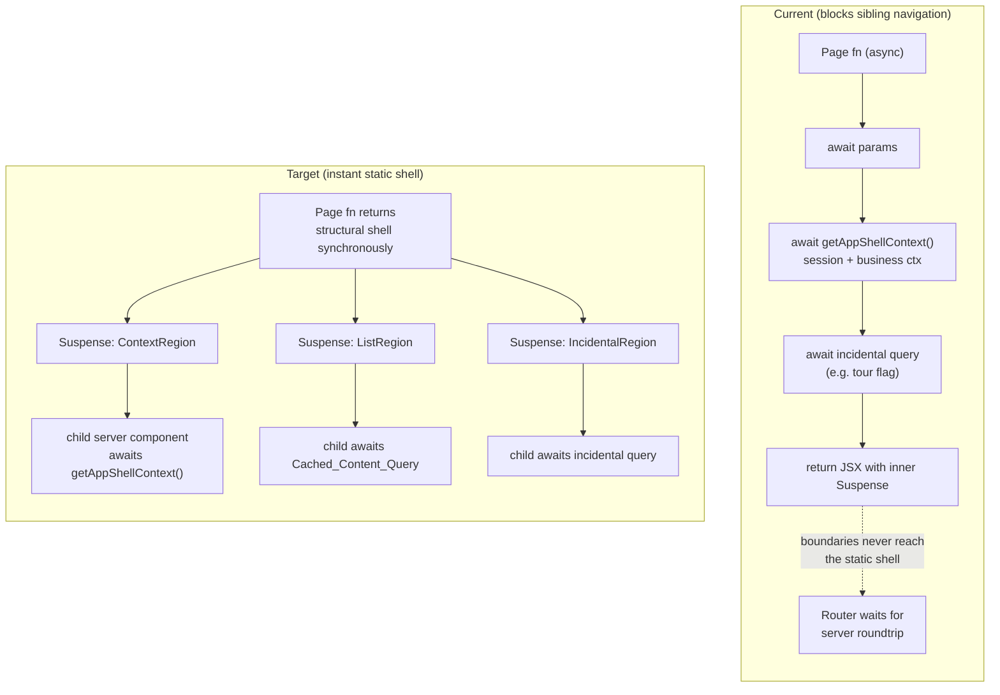
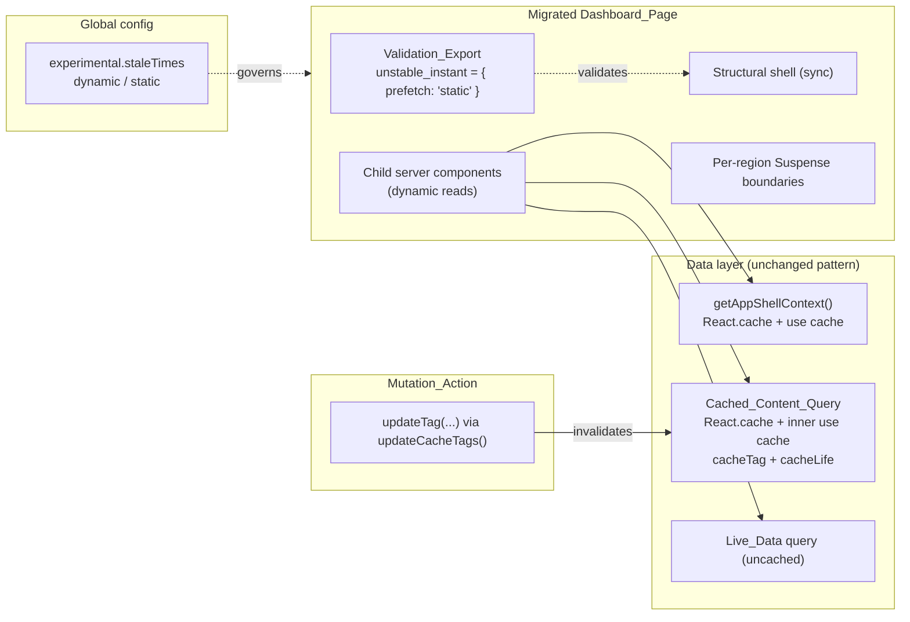
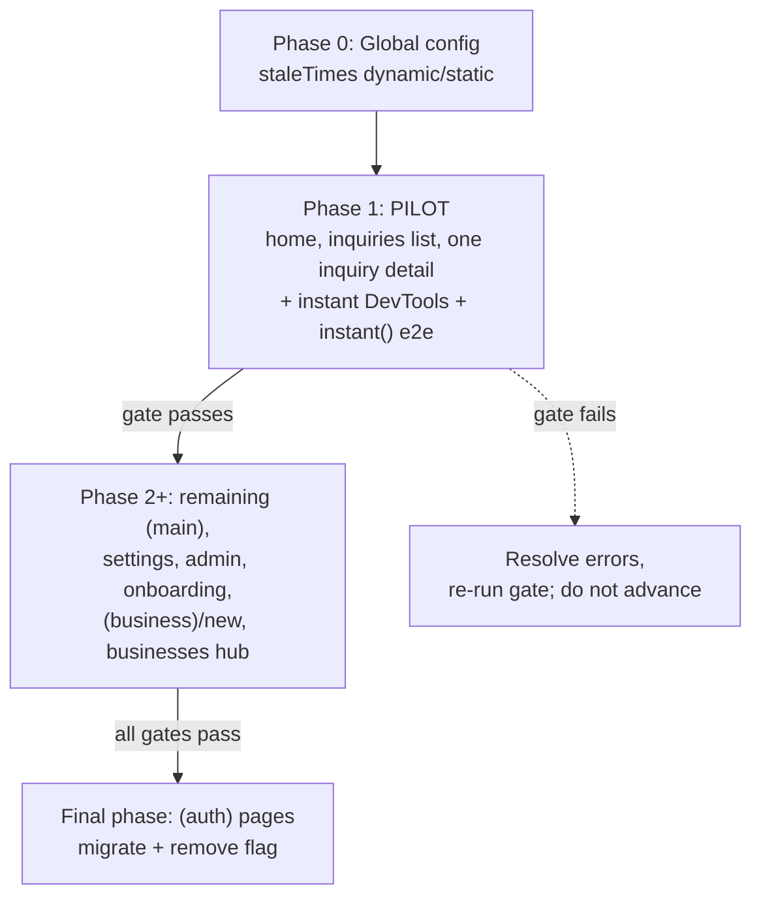

# Design Document

## Overview

This feature makes authenticated dashboard navigation in Requo genuinely instant by fixing three verified root causes (validation globally disabled, pages blocking on dynamic reads above the return, and incidental critical-path queries with unbounded router stale times) and rolling the fix out in verified phases. It does not introduce a new framework capability — it correctly adopts the Cache Components instant-navigation model that this Next.js 16.2 version already ships, on routes that currently opt out of its validation.

The design is deliberately surgical. It preserves every existing good pattern:

- The `(main)/layout.tsx` slot pattern (structural shell rendered synchronously; every data-dependent region in its own `<Suspense>`).
- The two-layer cache pattern (`React.cache()` for within-request dedupe + an inner `"use cache"` function with `cacheTag`/`cacheLife` for cross-request reuse).
- `use cache`-backed business context via `getAppShellContext` / `getBusinessContextForMembershipSlug`.
- Authorization, business data scoping, and cache invalidation on mutations.

### Source of truth

The bundled Next.js documentation under `node_modules/next/dist/docs/` is authoritative for all Next-specific behavior, because this Next version differs from training data. The specific docs consulted for this design:

- `01-app/02-guides/instant-navigation.md` — the "page that blocks" anti-pattern, the static shell concept, how validation checks every shared-layout entry point, the DevTools, and the `@next/playwright` `instant()` helper.
- `01-app/03-api-reference/03-file-conventions/02-route-segment-config/instant.md` — the `unstable_instant` export shape, `prefetch: 'static'`, `unstable_instant: false`, and the `unstable_disableValidation` flag in the `InstantConfig` type.
- `01-app/02-guides/prefetching.md` — prefetch scheduling, the client cache, and that data invalidations silently refresh prefetches.
- `01-app/03-api-reference/05-config/01-next-config-js/staleTimes.md` — `experimental.staleTimes.dynamic` / `.static` semantics and defaults.

### Key facts established from the codebase

- `next.config.ts` already sets `cacheComponents: true` and `experimental.instantNavigationDevToolsToggle: true`. Instant validation is therefore available; it is just being suppressed per-route.
- `experimental.staleTimes` is currently `{ dynamic: 86400, static: 86400 }` (24h) — the unbounded value Requirement 8 targets.
- The `unstable_disableValidation: true` flag is present on ~45 page files across `(main)`, `settings`, `admin`, `(business)/new`, `onboarding`, and `(auth)`.
- **Cache invalidation in this codebase uses `updateTag` from `next/cache`** (the Cache Components revalidation primitive), wrapped by the local `updateCacheTags(tags)` helper in `features/inquiries/actions.ts` and equivalents elsewhere. The requirements use the generic name `revalidateTag`; throughout this design "revalidate a cache tag" maps to the existing `updateTag`/`updateCacheTags` mechanism. **No new invalidation primitive is introduced**, and existing `updateTag` calls are preserved exactly.

## Architecture

### The instant-navigation model (from the bundled docs)

With Cache Components enabled, a route produces a prefetchable **static shell** — the UI Next.js can paint immediately on a client navigation before any dynamic data streams in. Anything that suspends (awaiting `params`/`searchParams`, reading `cookies()`/`headers()`, or awaiting uncached data) must sit **inside** a `<Suspense>` boundary, or it blocks navigation.

The subtlety the docs stress: validation checks **every shared-layout entry point**, not just the initial page load. On a client navigation between two siblings under `(main)` (e.g. `inquiries` → `home`), only the page segment re-renders; the shared `(main)` layout is the entry point. A `<Suspense>` boundary above that layout (e.g. in the root layout) is invisible to that navigation. So a page can render fine on a cold load yet block on sibling navigation. `unstable_instant` simulates these entry points at dev and build time and fails on any blocking component.

### Current state vs. target state



The architectural move is the same on every in-scope page: **push every dynamic read below a `<Suspense>` boundary into a child server component, and return the structural shell (and its skeletons) synchronously.** Cached reads stream in fast (often instantly from cache); genuinely live reads stream behind their fallbacks.

### System components



### Phased rollout architecture

Rollout is a sequence of bounded `Rollout_Phase`s, each ending in a `Verification_Gate` (`npm run check` + `npm run build`, both zero-error). The dependency order:



The pilot is the smallest representative set that exercises a list page, a detail page with a dynamic `[id]` segment, and the home page with an incidental query. Per Requirement 9.5, the `(auth)` pages are migrated **last**, only after every other in-scope phase has passed its gate.

## Components and Interfaces

### 1. Non-blocking page structure (Requirement 1, 5)

Each migrated page follows this shape (illustrative, matching the bundled `instant-navigation.md` example adapted to Requo's shared wrappers):

```tsx
// app/(business)/[businessSlug]/(main)/<route>/page.tsx
export const unstable_instant = { prefetch: "static" }; // validation ENABLED

export default function SomeDashboardPage({
  params,
  searchParams,
}: {
  params: Promise<{ businessSlug: string }>;
  searchParams?: Promise<Record<string, string | string[] | undefined>>;
}) {
  // No awaits here. Return the structural shell synchronously.
  return (
    <DashboardPage>
      <PageHeader title="..." description="..." />

      <Suspense fallback={<ControlsSkeleton />}>
        <ControlsRegion params={params} searchParams={searchParams} />
      </Suspense>

      <Suspense fallback={<ListSkeleton />}>
        <ListRegion params={params} searchParams={searchParams} />
      </Suspense>
    </DashboardPage>
  );
}

// Child server component — dynamic reads live HERE, below the boundary.
async function ListRegion({ params, searchParams }: { ... }) {
  const { businessSlug } = await params;
  const { businessContext } = await getAppShellContext(businessSlug);
  const items = await getCachedListForBusiness(businessContext.business.id); // Cached_Content_Query
  return <List items={items} />;
}
```

Key rules enforced by this structure:

- The page (and the `(main)` layout) perform **no `await` above the return** for session, `App_Shell_Context`, `params`, `searchParams`, or uncached data (Req 1.1, 1.2). The existing `(main)/layout.tsx` already conforms — it only awaits `params` to read the slug, and that layout is shared across siblings so it is not the entry point on sibling navigation. The design keeps the layout as-is.
- Each data-dependent region is its own `<Suspense>` (Req 1.4, 1.6).
- A failing region is isolated by an error boundary co-located with the region so only that region shows an error while the shell and sibling regions stay rendered (Req 1.7). Requo already has `(main)/error.tsx` at the segment level; per-region isolation uses a lightweight error boundary wrapper around the region's `<Suspense>` where a region can independently fail (notably the detail page's optional panels).

#### Home page incidental query (Requirement 5)

`getDashboardTourCompletedForMembership(membershipId)` is currently an uncached `db.select` awaited at the top of `DashboardOverviewContent`. Two coordinated changes:

1. Move the read into a `<Suspense>`-wrapped child component (`DashboardTourGate`) so it never blocks the page return (Req 5.1, 5.3).
2. Wrap it in the two-layer cache pattern. The tour-completed flag changes at most once per membership lifetime, so it comfortably satisfies the "changes ≤ once per 60s" condition (Req 5.2). It gets a `cacheTag` scoped to the membership/business checklist data it reads (reuse `getBusinessChecklistCacheTags`, already used by `getCachedChecklistProgressForBusiness` in the same file) and a `cacheLife` (`hotBusinessCacheLife`, stale 20s — ≥ the required retention floor is satisfied by choosing a `cacheLife` whose `stale`/`revalidate` ≥ 60s where the requirement's 60s floor applies; for the tour flag a longer life is appropriate). The child renders a fallback if the read fails or is slow rather than failing the navigation (Req 5.4).

### 2. Validation export and enforcement (Requirement 2)

The `Validation_Export` on each migrated page becomes:

```tsx
export const unstable_instant = { prefetch: "static" }; // unstable_disableValidation absent
```

This removes the `unstable_disableValidation: true` flag that currently suppresses validation (Req 2.1). With the flag gone, validation runs at dev time (error overlay) and at build time (`npm run build` fails on any blocking component, naming the page and component) (Req 2.2, 2.3, 2.4). A flagged component is resolved **before** the route counts as migrated, by either caching its data with `use cache` or moving it inside a `<Suspense>` boundary (Req 2.5) — never by re-adding the disable flag. The interface contract here is the framework's: the design's responsibility is to (a) remove the flag and (b) fix whatever validation surfaces.

### 3. Escape hatch (Requirement 3)

Not every route can be made instant within its phase. The `Escape_Hatch` is a controlled, per-route, tracked exemption. Per the bundled `instant.md` type, two forms exist:

- `export const unstable_instant = false` — exempt the segment from validation entirely.
- `export const unstable_instant = { prefetch: "static", unstable_disableValidation: true }` — keep the export but disable its validation.

Because an `unstable_instant` export is physically one-per-file, an `Escape_Hatch` inherently targets exactly one `Dashboard_Page` (Req 3.3). The design adds a **governance layer** so an escape hatch is never silent:

- A tracked registry file, `.kiro/specs/instant-navigation-rollout/escape-hatches.md` (human-readable) backed by a typed list `instant-navigation/escape-hatches.ts` in the rollout tooling area, records each active exemption: `{ route, reason, targetReviewDate }`.
- A pure validator, `validateEscapeHatch(entry)`, enforces the rules: it rejects an entry missing a `reason` or `targetReviewDate` (Req 3.4), rejects an entry whose `routes` resolves to more than one route (Req 3.5), and otherwise accepts. The validator returns a typed result `{ ok: true } | { ok: false, errors: string[] }` naming the missing/invalid field.
- A pure `isEscapeHatchOverdue(entry, now)` flags an entry as overdue when `now > targetReviewDate` and the entry is still active (Req 3.6).
- A coverage check (run in CI alongside the gate) parses the in-scope page files and asserts every page either has validation enabled or has a matching, valid registry entry. This prevents an escape hatch being applied as a default across multiple pages (Req 3.1, 3.3).

This validator/over­due/coverage logic is pure and is the primary target for property-based testing (see Correctness Properties).

### 4. Cached content on navigation (Requirement 4)

Each list/detail region reads through a `Cached_Content_Query` using the established two-layer pattern. Requo already has these for the pilot:

- `getInquiryListCountForBusiness`, `getInquiryListPageForBusiness` — inner `"use cache"`, `cacheLife(hotBusinessCacheLife)`, `cacheTag(...getBusinessInquiryListCacheTags(businessId))`, keyed by `businessId` + filters/page.
- `getInquiryDetailForBusiness` — inner `"use cache"`, `cacheTag(...getBusinessInquiryDetailCacheTags(businessId, inquiryId))`.

Contract for a `Cached_Content_Query` (Req 4.1, 4.2, 4.4):

- Keyed by the requested `businessId` (and any sub-key like `inquiryId`, filters, page), so it returns only content matching the active business context.
- Wrapped with `React.cache()` for within-request dedupe **and** an inner `"use cache"` function for cross-request reuse.
- Applies `cacheTag` (from `lib/cache/business-tags.ts` / `shell-tags.ts`) and `cacheLife`.

`Live_Data` (data that must always be fresh) is **not** cached; it streams behind its own `<Suspense>` and shows the boundary's fallback until it resolves (Req 4.3). When no cached content exists yet, the region shows skeletons until content is available (Req 4.5). After a mutation revalidates the tag, the next navigation serves refreshed content (Req 4.6) — this is the framework's prefetch-invalidation behavior described in `prefetching.md` ("data invalidations silently refresh associated prefetches").

### 5. Preserved authorization and scoping (Requirement 6)

No change to auth. Every migrated page resolves identity through `getAppShellContext(businessSlug)` exactly as before — now from inside a `<Suspense>` child rather than above the return. Because `getAppShellContext` is `React.cache`-wrapped and calls into the `use cache`-backed `getBusinessContextForMembershipSlug`, moving the call site does not change its redirect-on-no-access semantics (Req 6.1, 6.2, 6.5). Content remains scoped to the route's `businessId` because every `Cached_Content_Query` is keyed by it (Req 6.3, 6.6). The existing business-scoped access-control integration tests run unchanged against migrated routes and must still pass (Req 6.4).

### 6. Preserved cache invalidation (Requirement 7)

Mutations continue to call `updateTag` (via `updateCacheTags`) on every affected tag after a successful persist, before returning to the caller (Req 7.1). On failure before persistence, no invalidation occurs and previously cached content is served unchanged (Req 7.2). The design adds a **migration-coverage invariant**: a route is only counted as migrated if every `Cached_Content_Query` it introduces is associated with at least one cache tag that is revalidated by at least one existing or new `Mutation_Action` (Req 7.3). A route adding a cached query with no corresponding invalidation is flagged "not yet migrated" by the coverage check and excluded from the migrated set (Req 7.4). Mutation integration tests assert read-after-write returns mutated data on the first read post-mutation (Req 7.5).

### 7. Deliberate router stale times (Requirement 8)

`next.config.ts` `experimental.staleTimes` changes from `{ dynamic: 86400, static: 86400 }` to documented values within the required bounds:

```ts
experimental: {
  // Freshness-vs-reuse: dynamic segments (RSC payloads gated on per-request
  // data) reuse for a short window to make back/forward instant without
  // serving meaningfully stale business data. Ref: bundled staleTimes.md
  // (default 0s) and prefetching.md (client cache reuse on sibling nav).
  staleTimes: {
    dynamic: 30, // [0,60] — chosen value, documented
    static: 180, // [60,300] — chosen value, documented
  },
},
```

`dynamic` ∈ [0, 60] and `static` ∈ [60, 300], each documented with a freshness-vs-reuse rationale and a reference to `staleTimes.md` and `prefetching.md` (Req 8.1, 8.2, 8.6). Within the stale window, back/forward navigation renders from the client cache with no network request; past it, the segment refetches (Req 8.3, 8.4). A tag revalidation causes the next navigation to the affected segment to serve revalidated data (Req 8.5).

### 8. Scope boundaries (Requirement 10)

Modifications are restricted to in-scope `Dashboard_Page` files plus `experimental.staleTimes` (Req 10.1). Public route trees (`inquire`, `quote`, `b`), marketing pages, and API route handlers are untouched — verified by a file-level diff showing zero changes across those trees (Req 10.2). No changes to the auth system (Req 10.3) and no schema/migration changes (Req 10.4). The migration is structural only: each page renders the same components, structure, and styling, and preserves identical workflow destinations and step sequences (Req 10.5, 10.6). The refactors move dynamic reads into child components; they do not alter rendered output.

## Data Models

These models describe the rollout's tracking/governance state and the cache-key contracts. They are tooling/spec artifacts — **no application database schema changes are introduced** (Req 10.4).

### Escape hatch registry entry

```ts
type EscapeHatchEntry = {
  /** Exactly one in-scope route path, e.g. "app/(business)/[businessSlug]/settings/billing/page.tsx". */
  route: string;
  /** Non-empty human justification for why the route cannot be instant this phase. */
  reason: string;
  /** ISO date by which the exemption must be removed. */
  targetReviewDate: string; // YYYY-MM-DD
  /** Whether the exemption is still applied. */
  active: boolean;
};

type EscapeHatchValidationResult =
  | { ok: true }
  | { ok: false; errors: string[] };
```

### Rollout phase / migration coverage

```ts
type RolloutPhase = {
  id: string; // "pilot", "phase-2", ..., "auth"
  routes: string[]; // in-scope page files migrated together
  gate: { check: "pending" | "passed" | "failed"; build: "pending" | "passed" | "failed" };
};

type MigrationCoverage = {
  route: string;
  validationEnabled: boolean; // unstable_instant present without disable flag
  cachedQueries: Array<{ name: string; cacheTags: string[] }>;
  // For each cache tag, the mutation actions known to revalidate it.
  tagRevalidatedBy: Record<string, string[]>;
  migrated: boolean; // derived: validationEnabled && every cachedQuery tag has a revalidator
};
```

### Cache-key contract (existing helpers, documented for clarity)

| Query | Key | `cacheTag` source | `cacheLife` |
|---|---|---|---|
| `getInquiryListPageForBusiness` | `businessId` + filters + page | `getBusinessInquiryListCacheTags(businessId)` | `hotBusinessCacheLife` |
| `getInquiryListCountForBusiness` | `businessId` + filters | `getBusinessInquiryListCacheTags(businessId)` | `hotBusinessCacheLife` |
| `getInquiryDetailForBusiness` | `businessId` + `inquiryId` | `getBusinessInquiryDetailCacheTags(businessId, inquiryId)` | `hotBusinessCacheLife` |
| `getDashboardTourCompleted*` (new cached form) | `membershipId` / `businessId` | `getBusinessChecklistCacheTags(businessId)` | `hotBusinessCacheLife` |

### Stale-time configuration model

```ts
type StaleTimesConfig = {
  dynamic: number; // invariant: 0 <= dynamic <= 60
  static: number; // invariant: 60 <= static <= 300
};
```

## Correctness Properties

*A property is a characteristic or behavior that should hold true across all valid executions of a system — essentially, a formal statement about what the system should do. Properties serve as the bridge between human-readable specifications and machine-verifiable correctness guarantees.*

Most of this feature is structural route refactoring, framework-enforced instant validation, configuration, and DB-backed access control. Those acceptance criteria are best verified by build-time instant validation, `@next/playwright` `instant()` e2e assertions, snapshot/diff checks, and existing access-control/mutation integration tests (see Testing Strategy) — not by property-based testing.

PBT **does** apply to the feature's pure decision logic: the escape-hatch governance validator, the migration-coverage derivation, the cache-tag relationship helpers, the stale-times bounds validator, and the rollout gate/phase-ordering logic. The properties below cover exactly that logic. Each was derived from the prework analysis after consolidating redundant criteria.

### Property 1: Escape-hatch validator correctness

*For any* candidate escape-hatch entry, `validateEscapeHatch(entry)` returns `ok: true` **if and only if** the entry resolves to exactly one in-scope route, has a non-empty `reason`, and has a valid `targetReviewDate`; otherwise it returns `ok: false` with an `errors` list that names each violated condition (missing reason, missing/invalid review date, or route count not equal to one).

**Validates: Requirements 3.1, 3.2, 3.3, 3.4, 3.5**

### Property 2: Escape-hatch overdue detection

*For any* active escape-hatch entry and any reference instant `now`, `isEscapeHatchOverdue(entry, now)` returns true **if and only if** `now` is strictly after the entry's `targetReviewDate` and the entry is still active.

**Validates: Requirements 3.6**

### Property 3: Cache-tag scoping and mutation superset

*For any* `businessId` and `inquiryId`, every `Cached_Content_Query` tag set produced by the `lib/cache/business-tags.ts` helpers contains the business scope tag `business:<businessId>`, and the mutation tag set computed for that business/inquiry (`getInquiryMutationCacheTags`) is a superset of both the list query tags and the detail query tags. (Returned tag arrays are also duplicate-free.)

**Validates: Requirements 4.2, 7.1**

### Property 4: Migration-coverage derived flag

*For any* migration-coverage record, the derived `migrated` flag is true **if and only if** validation is enabled for the route (export present without the disable flag) **and** every cached query's cache tags each have at least one revalidating mutation action. Equivalently, a route with any cached-query tag that has no revalidator is never reported as migrated.

**Validates: Requirements 7.3, 7.4**

### Property 5: Stale-times bounds validator

*For any* `StaleTimesConfig`, `isValidStaleTimes(config)` returns true **if and only if** `0 <= dynamic <= 60` and `60 <= static <= 300`.

**Validates: Requirements 8.1, 8.2**

### Property 6: Verification gate and phase advancement

*For any* rollout phase with boolean `check` and `build` gate results, the gate is considered passed **if and only if** both `check` and `build` are zero-error (true), and the next phase may begin **if and only if** the current phase's gate passed. A phase whose gate did not pass never permits advancement.

**Validates: Requirements 9.2, 9.3, 9.6**

### Property 7: Phase-ordering validity

*For any* proposed ordering of rollout phases, the ordering is valid **if and only if** the pilot phase (home, inquiries list, one inquiry detail) precedes every other in-scope phase and the `(auth)` phase comes strictly after every other in-scope phase.

**Validates: Requirements 9.1, 9.5**

## Error Handling

- **Region-level failures (Req 1.7, 5.4).** Each data-dependent region streams behind its own `<Suspense>`. Where a region can independently fail, it is additionally wrapped in a co-located error boundary so a thrown error or rejected promise replaces only that region with an error indication while the structural shell and sibling regions stay rendered. The segment-level `(main)/error.tsx` remains the backstop for unexpected page-level errors. Incidental queries that fail or exceed ~5000ms render a fallback for their region and let the navigation complete rather than failing the page.
- **Authorization failures (Req 6.2, 6.5).** `getAppShellContext` continues to `redirect()` to the businesses hub for non-members and to the auth entry point for unauthenticated users. Because the call moves into a Suspense child (not above the return), the redirect still fires during that child's render; no business-scoped content is emitted before the redirect.
- **Mutation failures (Req 7.2).** A mutation that fails before persistence does not call `updateTag`/`updateCacheTags`; previously cached content continues to serve unchanged. Tag invalidation happens only after a successful persist and before the action returns.
- **Cold cache (Req 4.5).** When no cached content exists, regions render skeleton placeholders until content resolves — no error state.
- **Escape-hatch misconfiguration (Req 3.4, 3.5).** `validateEscapeHatch` returns a structured `{ ok: false, errors }` naming the missing reason, missing/invalid review date, or multi-route violation; the offending page remains subject to validation (the hatch is not applied) until corrected.
- **Validation failures (Req 2.3).** A blocking component fails `npm run build` with the page and component named and produces no artifact; this is resolved by caching or Suspense-wrapping the offending read before the route is counted migrated.

## Testing Strategy

A dual approach: property-based tests for the pure decision logic, and example/integration/e2e tests for structural, access-control, and framework-enforced behavior.

### Property-based tests (fast-check)

- Library: `fast-check` (already in the stack), run via Vitest in `tests/unit/`.
- Minimum **100 iterations** per property test.
- Each test is tagged with a comment referencing its design property:
  `// Feature: instant-navigation-rollout, Property <n>: <property text>`
- One property-based test per correctness property (Properties 1–7). Targets:
  - Properties 1–2: escape-hatch validator and overdue predicate (pure functions in the rollout tooling module).
  - Property 3: cache-tag helpers in `lib/cache/business-tags.ts` (`getBusinessInquiryListCacheTags`, `getBusinessInquiryDetailCacheTags`, `getInquiryMutationCacheTags`) — generate ids, assert scope-tag presence, superset relationship, and dedup.
  - Property 4: migration-coverage `migrated` derivation.
  - Property 5: `isValidStaleTimes`.
  - Properties 6–7: verification-gate / phase-advance and phase-ordering validators.
- Generators must cover edge cases surfaced in prework: empty/whitespace `reason`, missing/invalid dates, `now` exactly equal to `targetReviewDate` (boundary, not overdue), route lists of length 0/1/many, stale-time boundary values (0, 60, 300 and just outside), and tag sets for arbitrary id strings.

### Example and component tests

- Region error isolation (Req 1.7) and slow/failed incidental query fallback (Req 5.4): component tests that force a child to throw/reject and assert the shell and sibling regions stay rendered while only the affected region shows an error/fallback.
- Cold-cache skeletons (Req 4.5) and live-data fallback (Req 4.3): component/e2e tests asserting fallbacks appear then content streams.
- Chosen `cacheLife` retention floor for the incidental query (Req 5.2): a single unit assertion that the selected `cacheLife` retains for at least the required window.

### Integration tests (DB-backed)

- Business-scoped access control on migrated routes (Req 6.1–6.6): run the **existing** access-control integration suite unchanged against migrated routes; add non-member and unauthenticated redirect cases. These are mandatory backend permission tests.
- Cache invalidation read-after-write (Req 4.6, 7.5): mutation integration tests assert the first read after a successful mutation returns mutated data and never pre-mutation content; a failing mutation leaves cached content unchanged (Req 7.2).
- Data isolation (Req 4.1, 6.3, 6.6): seed two businesses; assert a `Cached_Content_Query` keyed by `businessId` returns only the requested business's rows.

### Build-time and e2e verification (the Verification_Gate)

- `npm run check` (lint + typecheck + SEO audits, including use-cache purity) and `npm run build` (runs instant validation) must both complete with zero errors for a phase to pass (Req 2.2, 2.3, 9.2). This is the structural guarantee for Req 1.1–1.4, 2.1, 5.1, 5.3.
- `@next/playwright` `instant()` assertions for the pilot navigation flows (Req 9.7, 1.3, 1.5), plus manual Next.js instant DevTools verification on the pilot routes (Req 9.4).
- `npm run test:e2e:smoke` for migrated user flows to confirm identical destinations and step sequences (Req 10.5).

### Scope-guard checks

- File-level `git diff` confirms zero changes across public route trees, marketing, API handlers, the auth system, and migrations/schema (Req 10.1–10.4). A migration-coverage parser asserts each in-scope page either has validation enabled or a valid, single-route escape-hatch registry entry (Req 2.5, 3.3, 7.4).

### Why PBT is scoped narrowly here

Per the bundled docs and the prework analysis, the page-structure, validation, router-cache, and access-control criteria are either framework-enforced (build validation), behavioral guarantees best asserted by `instant()`/e2e, or DB-backed isolation checks — none of which are "for all inputs X, P(X)" statements over our own pure logic. The pure governance/coverage/config logic introduced by the rollout is the right and only PBT surface, and Properties 1–7 cover it.
