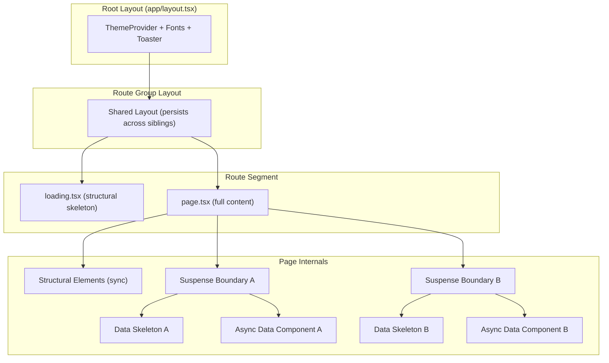
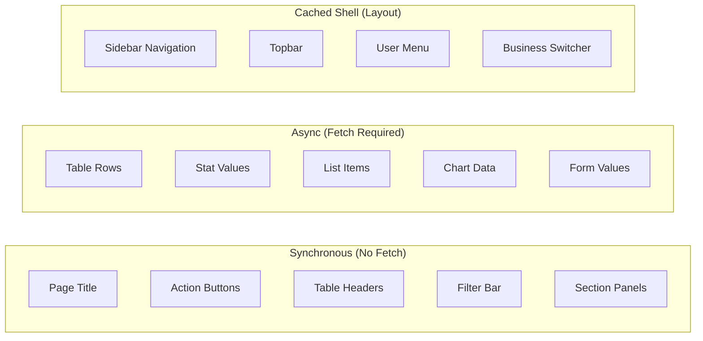

# Design Document: Instant Navigation

## Overview

This design implements an "instant navigation" pattern across all Requo routes. The core principle: render page structure synchronously during route transitions and defer only data-dependent content to localized skeleton states. The global progress bar is removed entirely.

The approach mirrors Linear, Vercel Dashboard, and Notion — users see the destination page frame immediately upon clicking a link, with only data rows, stats, and dynamic text shimmer-loading in place.

### Key Design Decisions

1. **Remove RouteProgressBar entirely** rather than hiding it — the component and its event system add unnecessary bundle weight when every route has a proper loading.tsx.
2. **Each route segment gets a purpose-built loading.tsx** that renders real structural elements (page titles, column headers, action buttons, filter bars) synchronously, with `<Skeleton>` only for data cells.
3. **Layouts remain untouched during sibling navigation** — this is already guaranteed by Next.js App Router architecture. The design ensures no layout renders its own skeleton chrome during transitions.
4. **Suspense boundaries wrap independent data sections** within page components to enable parallel streaming without a single top-level fetch gating the entire page.

## Architecture



### Navigation Flow

1. User clicks a link within the same route group
2. Next.js keeps the shared layout mounted (sidebar, topbar, header, footer)
3. The destination segment's `loading.tsx` renders immediately with structural elements
4. The page component streams in, replacing loading.tsx
5. Suspense boundaries within the page show localized skeletons until each data section resolves

### Layers of Instant Feel

| Layer | Renders | Wait For |
|-------|---------|----------|
| Shared Layout | Immediately (already mounted) | Nothing |
| loading.tsx structural chrome | Immediately on transition | Nothing |
| loading.tsx data skeletons | Immediately as placeholders | Page component |
| Page structural elements | When page JS arrives | Route resolution |
| Suspense data sections | When each fetch resolves | Individual data |

## Components and Interfaces

### Components to Remove

| Component | Path | Reason |
|-----------|------|--------|
| `RouteProgressBar` | `components/shared/route-progress-bar.tsx` | Replaced by instant structural loading states |
| `route-progress` utilities | `lib/navigation/route-progress.ts` | Event system no longer needed |

### Loading State Components (loading.tsx files)

Each loading.tsx follows a consistent contract:

```typescript
// Contract for all loading.tsx files
interface LoadingStateContract {
  // MUST render synchronously (no async, no data fetching)
  // MUST include real structural elements matching the page layout
  // MUST use <Skeleton> only for data-dependent content
  // MUST match spatial dimensions of the loaded page (no layout shift)
  // MUST NOT render shared layout chrome (sidebar, topbar, header, footer)
}
```

### Route Group Loading States

| Route Group | Loading File | Structural Elements | Data Skeletons |
|---|---|---|---|
| `(business)/[slug]/(main)/*` | Per-page loading.tsx | Page title, description, action buttons, table headers, filter bar | Table rows, stat values, list items |
| `(business)/[slug]/settings/*` | Per-section loading.tsx | Settings panel frame, section title, form field labels | Form field values, dynamic labels |
| `(auth)/*` | Existing (already good) | Auth card frame, brand mark, heading shapes | Form field placeholders |
| `(marketing)/*` | Per-page loading.tsx | Hero structure, section headings, CTAs | Dynamic pricing, testimonials |
| `(public)/*` | Per-page loading.tsx | Page frame, section structure | Inquiry/quote dynamic content |
| `(checkout)/*` | loading.tsx | Checkout page frame, step indicators | Pricing, plan details |
| `admin/*` | Per-page loading.tsx | Console structure, table headers | Data table rows, stats |
| `onboarding/*` | Existing (already good) | Step indicator, form structure | Dynamic templates |

### Shared Skeleton Primitives

Reuse existing primitives from `components/ui/skeleton.tsx`:

```typescript
// Existing — no new skeleton primitive needed
<Skeleton className="h-4 w-32 rounded-md" />
```

New page-specific skeleton compositions live alongside their loading.tsx files or in `components/shell/` when shared across multiple route segments.

### Suspense Boundary Pattern

```typescript
// Pattern for page components with multiple data sections
export default async function InquiriesPage({ params }) {
  const { businessSlug } = await params;

  return (
    <DashboardPage>
      {/* Structural — renders immediately */}
      <PageHeader title="Inquiries" description="Manage incoming inquiries">
        <CreateInquiryButton />
      </PageHeader>

      {/* Stats section — streams independently */}
      <Suspense fallback={<InquiryStatsSkeleton />}>
        <InquiryStats businessSlug={businessSlug} />
      </Suspense>

      {/* Table section — streams independently */}
      <Suspense fallback={<InquiryTableSkeleton />}>
        <InquiryTable businessSlug={businessSlug} />
      </Suspense>
    </DashboardPage>
  );
}
```

## Data Models

No database schema changes required. This feature operates entirely at the rendering layer.

### Component Data Flow



### Loading State Decision Matrix

For each element on a page, classify as:

| Classification | Rendering Strategy | Example |
|---|---|---|
| **Layout Chrome** | Persists in layout.tsx, never re-renders during navigation | Sidebar, topbar, footer |
| **Structural Element** | Rendered synchronously in loading.tsx with real markup | Page title, table column headers, "New" button shape |
| **Data Skeleton** | `<Skeleton>` placeholder in loading.tsx, replaced when page streams | Table row content, stat numbers, dynamic text |
| **Suspense Section** | Wrapped in `<Suspense>` within page for parallel streaming | Independent data cards, secondary lists |

## Correctness Properties

*A property is a characteristic or behavior that should hold true across all valid executions of a system — essentially, a formal statement about what the system should do. Properties serve as the bridge between human-readable specifications and machine-verifiable correctness guarantees.*

### Property 1: Loading state structural completeness

*For any* route segment with a loading.tsx file, the rendered loading state SHALL contain all structural elements (page title, action button placeholders, table/list headers, filter bar frames) that appear in the fully-loaded page, ensuring no element appears on load that was absent during the loading transition.

**Validates: Requirements 2.1, 2.2, 9.1**

### Property 2: Layout persistence across sibling navigation

*For any* sequence of navigations between sibling routes within the same route group, the shared layout component SHALL remain mounted in the DOM (same React fiber identity) and SHALL not re-render skeleton placeholders for its own chrome elements.

**Validates: Requirements 3.1, 3.2, 3.3**

### Property 3: Spatial dimension preservation

*For any* data skeleton placeholder rendered in a loading state, the dimensions (width and height) of the skeleton container SHALL equal the dimensions of the resolved content that replaces it, preventing cumulative layout shift above zero.

**Validates: Requirements 9.1, 9.2**

## Error Handling

### Loading State Errors

- `loading.tsx` files are synchronous and cannot error (no fetches, no async operations)
- If a page component throws during streaming, Next.js falls through to the nearest `error.tsx` boundary
- The structural shell from the layout remains mounted even when an error boundary activates

### Suspense Boundary Errors

- Each `<Suspense>` boundary that wraps a data section should have a sibling or nested `<ErrorBoundary>` for graceful degradation
- Pattern: wrap data sections in both Suspense (for loading) and error boundary (for failures)

```typescript
<Suspense fallback={<StatsSkeleton />}>
  <ErrorBoundary fallback={<StatsError />}>
    <StatsSection businessSlug={businessSlug} />
  </ErrorBoundary>
</Suspense>
```

### Layout Persistence on Error

- Shared layouts MUST remain mounted when a page-level error occurs
- The `error.tsx` file renders within the layout frame, not replacing it
- This is default Next.js App Router behavior and requires no special handling

## Testing Strategy

### Why Property-Based Testing Does Not Apply

This feature is entirely about UI rendering patterns — component composition, skeleton layout fidelity, and visual transition behavior. There are no pure functions with varied input spaces to property-test. The acceptance criteria concern:
- Presence/absence of specific UI elements during loading states
- Layout stability during navigation (CLS measurement)
- Component mounting/unmounting behavior

These are best validated through visual regression, component tests, and E2E navigation tests.

### Testing Approach

**Component Tests** (Vitest + React Testing Library):
- Verify each `loading.tsx` renders expected structural elements (headings, buttons, table headers) synchronously
- Verify `loading.tsx` files do not import or use any async operations
- Verify `loading.tsx` files include `<Skeleton>` only in data-dependent areas
- Verify `RouteProgressBar` is removed from the root layout component tree

**Visual Regression Tests** (Playwright screenshots):
- Capture loading states for each route group and compare against approved baselines
- Verify spatial dimensions match between loading.tsx skeleton and loaded page

**E2E Navigation Tests** (Playwright):
- Navigate between sibling routes and assert shared layout elements remain in DOM (not remounted)
- Assert no global progress bar element appears during navigation
- Measure Cumulative Layout Shift (CLS) during loading-to-loaded transition
- Verify independent Suspense sections stream in without blocking each other

**Integration Tests**:
- Verify build succeeds with all new loading.tsx files
- Verify no layout.tsx file renders skeleton chrome for its own persistent elements

### Test File Organization

```
tests/
├── components/
│   └── loading-states/
│       ├── auth-loading.test.tsx
│       ├── dashboard-loading.test.tsx
│       ├── marketing-loading.test.tsx
│       └── ...
└── e2e/
    └── navigation/
        ├── instant-navigation.spec.ts
        └── layout-persistence.spec.ts
```
