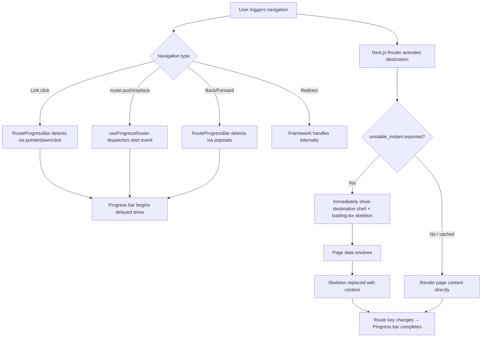

# Design Document: Non-Blocking Route Transitions

## Overview

This design shifts Requo's navigation model from blocking (hold current page until next is ready) to non-blocking (navigate immediately, show destination shell with skeleton fallbacks while content loads). The implementation leverages Next.js 16's `unstable_instant` route segment config and the existing `loading.tsx` skeleton infrastructure already present across route segments.

**Current behavior:** The `useProgressRouter` hook wraps `router.push`/`router.replace` in `startTransition`, which causes React to hold the current page visible while the destination resolves. The `RouteProgressBar` is the only loading signal during this period.

**Target behavior:** Navigation immediately activates the destination route, rendering its layout shell and `loading.tsx` skeleton fallback. The progress bar becomes supplemental feedback layered on top of the skeleton, not the primary indicator.

### Key Design Decisions

1. **`unstable_instant` as the primary mechanism** — Rather than removing `startTransition` from the hook (which would break React's concurrent rendering model), we export `unstable_instant` from every async page. This tells Next.js to immediately show the destination's static shell and loading state during client navigation.

2. **Layouts set `unstable_instant = false`** — Auth-gated layouts (like `businesses/[slug]/(main)/layout.tsx`) that call `requireSession()` must remain blocking at the layout level. The `loading.tsx` at that segment handles the fallback. This is already the pattern in the codebase.

3. **Progress bar remains but is demoted** — The `RouteProgressBar` continues to provide a subtle top-of-viewport indicator. Its existing 180ms show-delay already prevents it from flashing on fast navigations. No changes to its core timing logic are needed.

4. **`useProgressRouter` hook simplified** — The hook's `startTransition` wrapper is removed for `push` and `replace` calls. Since `unstable_instant` handles the loading state display, wrapping in `startTransition` is counterproductive — it suppresses the skeleton. The hook retains its progress-bar event dispatching role.

## Architecture



### Navigation Flow

1. **User action** — Click, programmatic push, back/forward, or redirect
2. **Progress bar start** — `RouteProgressBar` detects the navigation (via DOM events or custom events from `useProgressRouter`) and begins its 180ms delayed show
3. **Route activation** — Next.js immediately activates the destination segment because `unstable_instant` is exported. The destination layout renders, and `loading.tsx` shows as the Suspense fallback
4. **Data resolution** — Page-level async data fetches complete, content streams in
5. **Completion** — Route key changes, `RouteProgressBar` detects via `usePathname`/`useSearchParams` effect and animates to 100%

## Components and Interfaces

### 1. `unstable_instant` Page Exports

Every page performing async data fetching exports the `unstable_instant` config:

```typescript
// Standard export for pages with async data fetching
export const unstable_instant = {
  prefetch: 'static',
};
```

**Pages requiring this export** (that don't already have it):
- `app/(auth)/login/page.tsx`, `app/(auth)/signup/page.tsx`, `app/(auth)/forgot-password/page.tsx`, `app/(auth)/reset-password/page.tsx`, `app/(auth)/check-email/page.tsx`
- `app/admin/page.tsx` and all admin sub-routes
- `app/onboarding/page.tsx`
- `app/account/page.tsx`, `app/account/profile/page.tsx`, `app/account/security/page.tsx`, `app/account/billing/page.tsx`
- `app/businesses/page.tsx`
- All `app/businesses/[slug]/(main)/settings/**` pages

**Pages already exporting `unstable_instant`** (no changes needed):
- `app/businesses/[slug]/(main)/dashboard/page.tsx`
- `app/businesses/[slug]/(main)/quotes/page.tsx`, `quotes/[id]/page.tsx`, `quotes/new/page.tsx`
- `app/businesses/[slug]/(main)/inquiries/page.tsx`, `inquiries/[id]/page.tsx`, `inquiries/new/page.tsx`
- `app/businesses/[slug]/(main)/follow-ups/page.tsx`
- `app/businesses/[slug]/(main)/analytics/page.tsx`
- `app/businesses/[slug]/(main)/knowledge/page.tsx`
- `app/businesses/[slug]/(main)/forms/page.tsx`, `forms/[formSlug]/page.tsx`
- `app/businesses/[slug]/(main)/members/page.tsx`

**Pages currently set to `false` that need updating:**
- `app/account/profile/page.tsx` — change from `false` to `{ prefetch: 'static' }`
- `app/account/security/page.tsx` — change from `false` to `{ prefetch: 'static' }`
- `app/account/billing/page.tsx` — change from `false` to `{ prefetch: 'static' }`
- `app/businesses/[slug]/(main)/settings/members/page.tsx` — change from `false` to `{ prefetch: 'static' }`

**Layouts that KEEP `unstable_instant = false`:**
- `app/businesses/[slug]/(main)/layout.tsx` — auth gate with `requireSession()`
- `app/businesses/[slug]/(main)/settings/layout.tsx` — settings context resolution

These layouts intentionally block because they perform auth checks. Their corresponding `loading.tsx` files handle the fallback display.

### 2. Modified `useProgressRouter` Hook

```typescript
// hooks/use-progress-router.ts
"use client";

import { useRouter } from "next/navigation";
import { useCallback, useMemo } from "react";

import {
  dispatchRouteProgressComplete,
  dispatchRouteProgressStart,
  getCurrentRouteProgressKey,
  getRouteProgressKeyFromHref,
} from "@/lib/navigation/route-progress";

function getPathnameFromHref(href: string | URL) {
  try {
    if (typeof href === "string") {
      return new URL(href, window.location.origin).pathname;
    }
    return href.pathname;
  } catch {
    return null;
  }
}

export function useProgressRouter() {
  const router = useRouter();

  const push = useCallback(
    (...args: Parameters<typeof router.push>) => {
      const [href] = args;
      const nextRoute = getRouteProgressKeyFromHref(href);
      const nextPathname = getPathnameFromHref(href);
      const currentPathname =
        typeof window !== "undefined" ? window.location.pathname : null;
      const isSamePathQueryUpdate =
        nextPathname !== null && currentPathname === nextPathname;

      if (nextRoute && !isSamePathQueryUpdate) {
        dispatchRouteProgressStart({ route: nextRoute });
      }

      // No startTransition wrapper — let unstable_instant handle
      // immediate skeleton display at the destination route
      router.push(...args);
    },
    [router],
  );

  const replace = useCallback(
    (...args: Parameters<typeof router.replace>) => {
      const [href] = args;
      const nextRoute = getRouteProgressKeyFromHref(href);
      const nextPathname = getPathnameFromHref(href);
      const currentPathname =
        typeof window !== "undefined" ? window.location.pathname : null;
      const isSamePathQueryUpdate =
        nextPathname !== null && currentPathname === nextPathname;

      if (nextRoute && !isSamePathQueryUpdate) {
        dispatchRouteProgressStart({ route: nextRoute });
      }

      router.replace(...args);
    },
    [router],
  );

  const refresh = useCallback(
    (...args: Parameters<typeof router.refresh>) => {
      dispatchRouteProgressStart({
        force: true,
        route: getCurrentRouteProgressKey(),
      });
      router.refresh(...args);
    },
    [router],
  );

  return useMemo(
    () => ({
      ...router,
      push,
      replace,
      back: () => router.back(),
      forward: () => router.forward(),
      refresh,
    }),
    [router, push, replace, refresh],
  );
}
```

**Key change:** Removed `useTransition` and `startTransition` wrapping from `push` and `replace`. The hook now calls `router.push`/`router.replace` directly, allowing Next.js's `unstable_instant` mechanism to immediately show the destination skeleton. The hook retains its role of dispatching progress-bar start events.

**Removed:** The `isPending` state and `awaitingCompletionRef` logic. Progress bar completion is already handled by the `RouteProgressBar`'s `usePathname`/`useSearchParams` effect detecting route key changes.

### 3. `RouteProgressBar` Component

**No changes required.** The existing implementation already:
- Detects navigation via DOM events (pointerdown, click, keydown) and custom events
- Implements a 180ms show delay (satisfies Requirement 4.3)
- Completes on route key change via `usePathname`/`useSearchParams`
- Handles stall timeout at 15 seconds (satisfies Requirement 4.5)
- Resets on interrupted navigation (satisfies Requirement 4.6)
- Renders as a fixed 4px bar at z-index 140 above all content

The progress bar already co-exists with skeletons — it renders in a fixed position above page content. With non-blocking transitions, the skeleton appears immediately while the progress bar provides supplemental feedback on top.

### 4. Skeleton Coverage Audit

Existing `loading.tsx` files cover all required route segments:

| Route Segment | `loading.tsx` | Skeleton Component |
|---|---|---|
| `(auth)` | ✅ | Inline card skeleton |
| `admin` | ✅ | Inline skeleton |
| `admin/users` | ✅ | Dedicated skeleton |
| `admin/businesses` | ✅ | Dedicated skeleton |
| `admin/subscriptions` | ✅ | Dedicated skeleton |
| `admin/audit-logs` | ✅ | Dedicated skeleton |
| `businesses` | ✅ | Inline skeleton |
| `businesses/[slug]` | ✅ | `DashboardShellSkeleton` |
| `businesses/[slug]/(main)` | ✅ | `DashboardPageSkeleton` |
| `businesses/[slug]/(main)/quotes` | ✅ | `DashboardListPageSkeleton` |
| `businesses/[slug]/(main)/inquiries` | ✅ | `DashboardListPageSkeleton` |
| `businesses/[slug]/(main)/follow-ups` | ✅ | `DashboardListPageSkeleton` |
| `businesses/[slug]/(main)/analytics` | ✅ | Dedicated skeleton |
| `businesses/[slug]/(main)/knowledge` | ✅ | `DashboardKnowledgeSkeleton` |
| `businesses/[slug]/(main)/forms` | ✅ | Inline skeleton |
| `businesses/[slug]/(main)/members` | ✅ | `DashboardMembersSkeleton` |
| `businesses/[slug]/(main)/settings` | ✅ | `DashboardSettingsSkeleton` |
| `onboarding` | ✅ | Inline skeleton |
| `account` | ❌ | **Needs addition** |

**Gap identified:** The `app/account/` route group lacks a `loading.tsx`. Since account pages (`profile`, `security`, `billing`) perform async data fetching and will have `unstable_instant` enabled, a skeleton fallback is needed at the account layout level.

### 5. Account Route Skeleton (New)

```typescript
// app/account/loading.tsx
import { Skeleton } from "@/components/ui/skeleton";

export default function AccountLoading() {
  return (
    <div className="flex flex-col gap-6">
      <div className="flex flex-col gap-2">
        <Skeleton className="h-8 w-48 rounded-lg" />
        <Skeleton className="h-4 w-72 rounded-md" />
      </div>
      <div className="flex flex-col gap-4">
        <Skeleton className="h-12 w-full rounded-xl" />
        <Skeleton className="h-12 w-full rounded-xl" />
        <Skeleton className="h-12 w-full rounded-xl" />
      </div>
    </div>
  );
}
```

## Data Models

No new data models are introduced. This feature is purely a navigation/rendering concern that modifies:
- Page-level route segment config exports (`unstable_instant`)
- Client-side hook behavior (`useProgressRouter`)
- Skeleton fallback coverage (`loading.tsx` files)

No database schema changes, no new API endpoints, no new state management.

## Correctness Properties

*A property is a characteristic or behavior that should hold true across all valid executions of a system — essentially, a formal statement about what the system should do. Properties serve as the bridge between human-readable specifications and machine-verifiable correctness guarantees.*

### Property 1: Shared layout preservation during sibling navigation

*For any* pair of sibling routes that share the same immediate parent layout segment, navigating between them SHALL preserve the shared layout DOM node without unmounting or re-rendering it — only the page-level content slot changes.

**Validates: Requirements 3.3, 5.3, 6.3**

### Property 2: Progress bar hidden for fast navigations

*For any* navigation that completes (route key changes) within 180 milliseconds of the navigation trigger, the progress bar SHALL never transition to a visible state.

**Validates: Requirements 4.3**

### Property 3: Progress bar reset on interrupted navigation

*For any* sequence of two navigations where the second navigation is triggered while the first is still in progress (progress bar active), the progress bar SHALL reset its progress value and begin tracking the new navigation without requiring a full hide-then-show cycle.

**Validates: Requirements 4.6**

### Property 4: Non-blocking navigation via useProgressRouter

*For any* navigation triggered through `useProgressRouter.push` or `useProgressRouter.replace`, the hook SHALL NOT wrap the navigation in `startTransition`, ensuring the destination route's `loading.tsx` skeleton fallback becomes visible within one animation frame rather than being suppressed.

**Validates: Requirements 5.2**

## Error Handling

### Navigation Failures

- **Network errors during navigation:** The existing Next.js error boundary mechanism handles this. If a page fetch fails, the nearest `error.tsx` boundary renders. The `RouteProgressBar` completes gracefully via its 15-second stall timeout (already implemented).
- **Auth gate timeout:** If `requireSession()` in a layout doesn't resolve within 10 seconds, the skeleton remains visible. The existing stall timeout in `RouteProgressBar` completes the progress bar animation. An error boundary should catch the eventual rejection.
- **Page load timeout:** If a page's async data doesn't resolve within 10 seconds while a skeleton is displayed, the error boundary at `businesses/[slug]/(main)/error.tsx` (or the nearest ancestor) handles the failure.

### Graceful Degradation

- **If `unstable_instant` is not supported** (e.g., `cacheComponents` disabled): Navigation falls back to standard Next.js behavior. The progress bar still provides feedback. No crash or broken state.
- **If a `loading.tsx` is missing:** Next.js still activates the destination route immediately (per `unstable_instant`). The nearest ancestor layout renders while content resolves. The user sees the layout chrome without a skeleton placeholder — acceptable but not ideal.

### Progress Bar Edge Cases

- **Stalled navigation (>15s):** Progress bar completes and fades out gracefully (existing `STALL_TIMEOUT_MS = 15000` logic).
- **Rapid sequential navigations:** Progress bar resets on each new navigation (existing `beginNavigation` clears pending work before starting fresh).
- **Same-route navigation:** Hook skips progress bar start for same-path query updates (existing `isSamePathQueryUpdate` check).

## Testing Strategy

### Property-Based Tests

Property-based testing applies to the progress bar's state machine logic (Properties 2, 3) and the hook's non-blocking behavior (Property 4). These test pure client-side logic with generated inputs.

- **Library:** `fast-check` (already available in the project's test infrastructure via Vitest)
- **Minimum iterations:** 100 per property
- **Tag format:** `Feature: non-blocking-route-transitions, Property {N}: {title}`

Property 1 (shared layout preservation) is best validated via E2E tests since it requires real DOM observation of layout mount/unmount behavior across actual route transitions.

### Unit Tests

- `useProgressRouter` hook: Verify `push` and `replace` call `router.push`/`router.replace` directly without `startTransition` wrapping
- `useProgressRouter` hook: Verify progress start events are dispatched for cross-path navigations
- `useProgressRouter` hook: Verify same-path query updates skip progress start
- `RouteProgressBar`: Verify show-delay timing (180ms threshold)
- `RouteProgressBar`: Verify stall timeout behavior (15s graceful completion)
- `RouteProgressBar`: Verify reset behavior on interrupted navigation

### Integration / E2E Tests

- Navigate between sibling dashboard tabs → verify shared layout persists, only content slot swaps
- Navigate from marketing to businesses → verify full layout swap with skeleton
- Navigate to a prefetched route → verify no skeleton flash
- Navigate with slow network → verify skeleton appears, progress bar shows after 180ms
- Browser back/forward → verify cached content renders without skeleton
- Navigate to auth-gated route → verify skeleton displays until auth resolves

### Static Analysis / Smoke Tests

- Verify all async pages export `unstable_instant` with correct config
- Verify all route segments listed in Requirement 3.2 have a `loading.tsx` file
- Build succeeds with `unstable_instant` validation enabled (Next.js validates at build time)

### Configuration

```typescript
// Property test example structure
import { fc } from "fast-check";

// Feature: non-blocking-route-transitions, Property 2: Progress bar hidden for fast navigations
test.prop([fc.integer({ min: 0, max: 179 })], { numRuns: 100 })(
  "progress bar never shows for navigations completing within 180ms",
  (completionTimeMs) => {
    // ... test implementation
  }
);
```
