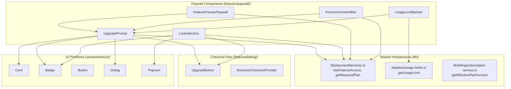
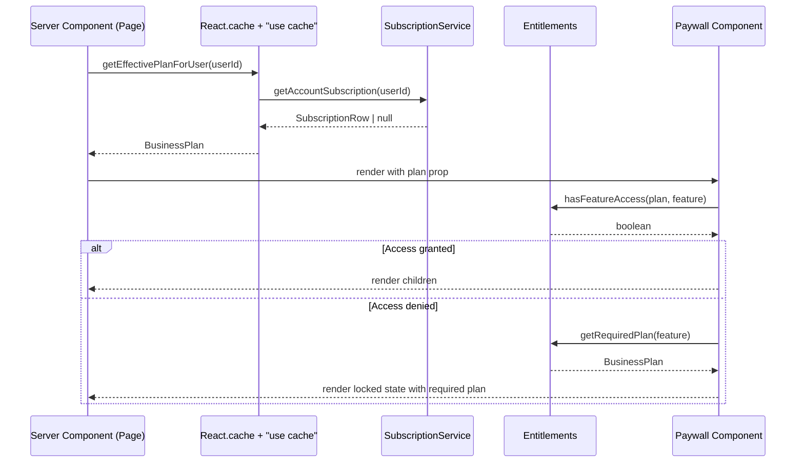

# Design Document: Paywall UI System

## Overview

The paywall UI system replaces Requo's inconsistent paywall patterns (full-page blurs, ad-hoc upgrade buttons, custom locked states) with a unified, composable set of React components. The core principle is "visible feature preview + locked premium action" — users always understand what a paid feature does before upgrading.

The system provides four primary components:
1. **UpgradePrompt** — multi-variant upgrade messaging (inline, card, banner, empty-state, modal)
2. **LockedAction** — wraps premium action buttons with a locked indicator and upgrade popover
3. **FeaturePreviewPaywall** — renders page layout with preview/demo data for locked features
4. **PremiumContentBlur** — blurs only premium-generated outputs (analytics, AI, reports)

All components integrate with the existing entitlements system (`hasFeatureAccess`, `getRequiredPlan`, `getUsageLimit`) and the existing checkout flow (`UpgradeButton`). The existing `UsageLimitBanner` is preserved with updated visual styling.

### Design Decisions

- **Lock the action, not the page**: Users see the real page structure and understand the feature before upgrading. Only premium-generated outputs (analytics data, AI suggestions) are blurred.
- **No premium data in DOM for locked users**: `PremiumContentBlur` renders static placeholder content, never the actual premium data. Server-side endpoints enforce the same boundary.
- **Reuse existing infrastructure**: All access checks go through `hasFeatureAccess()` and `getUsageLimit()`. Checkout triggers through the existing `UpgradeButton` component. No new billing paths.
- **Incremental migration**: Old and new components coexist during migration. Each route is migrated independently.
- **Fail-closed security**: If entitlement checks fail due to service errors, access is denied by default.

## Architecture



### Data Flow

1. **Server Component** resolves the business plan via `getEffectivePlanForUser()` (cached)
2. Plan is passed as a prop to paywall components
3. Each component calls `hasFeatureAccess(plan, feature)` or checks usage limits client-side
4. If locked: renders locked UI with upgrade CTA
5. If unlocked: renders children normally (passthrough)
6. Server-side endpoints independently enforce access via `hasFeatureAccess()` before returning premium data

### Module Location

Following the repo layout conventions:
- `features/paywall/components/` — all paywall UI components
- `features/paywall/lib/` — shared paywall utilities (placeholder data, descriptions)
- `features/paywall/index.ts` — public barrel export

The existing `components/shared/paywall.tsx` and `components/shared/pro-feature-notice-button.tsx` remain during migration and are deprecated once all routes are migrated.

## Components and Interfaces

### UpgradePrompt

```typescript
type UpgradePromptVariant = "inline" | "card" | "banner" | "empty-state" | "modal";
type UpgradePromptSize = "sm" | "md" | "lg";

type UpgradePromptProps = {
  /** Layout variant */
  variant: UpgradePromptVariant;
  /** Size scale, defaults to "md" */
  size?: UpgradePromptSize;
  /** Benefit description shown as secondary text */
  description: string;
  /** Current business plan — used to determine CTA text and whether to render */
  plan: BusinessPlan;
  /** Feature identifier for plan badge display */
  feature?: PlanFeature;
  /** Whether to show the plan badge */
  showBadge?: boolean;
  /** Upgrade action props for UpgradeButton integration */
  upgradeAction?: UpgradeActionProps;
  /** Optional trigger element for modal variant */
  trigger?: React.ReactNode;
  /** Additional className */
  className?: string;
};
```

**Rendering rules:**
- Returns `null` when `plan === "business"`
- CTA text: `"Upgrade to Pro"` for free, `"Upgrade to Business"` for pro
- `inline`: no wrapper, just CTA + description in a flex row
- `card`: wrapped in `Card` with `CardHeader` + `CardContent`
- `banner`: full-width horizontal strip with `rounded-xl border border-border/70 bg-card/50`
- `empty-state`: centered vertical layout with icon, description, and CTA
- `modal`: content rendered inside `Dialog` overlay

### LockedAction

```typescript
type LockedActionProps = {
  /** Feature to check entitlement against */
  feature: PlanFeature;
  /** Current business plan */
  plan: BusinessPlan;
  /** Value description for the upgrade popover (falls back to planFeatureDescriptions) */
  description?: string;
  /** Upgrade action props for the popover CTA */
  upgradeAction?: UpgradeActionProps;
  /** The action element to wrap (button, link, etc.) */
  children: React.ReactElement;
  /** Additional className for the wrapper */
  className?: string;
};
```

**Rendering rules:**
- If `hasFeatureAccess(plan, feature)` → render children normally (passthrough)
- If locked:
  - Render children with `opacity-50`, lock icon appended, plan badge overlay
  - Set `aria-disabled="true"` on the wrapped element
  - Intercept click → show upgrade `Popover` with plan name, description, and CTA
  - Preserve original button size, variant, and position (no layout shift)

### FeaturePreviewPaywall

```typescript
type FeaturePreviewPaywallProps = {
  /** Feature to check entitlement against */
  feature: PlanFeature;
  /** Current business plan */
  plan: BusinessPlan;
  /** Preview/demo content to show when locked (optional) */
  previewContent?: React.ReactNode;
  /** Description of the feature for the upgrade prompt */
  description?: string;
  /** The unlocked content */
  children: React.ReactNode;
  /** Additional className */
  className?: string;
};
```

**Rendering rules:**
- If `hasFeatureAccess(plan, feature)` → render children normally
- If locked + `previewContent` provided:
  - Render `previewContent` with a "Demo data" badge/indicator
  - Render inline `UpgradePrompt` (banner variant) below the preview
- If locked + no `previewContent`:
  - Render `UpgradePrompt` (empty-state variant) with feature description
- Never applies full-page blur or opaque overlay

### PremiumContentBlur

```typescript
type PremiumContentBlurProps = {
  /** Feature to check entitlement against */
  feature: PlanFeature;
  /** Current business plan */
  plan: BusinessPlan;
  /** Static placeholder content to show when locked (blurred) */
  placeholder: React.ReactNode;
  /** The actual premium content (only rendered when unlocked) */
  children: React.ReactNode;
  /** Additional className */
  className?: string;
};
```

**Rendering rules:**
- If `hasFeatureAccess(plan, feature)` → render children normally
- If locked:
  - Render `placeholder` with `blur-[3px] pointer-events-none select-none aria-hidden="true"`
  - Overlay centered `UpgradePrompt` (inline variant) on top
  - **Do NOT render `children` in the DOM** — premium data must not be accessible
- Wraps content in `role="region"` with `aria-label` describing the locked feature

### UsageLimitBanner (preserved)

```typescript
type UsageLimitBannerProps = {
  /** Human-readable label for the limit */
  label: string;
  /** Current usage count */
  current: number;
  /** Maximum allowed by plan */
  limit: number;
  /** Current business plan */
  plan: BusinessPlan;
  /** Additional className */
  className?: string;
};
```

Public API preserved from existing component. Visual styling updated to match unified paywall language (spacing, border tokens, typography).

### UpgradeActionProps (shared)

```typescript
type UpgradeActionProps = {
  userId: string;
  businessId: string;
  businessSlug: string;
  currentPlan: BusinessPlan;
  region: BillingRegion;
  defaultCurrency: BillingCurrency;
};
```

When `upgradeAction` is provided, components render the full `UpgradeButton` with checkout integration. When omitted, components render a simpler CTA that navigates to the billing page.

## Data Models

### Plan Resolution Flow



### Static Placeholder Data

Premium content previews use hardcoded placeholder data defined in `features/paywall/lib/placeholder-data.ts`. This data:
- Is static and does not originate from real user/business/account records
- Provides realistic-looking but clearly fake examples (e.g., "Acme Corp", sample metrics)
- Is scoped per feature (analytics placeholders, AI suggestion placeholders, etc.)

### Entitlement Types (existing, no changes)

```typescript
// lib/plans/plans.ts
type BusinessPlan = "free" | "pro" | "business";

// lib/plans/entitlements.ts
type PlanFeature = "analyticsConversion" | "analyticsWorkflow" | "multipleForms" | ...;

// lib/plans/usage-limits.ts
type UsageLimitKey = "inquiriesPerMonth" | "quotesPerMonth" | "customFieldsPerForm" | ...;
```

No schema changes required. The paywall system reads from existing plan infrastructure.

## Correctness Properties

*A property is a characteristic or behavior that should hold true across all valid executions of a system — essentially, a formal statement about what the system should do. Properties serve as the bridge between human-readable specifications and machine-verifiable correctness guarantees.*

### Property 1: Variant-wrapper mapping

*For any* valid UpgradePrompt variant value, the rendered output SHALL use the correct wrapper element: no wrapper for inline, Card for card, full-width strip element for banner, centered vertical layout for empty-state, and Dialog for modal.

**Validates: Requirements 1.10**

### Property 2: Description passthrough

*For any* non-empty description string passed to UpgradePrompt, the rendered output SHALL contain that exact string as visible secondary text content.

**Validates: Requirements 1.5**

### Property 3: LockedAction locked state rendering

*For any* (plan, feature) pair where `hasFeatureAccess(plan, feature)` returns false, LockedAction SHALL render the wrapped element with reduced opacity, a lock icon, a Plan_Badge showing the required plan, `aria-disabled="true"`, and SHALL prevent the default click action from executing.

**Validates: Requirements 2.2, 2.3**

### Property 4: LockedAction unlocked passthrough

*For any* (plan, feature) pair where `hasFeatureAccess(plan, feature)` returns true, LockedAction SHALL render the wrapped element in its normal interactive state without any lock icon, Plan_Badge, disabled attributes, or click interception.

**Validates: Requirements 2.4**

### Property 5: LockedAction default description fallback

*For any* PlanFeature identifier, when LockedAction is rendered without a description prop, the upgrade popover SHALL display the text from `planFeatureDescriptions[feature]`.

**Validates: Requirements 2.8**

### Property 6: FeaturePreviewPaywall locked state

*For any* (plan, feature) pair where `hasFeatureAccess(plan, feature)` returns false and previewContent is provided, FeaturePreviewPaywall SHALL render the preview content with a visible demo/example indicator AND an inline UpgradePrompt showing the feature description and required plan.

**Validates: Requirements 3.2, 3.3**

### Property 7: FeaturePreviewPaywall unlocked passthrough

*For any* (plan, feature) pair where `hasFeatureAccess(plan, feature)` returns true, FeaturePreviewPaywall SHALL render its children content without any paywall indicators, demo labels, or upgrade prompts.

**Validates: Requirements 3.4**

### Property 8: PremiumContentBlur excludes premium data from DOM

*For any* (plan, feature) pair where `hasFeatureAccess(plan, feature)` returns false, PremiumContentBlur SHALL NOT render its children (premium data) in the DOM. Only the static placeholder content SHALL be present.

**Validates: Requirements 4.2, 7.2**

### Property 9: PremiumContentBlur unlocked passthrough

*For any* (plan, feature) pair where `hasFeatureAccess(plan, feature)` returns true, PremiumContentBlur SHALL render its children normally without any blur effect, overlay, or placeholder content.

**Validates: Requirements 4.3**

### Property 10: PremiumContentBlur accessibility in locked state

*For any* (plan, feature) pair where `hasFeatureAccess(plan, feature)` returns false, PremiumContentBlur SHALL apply `pointer-events: none` and `aria-hidden="true"` to the blurred placeholder content, preventing interaction and screen reader access.

**Validates: Requirements 4.5, 4.6**

### Property 11: Business plan suppresses all paywall UI

*For any* paywall component (UpgradePrompt, LockedAction, FeaturePreviewPaywall, PremiumContentBlur) rendered with `plan="business"`, the component SHALL NOT display any upgrade prompts, locked-state indicators, plan badges, or blur overlays.

**Validates: Requirements 5.5, 1.4**

### Property 12: Plan badge presence on locked states

*For any* paywall component in a locked state (plan is "free" or "pro" and feature requires a higher plan), the rendered output SHALL include a Plan_Badge (Badge component) displaying the label of the required plan tier ("Pro" or "Business").

**Validates: Requirements 5.6**

### Property 13: Server-side access denial for unauthorized requests

*For any* server-side endpoint that returns Feature_Entitlement-gated data, when a request is received from a user whose plan does not grant access to the required feature, the endpoint SHALL return an error response without including any premium data in the response body.

**Validates: Requirements 7.6, 7.7**

### Property 14: Fail-closed on entitlement service error

*For any* entitlement check (`hasFeatureAccess()` or `getEffectivePlanForUser()`) that throws due to a service error, the paywall system SHALL deny access to the requested premium data rather than granting access by default.

**Validates: Requirements 7.8**

### Property 15: ARIA attributes on locked containers

*For any* paywall component in a locked state, the locked-state container SHALL have `role="region"` with an `aria-label` describing the locked feature name and required plan, and decorative elements (lock icons, blurred content) SHALL be marked with `aria-hidden="true"`.

**Validates: Requirements 8.3**

## Error Handling

### Entitlement Check Failures

- **Fail-closed**: If `hasFeatureAccess()` or `getEffectivePlanForUser()` throws, treat the user as having no access. Render the locked state.
- **Implementation**: Wrap entitlement calls in try/catch at the server component level. On error, pass `plan="free"` to paywall components.
- **Logging**: Log the error with context (userId, feature) for debugging but do not expose error details to the client.

### Missing Props / Invalid State

- **Missing `upgradeAction`**: Components render a simplified CTA that navigates to `/account/billing` instead of opening the inline checkout.
- **Invalid feature identifier**: TypeScript enforces `PlanFeature` type at compile time. Runtime fallback: treat as locked with "Pro" as required plan.
- **Missing `previewContent` on FeaturePreviewPaywall**: Falls back to empty-state variant of UpgradePrompt (Requirement 3.6).

### Checkout Flow Errors

- Handled by the existing `UpgradeButton` and `BusinessCheckoutProvider` infrastructure.
- Paywall components do not handle checkout errors directly — they delegate to the existing billing flow.

### Plan Change During Session

- Plan state is resolved server-side on each page navigation via cached `getEffectivePlanForUser()`.
- Cache tags (`getUserBillingCacheTags`) are revalidated when the subscription service processes plan changes.
- No full page reload required — Next.js App Router re-renders server components on navigation.

## Testing Strategy

### Property-Based Tests

The feature is suitable for property-based testing because the core logic (entitlement checks → render decisions) is a pure function of inputs (plan, feature) with a large input space (15 features × 3 plans × multiple component variants).

**Library**: `fast-check` with Vitest
**Minimum iterations**: 100 per property test
**Tag format**: `Feature: paywall-ui-system, Property {number}: {property_text}`

Property tests will cover:
- All 15 correctness properties defined above
- Generators for: `BusinessPlan`, `PlanFeature`, `UpgradePromptVariant`, description strings
- Component rendering assertions using `@testing-library/react`

### Unit Tests (Example-Based)

- UpgradePrompt size default (md when not specified)
- UpgradePrompt CTA text mapping (free → "Upgrade to Pro", pro → "Upgrade to Business")
- UpgradePrompt returns null for business plan
- LockedAction popover appears on click
- FeaturePreviewPaywall empty-state fallback when no previewContent
- Keyboard navigation (Tab, Enter, Space, Escape)
- Focus trap in modal variant
- Reduced-motion preference disables animations

### Integration Tests

- Server-side endpoint access denial (mock entitlement service, verify 403 responses)
- Plan change reflected on next navigation (simulate subscription update + cache revalidation)
- Feature-specific route tests (follow-ups page, analytics page, team members page)
- Migration coexistence (old and new components on separate routes without conflicts)

### Visual / E2E Tests

- Responsive rendering at 320px, 768px, 1024px, 1440px viewports
- Touch target sizes at mobile viewports
- Color contrast audit (axe-core)
- Visual regression snapshots for each component variant
