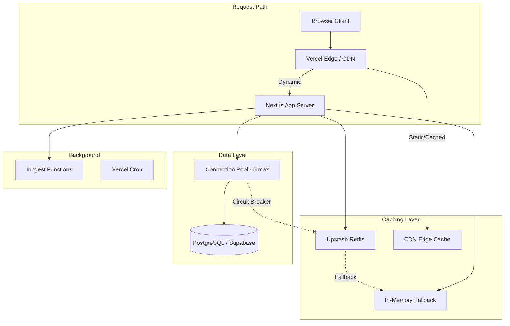
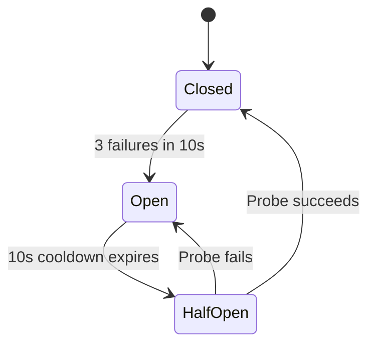

# Design Document: Performance & Scalability

## Overview

This design addresses Requo's top performance bottlenecks to support 100+ concurrent dashboard users and 500+ daily public page views without exceeding free-tier resource limits. The approach is incremental — each optimization targets a specific bottleneck while preserving existing architecture patterns and module boundaries.

The design covers 10 areas: Redis-based rate limiting, cached AI usage counting, static marketing pages, batched analytics rollup, edge-cached public pages, lazy-loaded heavy bundles, connection pool circuit breaker, extended embedding cache with batch generation, Inngest event batching, and composite database indexes.

All changes operate within:
- Supabase free tier: 500MB storage, 5 pooler connections
- Upstash Redis: 10K commands/day
- Inngest: 25K events/month
- Vercel Hobby/Pro hosting

## Architecture



### Key Architectural Decisions

1. **Redis as rate-limit store, not general cache** — Rate limiting moves to Redis sliding windows to free connection pool slots. The existing `cacheLayer` (Redis + in-memory) continues to handle AI caching.

2. **Cache-aside pattern for usage counting** — Usage counts are cached in the existing `cacheLayer` with atomic increment on write. The 60-second staleness window accepts a maximum overshoot of 3 weight units (one heavy request).

3. **Static generation over SSR for marketing** — Marketing pages export `force-static` + ISR revalidation. No runtime DB or session dependencies.

4. **Batched sequential processing for analytics** — `Promise.allSettled` within bounded batches prevents pool exhaustion while improving throughput over sequential processing.

5. **Circuit breaker at the query layer** — A state machine (closed → open → half-open) wraps dashboard read queries, falling back to cached data when the pool is exhausted.

6. **Lazy loading at the page boundary** — Heavy libraries (Recharts, @xyflow/react, react-easy-crop, pdf-lib, html-to-image) use `next/dynamic` with `ssr: false` and appropriately-sized skeleton placeholders.

7. **Event consolidation over event reduction** — Inngest events are batched by combining recipients/triggers into single payloads rather than reducing functionality.

8. **Indexes targeted at hot queries** — Composite indexes are added only where EXPLAIN shows sequential scans on filtered, sorted queries.

## Components and Interfaces

### 1. Redis Rate Limiter (`lib/rate-limit/redis-rate-limiter.ts`)

```typescript
type RateLimitConfig = {
  action: PublicActionType;
  scope: string;
  limit: number;
  windowMs: number;
};

type RateLimitResult = {
  allowed: boolean;
  metadata: {
    limit: number;
    remaining: number;
    reset: number; // Unix epoch seconds
  };
};

// Public API — drop-in replacements for existing functions
export async function assertPublicActionRateLimit(config: RateLimitConfig): Promise<boolean>;
export async function assertBusinessActionRateLimit(config: RateLimitConfig): Promise<boolean>;

// Response header helper
export function rateLimitHeaders(metadata: RateLimitResult['metadata']): HeadersInit;
```

**Redis Key Pattern:** `rl:{action}:{fingerprint}` with TTL = windowMs  
**Commands per check:** 2 (INCR with EX, GET current count)  
**Fallback:** Existing DB-based implementation on Redis failure (fail-closed for public, fail-open for business)

### 2. Cached Usage Counter (`lib/ai/usage-limiter.ts` — enhanced)

```typescript
// Enhanced checkUsageLimit with cache-first reads
export async function checkUsageLimit(input: UsageLimitCheck): Promise<UsageLimitResult>;

// Enhanced recordUsage with atomic cache increment
export async function recordUsage(
  userId: string,
  businessId: string,
  taskType: AiTaskType,
  weight: number
): Promise<void>;
```

**Cache Key Patterns:**
- `ai_usage:user:{userId}:{YYYY-MM}` — user-level monthly total
- `ai_usage:business:{businessId}:{YYYY-MM}` — business-level monthly total

**TTL:** 60 seconds  
**Staleness tolerance:** Up to 60s stale reads, max overshoot of 3 weight units

### 3. Static Marketing Pages (`app/(marketing)/*/page.tsx`)

```typescript
// Each marketing page exports:
export const dynamic = "force-static";
export const revalidate = 3600; // 1 hour ISR
```

**Scope:** landing, pricing, legal, terms, privacy, refund-policy, security, subprocessors  
**Excluded:** `opengraph-image.tsx`, `twitter-image.tsx` (on-demand generation)  
**Layout constraint:** Marketing layout must not use `headers()`, `cookies()`, DB queries, or session checks

### 4. Batched Analytics Rollup (`features/analytics/jobs/rollup.ts` — enhanced)

```typescript
type BatchConfig = {
  batchSize: number;  // default: 10, min: 5, max: 25
};

export async function computeDailyRollups(config?: BatchConfig): Promise<AnalyticsRollupSummary>;
```

**Processing model:** Sequential batches of `Promise.allSettled` calls  
**Connection safety:** At most one batch in-flight at a time (max 5 concurrent DB connections per batch assuming 1 connection per business rollup)  
**Error isolation:** Failed businesses are logged and included in summary; processing continues

### 5. Edge Cache Headers (`lib/cache/public-page-headers.ts`)

```typescript
export function publicPageCacheHeaders(): HeadersInit;
// Returns: { 'Cache-Control': 'public, s-maxage=60, stale-while-revalidate=300', 'Vary': 'Accept-Encoding' }
```

**Applied to:** `/inquire/[slug]` and `/quote/[token]` routes  
**Runtime:** Edge runtime for sub-200ms cold starts  
**Client-side refresh:** State-changing actions trigger `router.refresh()` or SWR revalidation within 2 seconds

### 6. Bundle Optimizer (`components/shared/lazy-*.tsx`)

```typescript
// Pattern for each lazy-loaded component
const LazyRecharts = dynamic(() => import('./recharts-wrapper'), {
  ssr: false,
  loading: () => <ChartSkeleton />,
});
```

**Target libraries:**
| Library | Trigger Page | Est. Savings (gzipped) |
|---------|-------------|----------------------|
| Recharts | Analytics pages | ~45 KB |
| @xyflow/react | Automations builder | ~65 KB |
| react-easy-crop | Image crop dialog | ~15 KB |
| html-to-image | PDF/export actions | ~10 KB |
| pdf-lib | PDF generation | ~30 KB |

**Placeholder requirement:** Matching container dimensions, < 2 KB JS, CLS < 0.1  
**Error handling:** Inline error boundary with retry control

### 7. Connection Pool Circuit Breaker (`lib/db/circuit-breaker.ts`)

```typescript
type CircuitState = 'closed' | 'open' | 'half-open';

type CircuitBreakerConfig = {
  failureThreshold: 3;       // consecutive failures to open
  failureWindowMs: 10_000;   // window for counting failures
  cooldownMs: 10_000;        // open state duration
  maxQueuedWrites: 20;       // max pending writes during open state
  staleCacheMaxAge: 120_000; // max age of cache fallback (ms)
};

export function withCircuitBreaker<T>(
  queryKey: string,
  queryFn: () => Promise<T>,
  options?: { isWrite?: boolean }
): Promise<T>;
```

**Scope:** Dashboard read queries (shell queries, business-scoped data fetches)  
**Excluded:** Authentication, billing webhooks, migrations  
**State machine:** closed → (3 failures in 10s) → open → (10s cooldown) → half-open → (probe success) → closed

### 8. Embedding Batcher (`lib/ai/embeddings.ts` — enhanced)

```typescript
// New batch function
export async function generateEmbeddings(
  texts: string[]
): Promise<(number[] | null)[]>;

// Extended TTL for single embeddings
const EMBEDDING_CACHE_TTL_SECONDS = 86_400; // 24 hours (was 300s)
```

**Batch size:** 1–20 texts per call  
**Cache key:** `emb:{sha256(text)}` (unchanged format, extended TTL)  
**Fallback:** Sequential individual calls if batch API unavailable  
**Invalidation:** Explicit delete on knowledge base entry update/delete

### 9. Inngest Event Batcher (`lib/inngest/batch.ts`)

```typescript
export async function batchSendEvents(
  events: Array<{ name: string; data: unknown }>
): Promise<void>;

// Notification batching - combines recipients into single event
export async function sendBatchedNotification(
  eventName: string,
  recipients: Array<{ userId: string; payload: unknown }>,
  maxPerEvent?: number // default: 100
): Promise<void>;

// Automation dispatch debouncing
export async function sendDebouncedAutomationDispatch(
  businessId: string,
  triggers: AutomationDispatchEventData[],
  debounceMs?: number // default: 5000
): Promise<void>;
```

**Max payload size:** 512KB per event; auto-split if exceeded  
**Retry:** 3 attempts with exponential backoff on partial delivery failure  
**Event reduction target:** ≥30% fewer monthly events

### 10. Database Index Migration (`drizzle/XXXX_performance_indexes.sql`)

```sql
-- Inquiries: inbox query (business + status + created_at sort)
CREATE INDEX CONCURRENTLY IF NOT EXISTS inquiries_business_status_created_at_idx
  ON inquiries (business_id, status, created_at);

-- Quotes: list query (business + status + created_at sort)
CREATE INDEX CONCURRENTLY IF NOT EXISTS quotes_business_status_created_at_idx
  ON quotes (business_id, status, created_at);
```

**Note:** The `public_action_events(action, key, created_at)` and `ai_usage_events(user_id, created_at)` / `ai_usage_events(business_id, created_at)` indexes already exist in the current schema. The migration only adds the two missing composite indexes on `inquiries` and `quotes` that include `created_at` for sort optimization.

**Storage budget:** < 50MB total new index size, verified via `pg_total_relation_size`  
**Safety:** `CREATE INDEX CONCURRENTLY` avoids table locks

### Vercel Cron Migration Candidates

Jobs that use no step functions, require no retry logic, and complete quickly:

| Current Job | Duration | Candidate? | Reason |
|-------------|----------|-----------|--------|
| Token log cleanup | < 10s | Yes | Simple DELETE query, no steps |
| Expire quotes | < 10s | Yes | Simple UPDATE query, no steps |
| Expire subscriptions | < 5s | Yes | Simple UPDATE query, no steps |

Moving 3 daily cron jobs to Vercel Cron saves ~90 Inngest events/month (3 × 30 days).

## Data Models

### Redis Key Space

| Pattern | Purpose | TTL | Commands/op |
|---------|---------|-----|------------|
| `rl:{action}:{fingerprint}` | Rate limit counter | windowMs | 2 |
| `ai_usage:user:{userId}:{YYYY-MM}` | User monthly usage | 60s | 1 (read) or 1 (incr) |
| `ai_usage:business:{businessId}:{YYYY-MM}` | Business monthly usage | 60s | 1 (read) or 1 (incr) |
| `emb:{sha256}` | Embedding vector | 86400s | 1 |
| `cool:{userId}:{taskType}` | AI cooldown | 3s | 1 |
| `cb:state` | Circuit breaker state | 30s | 1 |

### Redis Budget Analysis (10K commands/day)

| Operation | Frequency | Commands/op | Daily Total |
|-----------|-----------|-------------|-------------|
| Rate limit checks | ~200/day | 2 | 400 |
| Usage cache reads | ~100/day | 1 | 100 |
| Usage cache increments | ~50/day | 1 | 50 |
| Embedding cache reads | ~50/day | 1 | 50 |
| Embedding cache writes | ~10/day | 1 | 10 |
| Cooldown checks | ~100/day | 1 | 100 |
| Circuit breaker | ~20/day | 1 | 20 |
| **Total** | | | **~730** |

Well within the 10K daily command budget with ~13x headroom.

### New Database Indexes

| Table | Columns | Purpose |
|-------|---------|---------|
| `inquiries` | `(business_id, status, created_at)` | Inbox filter + sort |
| `quotes` | `(business_id, status, created_at)` | Quote list filter + sort |

### Circuit Breaker State Model




## Correctness Properties

*A property is a characteristic or behavior that should hold true across all valid executions of a system — essentially, a formal statement about what the system should do. Properties serve as the bridge between human-readable specifications and machine-verifiable correctness guarantees.*

### Property 1: Rate limit result correctness

*For any* rate limit check with configured limit L and current sliding window count C, the result SHALL be `allowed: true` with `remaining = L - C` when C < L, and `allowed: false` with `remaining = 0` when C ≥ L, and in both cases the `reset` timestamp SHALL be a valid Unix epoch seconds value in the future.

**Validates: Requirements 1.5, 1.6**

### Property 2: Rate limit fallback semantics

*For any* rate limit check configuration, when Redis is unavailable (connection failure or timeout), public action checks SHALL return `false` (fail-closed) and business action checks SHALL return `true` (fail-open), preserving the existing safety semantics of each scope.

**Validates: Requirements 1.4, 1.8**

### Property 3: Rate limit response headers

*For any* valid rate limit metadata (limit ≥ 1, remaining ≥ 0, reset > 0), the `rateLimitHeaders` function SHALL produce headers where `X-RateLimit-Limit` equals the limit, `X-RateLimit-Remaining` equals the remaining count, and `X-RateLimit-Reset` equals the reset timestamp as a string.

**Validates: Requirements 1.7**

### Property 4: Usage counter cache-first with DB fallback

*For any* valid businessId, userId, and current UTC month, `checkUsageLimit` SHALL return the cached usage value when present, or execute a database aggregate query and cache the result with 60-second TTL when the cache is empty, and the cache keys for user-level and business-level totals SHALL always be distinct.

**Validates: Requirements 2.1, 2.2, 2.5**

### Property 5: Usage counter atomic increment

*For any* successful AI invocation with weight W (1 ≤ W ≤ 3), calling `recordUsage` SHALL increase the cached counter by exactly W units, such that the cached value after increment equals the cached value before increment plus W.

**Validates: Requirements 2.3**

### Property 6: Usage counter total cache unavailability fallback

*For any* valid usage check input, when both Redis and in-memory cache are entirely unavailable, `checkUsageLimit` SHALL fall through to the database aggregate query and return a valid usage result (never throw or return undefined).

**Validates: Requirements 2.8**

### Property 7: Analytics rollup batch processing invariants

*For any* list of N active businesses and batch size B (5 ≤ B ≤ 25), the rollup SHALL process them in exactly ⌈N/B⌉ sequential batches where each batch contains at most B businesses, and batch K+1 SHALL not begin execution until all promises in batch K have settled.

**Validates: Requirements 4.1, 4.3**

### Property 8: Analytics rollup error isolation with reporting

*For any* batch containing a mix of succeeding and failing business rollups, all non-failing businesses SHALL complete their rollup, and every failing business SHALL appear in the returned summary's `errors` array with its businessId and error message while the `processed` count reflects only successful completions.

**Validates: Requirements 4.2, 4.4**

### Property 9: Circuit breaker cache age threshold

*For any* query key with cached data of age A (in seconds) when a pool exhaustion error occurs, the circuit breaker SHALL return the cached data if A ≤ 120, and SHALL return a structured unavailability error if A > 120 or no cached data exists.

**Validates: Requirements 7.1**

### Property 10: Circuit breaker state machine transitions

*For any* sequence of pool exhaustion failures with timestamps, the circuit breaker SHALL transition from closed to open if and only if 3 or more failures occur within a 10-second window, SHALL transition from open to half-open after a 10-second cooldown, and SHALL transition from half-open to closed on probe success or back to open on probe failure.

**Validates: Requirements 7.3, 7.6**

### Property 11: Circuit breaker write queue capacity

*For any* number of write operations N attempted while the circuit breaker is in the open state, exactly min(N, 20) operations SHALL be queued and any operations beyond 20 SHALL be immediately rejected with a structured error.

**Validates: Requirements 7.4**

### Property 12: Embedding batch order preservation

*For any* array of 1 to 20 text inputs, `generateEmbeddings` SHALL return an array of the same length where each position i contains either the embedding vector for `texts[i]` or null (on individual failure), preserving positional correspondence.

**Validates: Requirements 8.3**

### Property 13: Embedding cache key determinism

*For any* text input, the embedding cache key SHALL be deterministic (same text always produces the same key), and for any two distinct text inputs, the cache keys SHALL differ (collision-free via SHA-256).

**Validates: Requirements 8.8**

### Property 14: Embedding batch cache consistency

*For any* text processed via `generateEmbeddings` in a batch, the result SHALL be cached with the same key format (`emb:{sha256(text)}`) and TTL (86400 seconds) as if it had been processed via the single `generateEmbedding` function, so that subsequent single lookups benefit from batch-generated cache entries.

**Validates: Requirements 8.6**

### Property 15: Embedding cache invalidation on update

*For any* knowledge base entry with text content T₁ that is updated to T₂, the cache key corresponding to SHA-256(T₁) SHALL be deleted, and a new cache entry SHALL be created for SHA-256(T₂) with the new embedding and 86400-second TTL.

**Validates: Requirements 8.2**

### Property 16: Embedding batch fallback to sequential

*For any* array of texts when the batch embedding API call fails entirely, `generateEmbeddings` SHALL fall back to calling `generateEmbedding` individually for each text and return null in positions where individual generation also fails.

**Validates: Requirements 8.5**

### Property 17: Event batcher recipient combining with payload splitting

*For any* set of N notification recipients for a single triggering event, the event batcher SHALL produce ⌈N/100⌉ Inngest events each containing at most 100 recipients, and if any resulting event payload exceeds 512KB, it SHALL be further split into the minimum number of events each within the 512KB limit while preserving recipient ordering.

**Validates: Requirements 9.1, 9.6**

### Property 18: Event batcher debounced automation dispatch

*For any* set of automation triggers arriving for the same business within a 5-second debounce window, the event batcher SHALL combine them into a single dispatch event containing all pending triggers (up to 50 per event), emitting ⌈triggers/50⌉ events total.

**Validates: Requirements 9.2**

### Property 19: Event batcher partial failure retry

*For any* batch send operation where K out of N split payloads fail delivery, the event batcher SHALL retry only the K failed payloads (not the N-K successful ones), up to 3 attempts with exponential backoff, and log the batch ID along with delivered/failed counts.

**Validates: Requirements 9.7**

## Error Handling

### Rate Limiter Errors

| Error Condition | Behavior | Recovery |
|----------------|----------|----------|
| Redis connection failure | Fall back to DB-based rate limiting | Auto-recovers on next request when Redis reconnects |
| Redis timeout (> 2s) | Fall back to DB-based rate limiting | Log warning, continue with DB |
| Missing Redis env vars | Permanent fallback to DB | Log once at startup |
| DB fallback also fails (public) | Return `false` (deny request) | Fail-closed is safe default |
| DB fallback also fails (business) | Return `true` (allow request) | Fail-open preserves user experience |

### Usage Counter Errors

| Error Condition | Behavior | Recovery |
|----------------|----------|----------|
| Cache read failure | Fall through to DB aggregate | Auto-recovers on next request |
| Cache increment failure | Delete cache key, log warning | Next check refreshes from DB |
| Cache entirely unavailable | All reads go to DB | Graceful degradation, no failures |
| DB aggregate query failure | Propagate error to caller | Caller handles (existing pattern) |

### Analytics Rollup Errors

| Error Condition | Behavior | Recovery |
|----------------|----------|----------|
| Individual business rollup fails | Log error, include in summary, continue | Retried on next cron run |
| Entire batch timeout | Inngest retry (up to 2 retries) | Automatic via Inngest config |
| DB connection pool exhaustion | Some businesses in batch fail | Remaining batches may succeed; retry on next run |

### Circuit Breaker Errors

| Error Condition | Behavior | Recovery |
|----------------|----------|----------|
| Pool exhaustion (closed state) | Return cached data or error | Track failure count |
| Pool exhaustion (3+ in 10s) | Enter open state | Cooldown → half-open → probe |
| Cache miss during open state | Return unavailability error | User sees "temporarily unavailable" message |
| Write queue overflow (> 20) | Reject write immediately | User prompted to retry later |
| Probe query fails (half-open) | Return to open state | Restart cooldown |

### Embedding Errors

| Error Condition | Behavior | Recovery |
|----------------|----------|----------|
| Batch API unavailable | Fall back to sequential calls | Transparent to caller |
| Individual embedding failure in batch | Return null for that position | Caller handles null positions |
| All providers fail | Return null (single) or null array | Existing pattern preserved |
| Cache write failure | Embedding still returned to caller | Re-generated on next request |

### Event Batcher Errors

| Error Condition | Behavior | Recovery |
|----------------|----------|----------|
| Payload exceeds 512KB | Auto-split into smaller payloads | Transparent to caller |
| Partial delivery failure | Retry only failed chunks (3 attempts) | Exponential backoff |
| Complete delivery failure | Retry entire batch (3 attempts) | Log and alert on final failure |
| Inngest client unavailable | Propagate error | Caller handles (existing pattern) |

## Testing Strategy

### Property-Based Tests (fast-check)

Property-based testing is appropriate for this feature because the core components (rate limiter, usage counter, circuit breaker, batcher) are pure logic functions with clear input/output behavior and universal properties that should hold across wide input spaces.

**Library:** fast-check (already available in the project)  
**Minimum iterations:** 100 per property  
**Tag format:** `Feature: performance-scalability, Property {N}: {description}`

| Property | Target Module | Key Generators |
|----------|--------------|----------------|
| 1: Rate limit result correctness | `lib/rate-limit/redis-rate-limiter.ts` | `fc.nat()` for limit/count, `fc.integer()` for timestamps |
| 2: Rate limit fallback semantics | `lib/rate-limit/redis-rate-limiter.ts` | `fc.constantFrom(...actionTypes)`, `fc.string()` for scope |
| 3: Rate limit response headers | `lib/rate-limit/redis-rate-limiter.ts` | `fc.record({limit: fc.nat(), remaining: fc.nat(), reset: fc.nat()})` |
| 4: Usage counter cache-first | `lib/ai/usage-limiter.ts` | `fc.uuid()` for IDs, `fc.nat()` for cached values |
| 5: Usage counter increment | `lib/ai/usage-limiter.ts` | `fc.integer({min:1, max:3})` for weight, `fc.nat()` for initial |
| 6: Usage counter fallback | `lib/ai/usage-limiter.ts` | `fc.uuid()` for IDs, `fc.constantFrom(...plans)` |
| 7: Batch processing invariants | `features/analytics/jobs/rollup.ts` | `fc.integer({min:1, max:100})` for N, `fc.integer({min:5, max:25})` for B |
| 8: Error isolation | `features/analytics/jobs/rollup.ts` | `fc.array(fc.boolean())` for success/failure pattern |
| 9: Cache age threshold | `lib/db/circuit-breaker.ts` | `fc.integer({min:0, max:300})` for age |
| 10: State machine transitions | `lib/db/circuit-breaker.ts` | `fc.array(fc.nat())` for failure timestamps |
| 11: Write queue capacity | `lib/db/circuit-breaker.ts` | `fc.integer({min:0, max:50})` for N writes |
| 12: Batch order preservation | `lib/ai/embeddings.ts` | `fc.array(fc.string(), {minLength:1, maxLength:20})` |
| 13: Cache key determinism | `lib/ai/embeddings.ts` | `fc.string()` for text |
| 14: Batch cache consistency | `lib/ai/embeddings.ts` | `fc.array(fc.string(), {minLength:1, maxLength:20})` |
| 15: Cache invalidation | `lib/ai/embeddings.ts` | `fc.string()` for old/new content |
| 16: Batch fallback | `lib/ai/embeddings.ts` | `fc.array(fc.string(), {minLength:1, maxLength:20})` |
| 17: Recipient combining + split | `lib/inngest/batch.ts` | `fc.integer({min:1, max:500})` for recipients |
| 18: Debounced dispatch | `lib/inngest/batch.ts` | `fc.array(fc.object())` for triggers |
| 19: Partial failure retry | `lib/inngest/batch.ts` | `fc.array(fc.boolean())` for delivery success pattern |

### Unit Tests (Vitest)

| Area | Tests | Focus |
|------|-------|-------|
| Redis rate limiter | 8–10 tests | Redis key format, command count (exactly 2), action type compatibility, fingerprint generation |
| Usage counter | 6–8 tests | TTL setting on new key, cache delete on increment failure, month boundary key format |
| Marketing page exports | 8 tests | Each page exports `force-static` and `revalidate = 3600` |
| Public page headers | 3 tests | Correct Cache-Control, Vary header values |
| Bundle lazy-loading | 5 tests | Error boundary behavior, retry mechanism |
| Circuit breaker | 8 tests | State transitions, log output format, scope exclusions |
| Embedding TTL | 2 tests | Constant equals 86400, empty input returns [] |
| Event batcher | 4 tests | Batch API call format, 512KB size calculation |

### Integration Tests

| Area | Tests | Focus |
|------|-------|-------|
| Rate limiter with real Redis | 2 tests | Sliding window works end-to-end |
| Usage counter with DB | 2 tests | Cache miss → DB query → cache set flow |
| Analytics rollup with DB | 2 tests | Batch processing with real queries |
| Index verification | 2 tests | EXPLAIN confirms Index Scan usage |
| Marketing page build | 1 test | `next build` completes with static outputs |

### E2E Tests (Playwright)

| Flow | Tests | Focus |
|------|-------|-------|
| Public page caching | 1 test | Verify response headers on public pages |
| Lazy-loaded components | 2 tests | Chart renders on analytics page, workflow builder renders |
| Rate limit headers | 1 test | Verify X-RateLimit-* headers in response |

### Performance Benchmarks (non-blocking, informational)

| Metric | Target | Tool |
|--------|--------|------|
| Dashboard First Load JS | ≥ 100 KB reduction (gzipped) | `next build` output comparison |
| Public page cold start | < 200ms p95 | Vercel analytics |
| Rate limit check latency | < 10ms (Redis path) | `server-timing` header in dev |
| Analytics rollup duration (50 businesses) | < 30s | Inngest dashboard |
