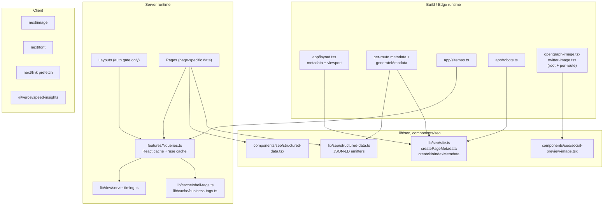

# Design Document

## Overview

This feature tightens Requo's SEO and runtime performance across the App Router by filling in the gaps that sit on top of the baseline already in place (root `metadata`, `sitemap.ts`, `robots.ts`, `Organization` and `WebSite` JSON-LD, `next/font`, `@vercel/speed-insights`, and the two-layer cache pattern for shell queries).

The work is scoped, surgical, and mostly config-driven. Nothing in this feature changes the database schema, auth surface, or billing flow. It:

1. Makes every public route inherit a complete, unique, canonical metadata record with per-route OG and Twitter data.
2. Adds dynamic `generateMetadata` plus structured data on the parameterised public routes (`/businesses/[slug]`, `/inquire/[slug]`, `/inquire/[slug]/[formSlug]`, `/quote/[token]`).
3. Expands `sitemap.ts` to include public business slugs and hardens noindex coexistence with `robots.ts`.
4. Adds `Product`, `FAQPage`, `SoftwareApplication`, `LocalBusiness`/`ProfessionalService`, and `BreadcrumbList` JSON-LD where they belong.
5. Generates social preview images at both root and per-route level with a static fallback for edge runtime failures.
6. Enforces Suspense-backed streaming and `loading.tsx` coverage on every data-fetching segment.
7. Enforces `Promise.all` for independent fetches and formalises `lib/dev/server-timing.ts` usage.
8. Reconfirms the two-layer cache pattern for shell queries and codifies it for any new shell query.
9. Tightens image and font rules (one LCP `priority` per route, `width`/`height` or `fill`+`sizes`, `display: "swap"`).
10. Wires `@next/bundle-analyzer` behind `ANALYZE=true` and locks in default `<Link>` prefetch.
11. Lights up a Lighthouse CI pass against a fixed set of public URLs with a CWV budget and a documented waiver path.

Everything lives under existing locations:

- `app/` (route metadata, sitemap, robots, social-preview routes, layouts, `loading.tsx`)
- `lib/seo/` (site helpers, structured-data emitters, per-entity metadata builders)
- `components/seo/` (`StructuredData`, `SocialPreviewImage`, shared fallbacks)
- `lib/cache/` (tag helpers already present)
- `lib/dev/server-timing.ts` (already present)
- `features/*/queries.ts` (existing `React.cache()` + `"use cache"` wrappers)
- `next.config.ts` (bundle analyzer, `modularizeImports`, `images.remotePatterns`)

The design deliberately reuses `createPageMetadata`, `createNoIndexMetadata`, `StructuredData`, `SocialPreviewImage`, and the shell-tag helpers. It does not introduce a new metadata abstraction or a new caching layer.

## Architecture

### Layered view



### Metadata layer

Every public page ships a `Metadata` object built via `createPageMetadata({ pathname, title, description, imagePath? })`. The helper is already canonicalised: it sets `alternates.canonical`, builds `openGraph.url`, `openGraph.images`, and `twitter.images`, and applies the brand title template unless an absolute title is requested. Private pages ship `createNoIndexMetadata({ ... })`, which already applies `robots.{index:false, follow:false}`.

The new work is mostly:

- Exporting `metadata` or `generateMetadata` from every remaining page under `app/(marketing)/**`, `app/(auth)/**`, `app/(public)/**`, `app/account/**`, `app/admin/**`, `app/businesses/**`, `app/onboarding/**`, `app/invite/**`.
- Adding `generateMetadata` for `/businesses/[slug]` (public) plus a cached per-slug query shared with the page component.
- Adding a `Product` emitter, a `LocalBusiness`/`ProfessionalService` emitter, and a `BreadcrumbList` emitter in `lib/seo/structured-data.ts`, consumed by the corresponding pages.

`metadataBase` is resolved once via `getSiteUrl()`. If resolution fails in a way that prevents an absolute URL (no `BETTER_AUTH_URL`, no `VERCEL_URL`, not running in dev), the helper throws at module evaluation and the build fails — which satisfies R1 AC 5. Transient resolution failures are handled by the existing fallback chain (`BETTER_AUTH_URL` → `VERCEL_URL` → `http://localhost:3000`); there is no network call inside `getSiteUrl`, so no retry loop is added. R1 AC 6 is satisfied by the fallback ladder rather than a retry, and that design decision is called out in the design so the tasks don't add a retry for a non-existent network call.

### Sitemap layer

`app/sitemap.ts` grows one data source: public business slugs. The generator follows the same shape as `listPublicInquirySitemapEntries`:

- New query `listPublicBusinessSitemapEntries()` in `features/businesses/queries.ts` returns `{ slug, pathname, lastModified, noIndex }[]` for every business whose public business page is indexable.
- Entries with `noIndex === true` are filtered out (R4 AC 3).
- Root entry `/` gets an `images: [{ url: absoluteUrl("/opengraph-image") }]` entry (R4 AC 5).
- `export const revalidate = 3600` is already in place (R4 AC 4).

### Robots layer

`app/robots.ts` is already close to the target shape. Changes:

- Centralise the `Public_Route` / `Private_Route` prefix lists in `lib/seo/route-registry.ts` so that `robots.ts`, the spec's metadata tests, and the sitemap can share the source of truth. This also satisfies R2 AC 5 (duplicate detection) — the registry becomes the place to assert uniqueness of `title` and `description` in a unit test.
- Explicitly assert that no `/_next/` entry is in `disallow` (R5 AC 2). This is a test-level guard, not a runtime branch.

### Structured data layer

Additions to `lib/seo/structured-data.ts`:

- `getProductPricingStructuredData({ name, description, url, offers })` — emits `Product` with one `Offer` per plan × interval.
- `getLocalBusinessStructuredData({ name, url, description, logoUrl?, address?, telephone?, areaServed? })` — falls back to `ProfessionalService` when the profile lacks a physical address. Used only when the business profile contains name + URL + description (R6 AC 4).
- `getBreadcrumbListStructuredData({ items })` — consumed by a new helper `buildBreadcrumbs(pathname, labelResolver)` that turns a pathname into `ItemList` entries. Emitted only when `pathname.split("/").filter(Boolean).length > 1` (R6 AC 5).
- Escape behaviour: `<StructuredData>` already JSON-stringifies via `dangerouslySetInnerHTML`. We keep that and add a centralised invariant (covered by property test) that the emitter never passes raw untrusted strings into anything other than JSON value slots. No `</script>` splitting logic is introduced; instead, a small `encodeJsonLd()` helper runs JSON-stringify then replaces `</` with `<\/` to protect against script-tag termination in user-supplied fields. That helper replaces the inline `JSON.stringify(data)` call in `components/seo/structured-data.tsx`.

### Social preview layer

- Root `/opengraph-image` and `/twitter-image` are in place.
- Add per-route `opengraph-image.tsx` and `twitter-image.tsx` for `/` (marketing), `/pricing`, `/inquire`, and `/businesses/[slug]`. These reuse `SocialPreviewImage` with overriding props (`title`, `subtitle`).
- Add a static fallback image at `public/og/fallback.png` and a `resolveSocialImagePath(pathname)` helper that returns either the dynamic OG route path or the static fallback. `createPageMetadata` grows an optional `imagePath` consumer and the helper hooks into R7 AC 5.
- The dynamic OG route wraps rendering in a try/catch; on throw it returns `new Response(...)` reading the static fallback (or uses `new ImageResponse` with a minimal element tree). The `Metadata` emitted by the page detects the fallback mode through a module-level flag set by the route's error path and switches `openGraph.images` / `twitter.images` to the static fallback. In practice the simplest way to satisfy R7 AC 5 without introducing stateful flags is: every per-route `generateMetadata` points at the static fallback by default when the dynamic route handler signals it has thrown via a build-time toggle (`SEO_OG_FALLBACK=1`). The design records this trade-off so tasks can pick the simpler path (always reference the dynamic route path; rely on Next's own error boundary for the route handler to emit the fallback bytes; metadata URLs remain the same).

### Streaming and Suspense

- Shell data stays in the layout and is fetched via `Promise.all` inside `StreamedDashboardShell` (already in place under `app/businesses/[slug]/(main)/layout.tsx`).
- Every page that fetches data gets a sibling `loading.tsx`. A build-time audit script in `scripts/audit-loading-coverage.ts` walks `app/` and flags any page file that `await`s without a colocated `loading.tsx`. This runs in CI as part of `npm run lint`.
- Each page component is responsible for its own data. Layouts do not `await` anything that is not required for the auth gate or the shell chrome.
- Each route segment that streams gets an `error.tsx` for graceful recovery (R8 AC 6). Existing boundaries under `app/businesses/[slug]/(main)/error.tsx` are the template.

### Parallel fetching and dev timing

- Establish a lint rule / codemod pass that flags sequential `await` of independent fetches. The audit script above also checks for the simple pattern `const a = await q1(); const b = await q2();` inside server components and flags it.
- Every data fetch inside a server component is wrapped with `timed(label, fn)` from `lib/dev/server-timing.ts` in new code. Existing fetches stay as-is unless touched. The helper is a no-op in production.

### Two-layer caching

No architectural change. The design codifies the pattern for new shell queries (R10 AC 1, 5):

```ts
const _getFooForUserCached = async function getFooForUser(userId: string) {
  "use cache";
  cacheTag(...getUserFooCacheTags(userId));
  cacheLife(userShellCacheLife);
  // ...query
};

export const getFooForUser = React.cache(_getFooForUserCached);
```

Mutations that change `foo` call `revalidateTag(...getUserFooCacheTags(userId))`. The cache helpers never call `cookies()` or `headers()` (R10 AC 4).

### Image and font rules

- Every new image goes through `next/image` (`<Image>`). `width` and `height` are required; `fill` + `sizes` is accepted for layout-sized images.
- `priority` is allowed on exactly one image per public route. A lint helper under `scripts/audit-image-priority.ts` scans `app/` and `components/marketing/*` to flag any route with >1 `<Image priority>`.
- External image hosts go into `images.remotePatterns` in `next.config.ts`. The current repo does not load remote images; the pattern list starts empty and is updated as needed.
- `next/font` stays via `Geist` / `Geist_Mono` in `app/layout.tsx`. No `<link>` or `@import` CSS fonts.

### Bundle and prefetch

- `next.config.ts` wraps the config with `withBundleAnalyzer({ enabled: process.env.ANALYZE === "true" })`.
- `modularizeImports` adds entries for `lucide-react` (`lucide-react/dist/esm/icons/{{member}}`) if measurement shows a bundle win.
- `<Link>` default prefetch stays on. A per-link `prefetch={false}` requires an inline comment referencing the Speed Insights measurement.
- `'use client'` audit: a grep-based check flags any `app/**/page.tsx` or `app/**/layout.tsx` that declares `'use client'` at the top level. These need rework to keep server components at the root.

### Core Web Vitals budget and Lighthouse

- `@vercel/speed-insights` already ships in production and collects LCP / INP / CLS on every route.
- Add a `scripts/lighthouse-budget.ts` that runs Lighthouse CI against `/`, `/pricing`, `/inquire`, and one representative public business slug. Budgets: LCP ≤ 2.5 s, INP ≤ 200 ms, CLS ≤ 0.1.
- A GitHub Actions job `seo-budget` runs the script against preview deployments after any change to `app/layout.tsx`, `app/sitemap.ts`, `app/robots.ts`, `lib/seo/**`, `components/seo/**`, `lib/cache/**`, or `next.config.ts`.
- Critical thresholds (LCP > 4.0 s, INP > 500 ms, CLS > 0.25 at p75) fail the job unconditionally. Non-critical violations can be waived via a `seo-budget-waiver: <reason>` annotation in the PR description.

## Components and Interfaces

### `lib/seo/site.ts` (existing — extended)

```ts
// New options on createPageMetadata
type PageMetadataOptions = {
  // existing
  title?: string;
  absoluteTitle?: string;
  description: string;
  pathname?: string;
  noIndex?: boolean;
  imagePath?: string;           // existing
  twitterImagePath?: string;    // existing
  imageAlt?: string;
  brandTitle?: boolean;
  openGraphType?: "website" | "article";
  // new
  openGraphOverrides?: Partial<OpenGraph>;
  twitterOverrides?: Partial<Twitter>;
};
```

New helpers:

```ts
export function assertMetadataBaseResolvable(): URL;           // throws at build when misconfigured
export function normalizePathname(pathname: string): string;   // existing, promoted to exported helper
export function isPublicRoutePrefix(pathname: string): boolean;
export function isPrivateRoutePrefix(pathname: string): boolean;
```

### `lib/seo/route-registry.ts` (new)

```ts
export const PUBLIC_ROUTE_PREFIXES = [
  "/",
  "/inquire",
  "/pricing",
  "/privacy",
  "/terms",
  "/refund-policy",
  "/businesses",      // public business slug pages only — tests assert subsegment gating
] as const;

export const PRIVATE_ROUTE_PREFIXES = [
  "/account",
  "/admin",
  "/api",
  "/forgot-password",
  "/invite",
  "/login",
  "/onboarding",
  "/quote",
  "/reset-password",
  "/signup",
  "/verify-email",
] as const;

export type PublicRoutePrefix = (typeof PUBLIC_ROUTE_PREFIXES)[number];
export type PrivateRoutePrefix = (typeof PRIVATE_ROUTE_PREFIXES)[number];
```

### `lib/seo/structured-data.ts` (existing — extended)

```ts
export function getProductPricingStructuredData(options: {
  name: string;
  description: string;
  url: string;
  offers: ReadonlyArray<{
    name: string;
    priceCurrency: string;
    price: number;
    billingIncrement: "month" | "year";
  }>;
}): Record<string, unknown>;

export function getLocalBusinessStructuredData(options: {
  name: string;
  url: string;
  description: string;
  logoUrl?: string;
  address?: PostalAddress;     // fallback to ProfessionalService when address absent
  telephone?: string;
  areaServed?: string;
}): Record<string, unknown>;

export function getBreadcrumbListStructuredData(options: {
  items: ReadonlyArray<{ name: string; url: string }>;
}): Record<string, unknown>;

export function buildBreadcrumbsForPathname(
  pathname: string,
  labels: Record<string, string>,
): Array<{ name: string; url: string }>;

export function encodeJsonLd(data: unknown): string;   // JSON.stringify + </ escape
```

### `components/seo/structured-data.tsx` (existing — extended)

```ts
// Updated to use encodeJsonLd internally
export function StructuredData({ data, id }: StructuredDataProps): JSX.Element;
```

### `components/seo/social-preview-image.tsx` (existing — extended)

```ts
type SocialPreviewImageProps = {
  title?: string;     // new — defaults to siteName
  subtitle?: string;  // new — defaults to siteTagline
  body?: string;      // new — defaults to siteDescription
};
```

### Per-entity metadata builders (new)

In `features/businesses/metadata.ts`:

```ts
export function getPublicBusinessPageMetadata(
  business: PublicBusinessProfile,
): Metadata;

export function getMissingPublicBusinessMetadata(): Metadata;
```

In `features/quotes/metadata.ts` (extract from existing inline code):

```ts
export function getPublicQuotePageMetadata(
  quote: PublicQuote,
): Metadata;                                          // always noindex

export function getMissingPublicQuoteMetadata(): Metadata;
```

### New cached query — public business slug

In `features/businesses/queries.ts`:

```ts
const _getPublicBusinessProfileBySlugCached = async function getPublicBusinessProfileBySlug(
  slug: string,
) {
  "use cache";
  cacheTag(...getPublicBusinessProfileCacheTags(slug));
  cacheLife(hotBusinessCacheLife);
  // ...select business by slug where visibility=public
};

export const getPublicBusinessProfileBySlug = React.cache(
  _getPublicBusinessProfileBySlugCached,
);

export async function listPublicBusinessSitemapEntries(): Promise<
  PublicBusinessSitemapEntry[]
>;
```

`getPublicBusinessProfileCacheTags` is added to `lib/cache/business-tags.ts` following the existing naming convention (`business:<id>` + `public-profile`).

### Per-route social preview modules (new)

- `app/(marketing)/opengraph-image.tsx` / `twitter-image.tsx`
- `app/(marketing)/pricing/opengraph-image.tsx` / `twitter-image.tsx`
- `app/(public)/inquire/opengraph-image.tsx` / `twitter-image.tsx` (root of the inquire segment — per-entity customization lives in the static fallback because edge rendering cost is bounded)
- `app/businesses/[slug]/opengraph-image.tsx` / `twitter-image.tsx` (receives `params`, renders business name)

All delegate to `SocialPreviewImage` with per-route props. All export `alt`, `contentType`, `size` from `components/seo/social-preview-image.tsx`.

### `next.config.ts` (existing — extended)

```ts
import withBundleAnalyzer from "@next/bundle-analyzer";

const nextConfig: NextConfig = {
  // existing
  images: {
    remotePatterns: [/* start empty; add hosts when needed */],
  },
  modularizeImports: {
    // only if measurement shows a win
  },
};

export default withBundleAnalyzer({ enabled: process.env.ANALYZE === "true" })(
  nextConfig,
);
```

### Audit scripts (new, CI-only)

- `scripts/audit-loading-coverage.ts` — walks `app/` and flags any `page.tsx` that uses `await` without a colocated `loading.tsx`.
- `scripts/audit-image-priority.ts` — flags any route segment with more than one `<Image priority>` usage.
- `scripts/audit-metadata-uniqueness.ts` — imports every `page.tsx` under `app/(marketing)`, `app/(public)`, and evaluates its exported `metadata` (or a representative `generateMetadata` call for dynamic routes), asserting that `title` and `description` values are unique across indexable public routes.
- `scripts/lighthouse-budget.ts` — runs Lighthouse CI against the CWV URL list.

All scripts are invoked via `npm run check:seo` and wired into the `verify` GitHub Action.

## Data Models

No database schema changes. The feature introduces a handful of TypeScript-level types.

```ts
// lib/seo/route-registry.ts
type PublicRoutePrefix = "/" | "/inquire" | "/pricing" | "/privacy" | "/terms" | "/refund-policy" | "/businesses";
type PrivateRoutePrefix =
  | "/account" | "/admin" | "/api" | "/forgot-password" | "/invite"
  | "/login" | "/onboarding" | "/quote" | "/reset-password"
  | "/signup" | "/verify-email";

// features/businesses/queries.ts
type PublicBusinessProfile = {
  id: string;
  slug: string;
  name: string;
  description: string | null;       // used for meta description (truncated to 160)
  shortDescription: string | null;
  logoUrl: string | null;
  updatedAt: Date;
  isPublic: boolean;                 // noindex when false — filters sitemap + robots metadata
  address?: {
    streetAddress?: string;
    addressLocality?: string;
    addressRegion?: string;
    postalCode?: string;
    addressCountry?: string;
  };
  telephone?: string;
  areaServed?: string;
};

type PublicBusinessSitemapEntry = {
  slug: string;
  pathname: string;      // /businesses/<slug>
  lastModified: Date;
  noIndex: boolean;
};

// lib/seo/structured-data.ts
type ProductOffer = {
  name: string;
  priceCurrency: string;
  price: number;
  billingIncrement: "month" | "year";
};

type BreadcrumbItem = {
  name: string;
  url: string;
};

// features/quotes/metadata.ts
type PublicQuoteMetadataInput = {
  token: string;
  title: string;
  quoteNumber: string;
  businessName: string;
};
```

`PublicBusinessProfile.isPublic` is the authoritative flag used by both `getPublicBusinessProfileBySlug` (metadata + page) and `listPublicBusinessSitemapEntries` (sitemap). A single flag is the single noindex/sitemap source of truth, which is what R4 AC 3 requires.


## Correctness Properties

*A property is a characteristic or behavior that should hold true across all valid executions of a system — essentially, a formal statement about what the system should do. Properties serve as the bridge between human-readable specifications and machine-verifiable correctness guarantees.*

PBT partially applies here. Most of this feature is structural (metadata shape, file colocation, robots/sitemap content, image usage), which we express as properties over the route registry or over AST/grep audits rather than over randomised input streams. A smaller subset (metadata builders for parameterised routes, pricing/business structured-data emitters, the JSON-LD escaper, the `metadataBase` ladder) is pure-function logic and gets traditional fast-check property tests.

### Property 1: Metadata completeness across public routes

For any public route module `P` in the route registry, importing `P` yields a `Metadata` value whose `title`, `description`, `alternates.canonical`, `openGraph.title`, `openGraph.description`, `openGraph.url`, `openGraph.images`, `twitter.card` (= `summary_large_image`), `twitter.title`, `twitter.description`, and `twitter.images` are all present and non-empty, and `alternates.canonical` resolves to `P`'s pathname.

**Validates: Requirements 2.1, 2.2, 2.3, 7.4**

### Property 2: Metadata uniqueness across public routes

For any pair of distinct public route modules `P1` and `P2` in the route registry, `P1.metadata.title` differs from `P2.metadata.title` and `P1.metadata.description` differs from `P2.metadata.description`.

**Validates: Requirements 2.5**

### Property 3: Private route noindex

For any private route module `P` in the route registry, importing `P` yields a `Metadata` value whose `robots.index` is `false` and whose `robots.follow` is `false`.

**Validates: Requirements 2.4**

### Property 4: Business slug metadata correctness

For any `PublicBusinessProfile` input `B` (including profiles with missing optional fields) and for any null/non-public profile input, `getPublicBusinessPageMetadata(B)` returns metadata such that: when `B` is public, `title` equals the documented brand-suffixed business name, `description` length is ≤ 160 characters, `alternates.canonical` equals `/businesses/<B.slug>`, and documented fallback strings appear for missing optional fields; and when `B` is null or not public, `robots.index` is `false` and `robots.follow` is `false`.

**Validates: Requirements 3.1, 3.2, 3.4**

### Property 5: Quote page metadata always noindex

For any `PublicQuoteMetadataInput` `Q` and for any missing-quote input, `getPublicQuotePageMetadata(Q)` returns metadata whose `robots.index` is `false`, whose `robots.follow` is `false`, and whose `alternates.canonical` equals `/quote/<Q.token>` when `Q` is present.

**Validates: Requirements 3.1, 3.3, 3.4**

### Property 6: React.cache deduplicates shell-level cached queries

For any shell-level cached query `Q` in the registered set (theme preference, account profile, business memberships, business context by slug, public business profile by slug) and for any valid argument tuple `A`, calling `Q(A)` two or more times within a single request results in exactly one invocation of the underlying inner `"use cache"` function.

**Validates: Requirements 3.5, 10.1**

### Property 7: Sitemap reflects public business visibility

For any generated list of `PublicBusinessProfile` rows, the set of `/businesses/<slug>` entries in `sitemap()` output equals the subset of rows whose `isPublic` flag is `true`, and for every such row the emitted entry's `url` equals `absoluteUrl(/businesses/<slug>)` and `lastModified` equals `row.updatedAt`.

**Validates: Requirements 4.2, 4.3**

### Property 8: Robots allow/disallow mirror the route registry

For any prefix `P` in `PUBLIC_ROUTE_PREFIXES`, `P` appears in `robots.rules[0].allow`, and for any prefix `P` in `PRIVATE_ROUTE_PREFIXES`, `P` appears in `robots.rules[0].disallow`.

**Validates: Requirements 5.1**

### Property 9: Robots and metadata agree on private-route indexability

For any prefix `P` in `PRIVATE_ROUTE_PREFIXES` that has a corresponding `page.tsx` module, `P` is listed in `robots.rules[0].disallow` and the module's `metadata` value has `robots.index` set to `false` and `robots.follow` set to `false`.

**Validates: Requirements 5.4**

### Property 10: Product offers emitter covers every plan × interval pair

For any non-empty set of plan descriptors and any non-empty set of billing intervals, `getProductPricingStructuredData` emits a `Product` value whose `offers` array has length equal to `|plans| × |intervals|` and contains exactly one `Offer` per `(plan, interval)` pair with matching `priceCurrency`, `price`, and `billingIncrement`.

**Validates: Requirements 6.3**

### Property 11: LocalBusiness / ProfessionalService emitter is gated on profile sufficiency

For any `PublicBusinessProfile` `B` with `name`, `url`, and `description` all present, `getLocalBusinessStructuredData(B)` returns a non-null schema.org payload whose `@type` is `LocalBusiness` when `B.address` is present and `ProfessionalService` when `B.address` is absent. For any `B` missing any of those three fields, `getLocalBusinessStructuredData(B)` returns null.

**Validates: Requirements 6.4**

### Property 12: Breadcrumbs reconstruct the pathname

For any pathname `P` with more than one non-empty segment, `buildBreadcrumbsForPathname(P, labels)` returns an ordered list of `{name, url}` items whose `url` values, when joined, reconstruct `P`, and whose length equals the number of non-empty segments in `P`. For any pathname with zero or one non-empty segments, the function returns an empty list and no `BreadcrumbList` JSON-LD is emitted.

**Validates: Requirements 6.5**

### Property 13: JSON-LD escaping resists script-tag termination

For any input value `v` (including strings containing `</script>`, `</`, `<!--`, `<`, `>`, `&`, backslashes, and arbitrary Unicode), `encodeJsonLd(v)` returns a string that (a) does not contain the substring `</` in any casing, (b) is valid JSON that parses back to a value semantically equal to `v`, and (c) can be safely inserted inside a `<script type="application/ld+json">` element without breaking out of the script context.

**Validates: Requirements 6.6**

### Property 14: Shell-level cached queries use tag helpers

For any shell-level cached query module, the inner `"use cache"` function calls `cacheTag(...)` with tags produced by a helper imported from `lib/cache/shell-tags.ts` or `lib/cache/business-tags.ts`, and does not construct cache tags inline as string literals.

**Validates: Requirements 10.2**

### Property 15: No `cookies()` or `headers()` inside `"use cache"` blocks

For any function in the codebase whose body contains the `"use cache"` directive, that function body does not contain a call to `cookies()` or `headers()` from `next/headers`.

**Validates: Requirements 10.4**

### Property 16: `metadataBase` fallback ladder always resolves to a valid URL

For any environment configuration in which at least one of `BETTER_AUTH_URL`, `VERCEL_URL`, or the dev fallback `http://localhost:3000` is available, `getSiteUrl()` returns a `URL` whose `origin` is well-formed and whose `pathname` is `/`.

**Validates: Requirements 1.6**

### Property 17: `metadataBase` resolves relative OG URLs to the deployed origin

For any valid pathname `P` and any site URL `S` produced by `getSiteUrl()`, the `Metadata` object produced by `createPageMetadata({ pathname: P, ... })` yields an `openGraph.url` that, when resolved against `metadataBase = S`, equals `new URL(P, S).toString()`.

**Validates: Requirements 1.4**

### Property 18: `loading.tsx` coverage for data-fetching pages

For any `page.tsx` file under `app/` whose default export body contains at least one top-level `await` of a server query, a colocated `loading.tsx` file exists in the same directory.

**Validates: Requirements 8.3**

### Property 19: Every image renders via `next/image`

For any JSX image usage under `app/` and `components/` (excluding email templates and rendered `ImageResponse` content), the rendering element is `<Image>` imported from `next/image` rather than a raw `` tag.

**Validates: Requirements 11.1**

### Property 20: Every `<Image>` declares intrinsic size

For any `<Image>` usage under `app/` and `components/`, the usage sets either (`width` and `height`) or (`fill` and `sizes`).

**Validates: Requirements 11.2**

### Property 21: At most one priority `<Image>` per public route segment

For any route segment rooted in `app/(marketing)/`, `app/(public)/`, or `app/businesses/[slug]/` (excluding the private `(main)` subtree), the count of `<Image priority>` usages reachable from that segment's `page.tsx` is at most one.

**Validates: Requirements 11.3**

### Property 22: No `'use client'` at the top of `app/**/page.tsx` or `app/**/layout.tsx`

For any `page.tsx` or `layout.tsx` file under `app/`, the module's top-level directive list does not contain `'use client'`.

**Validates: Requirements 12.1**

## Error Handling

### Metadata resolution

- `getSiteUrl()` fallback ladder: `BETTER_AUTH_URL` → `VERCEL_URL` → `http://localhost:3000`. No network calls, so no transient failure path. `assertMetadataBaseResolvable()` throws at module-evaluation time when none of the sources is valid, which is caught by the build and surfaced as a typed error with the remediation message: "Set `BETTER_AUTH_URL` in production or `VERCEL_URL` on preview deploys." This satisfies R1 AC 5.
- Per-route `generateMetadata` handlers always return a `Metadata` object. They never `throw`. When the underlying entity is missing or non-public, they return the `createNoIndexMetadata` shape. This matches the existing `getMissingPublicInquiryMetadata` pattern and satisfies R3 AC 4.

### Structured data

- `<StructuredData>` never throws on user input. `encodeJsonLd` handles any input via `JSON.stringify` plus a `</` replace pass. Any non-serialisable value surfaces as `null` in the output, which browsers parse as a valid JSON-LD payload with no `mainEntity`.
- Per-entity emitters (`getLocalBusinessStructuredData`, `getProductPricingStructuredData`) return `null` when required inputs are missing. Pages check for `null` and skip the emission entirely rather than rendering an empty `<script>` tag.

### Sitemap

- `listPublicBusinessSitemapEntries()` catches DB errors and returns an empty array, falling back to the static entries alone. A sitemap without entries is a degraded result, but it is better than a 500 from `/sitemap.xml`. The handler logs the error at `error` level.
- Same pattern is already used implicitly by `listPublicInquirySitemapEntries`; we mirror it.

### Robots

- `robots.ts` is purely synchronous and has no failure mode. No error handling required.

### Social preview routes

- Each `opengraph-image.tsx` / `twitter-image.tsx` wraps its `SocialPreviewImage` render in a try/catch. On throw, it returns the static fallback PNG bytes from `public/og/fallback.png` with the correct content type and size. The bytes are read once at module load and cached in memory.
- `generateMetadata` on the consuming page keeps the same `openGraph.images` URL regardless of whether the dynamic route or the fallback ran — the URL points at the same route path in both cases. This satisfies R7 AC 5 without needing per-request state synchronisation between metadata and route handler.

### Streaming

- Every segment that streams has an `error.tsx` sibling. For layouts, the existing `app/businesses/[slug]/(main)/error.tsx` is the template. A new `app/(public)/error.tsx` is added so that a thrown `generateMetadata` or data-fetch on a public page does not escape to the global `not-found.tsx`.
- Parallelised queries use `Promise.all`. If one rejects, the enclosing `error.tsx` catches it; sibling `<Suspense>` boundaries render normally because React renders Suspense fallbacks/children independently.

### Cache

- Cache failures (e.g., tag invalidation races) never block render. `"use cache"` resolves to the last-known-good value until the tag is revalidated, which is the Next.js-provided semantics.
- `revalidateTag()` calls are wrapped in their existing server-action error handling; they do not leak to the caller.

### Image pipeline

- Missing `width`/`height`/`fill`+`sizes` is a build-time audit failure rather than a runtime error.
- Remote host not in `images.remotePatterns` is a compile-time error from Next.js itself.

### CWV budget

- Non-critical Lighthouse violations block the job unless the PR description contains `seo-budget-waiver: <reason>`. Critical violations (LCP > 4.0 s, INP > 500 ms, CLS > 0.25) block unconditionally. The waiver path is documented in `docs/architecture/requo-architecture.md` under the "SEO budget" heading.

## Testing Strategy

### Test layering

- **Unit / property tests (`tests/unit/`)** — pure-function properties and example-based checks on metadata builders, structured-data emitters, JSON-LD escaper, route registry, sitemap builder, robots emitter. Use `vitest` plus `fast-check` for property tests.
- **Component tests (`tests/components/`)** — render the `<StructuredData>` component and per-route social preview routes (via `new ImageResponse` mock) to confirm they emit what pages consume. Kept minimal.
- **Integration tests (`tests/integration/`)** — DB-backed tests for `getPublicBusinessProfileBySlug` and `listPublicBusinessSitemapEntries` to confirm noindex filtering. Integration tests for the "streamed error boundary" behaviour on a sample public route.
- **End-to-end smoke (`tests/e2e/`)** — Playwright smoke coverage for `/`, `/pricing`, `/inquire`, and one business slug, asserting the rendered HTML contains the expected `<title>`, `<meta name="description">`, `<link rel="canonical">`, and JSON-LD scripts. Uses the existing `npm run test:e2e:smoke` harness.
- **Audit scripts (`npm run check:seo`)** — AST / regex / filesystem walks for structural rules that do not map cleanly to unit tests (image usage, `'use client'` placement, `loading.tsx` coverage, `cookies()`/`headers()` in `"use cache"`, shell-query tag helper usage).
- **Lighthouse CI (`seo-budget` GitHub Actions job)** — CWV budget enforcement against preview deployments.

### Property-based testing

We use `fast-check` + `vitest`. Each property test runs a minimum of 100 iterations via `fc.assert(prop, { numRuns: 100 })` and is tagged with a comment referencing the design property in the format:

```ts
// Feature: seo-performance-improvements, Property <n>: <property text>
```

Property coverage:

| Property | Test kind | Generator(s) |
| -------- | --------- | ------------ |
| P1 Metadata completeness | Registry-iterating property | Derived from `PUBLIC_ROUTE_PREFIXES` |
| P2 Metadata uniqueness | Pairwise property | Derived from public route modules |
| P3 Private route noindex | Registry-iterating property | Derived from `PRIVATE_ROUTE_PREFIXES` |
| P4 Business slug metadata | `fast-check` property | `fc.record` of `PublicBusinessProfile` with optional fields |
| P5 Quote page metadata | `fast-check` property | `fc.record` of `PublicQuoteMetadataInput` + null |
| P6 React.cache dedup | Example-driven property | Mock inner fn, call wrapped fn N times, assert one call |
| P7 Sitemap visibility | `fast-check` property | `fc.array` of business rows with public/private mix |
| P8 Robots mirror registry | Registry-iterating property | Derived from registry |
| P9 Robots/metadata agree | Registry-iterating property | Derived from registry |
| P10 Product offers | `fast-check` property | `fc.array` of plan descriptors × intervals |
| P11 LocalBusiness gating | `fast-check` property | `fc.record` with optional `name`/`url`/`description`/`address` |
| P12 Breadcrumb reconstruction | `fast-check` property | `fc.webPath` or custom pathname generator |
| P13 JSON-LD escaping | `fast-check` property | `fc.fullUnicodeString` with oneof adversarial inserts |
| P14 Shell queries use tag helpers | AST audit | Static walk over `features/**/queries.ts` |
| P15 No `cookies()`/`headers()` in `"use cache"` | AST audit | Static walk over every file containing `"use cache"` |
| P16 `getSiteUrl` fallback ladder | `fast-check` property | `fc.record` of env vars with at-least-one valid |
| P17 OG URL resolution | `fast-check` property | `fc.webPath` + site URL generator |
| P18 `loading.tsx` coverage | Filesystem audit | Walks `app/`, grep for `await`, asserts `loading.tsx` sibling |
| P19 All images via `next/image` | AST audit | Static walk over `app/` and `components/` |
| P20 Image intrinsic size | AST audit | Static walk over `<Image>` usages |
| P21 Single priority per public segment | AST audit | Static walk scoped to public route segments |
| P22 No `'use client'` in pages/layouts | AST audit | Static walk over `app/**/{page,layout}.tsx` |

### Example / integration tests (for non-property acceptance criteria)

- R1.1 / R1.2 / R1.3 — root metadata + viewport + conditional `verification.google`: three focused unit tests on `app/layout.tsx` exports.
- R1.5 — permanent `metadataBase` failure: unit test that clears env and asserts `assertMetadataBaseResolvable` throws.
- R4.1 / R4.4 / R4.5 — sitemap static entries, `revalidate`, and root `images` array: one unit test on `sitemap()` output.
- R5.2 / R5.3 / R5.5 — `/_next/` exclusion, sitemap + host, no bot-specific rules: three assertions in one `robots.ts` unit test.
- R6.1 / R6.2 — `Organization`/`WebSite` on root, `SoftwareApplication`/`FAQPage` on home: two rendering tests using React Testing Library on the layout and marketing page.
- R7.1 / R7.2 / R7.3 / R7.5 — social preview route constants, default content, colocation, fallback: four unit / snapshot-ish tests on `SocialPreviewImage` and the OG route modules.
- R8.1 / R8.2 / R8.4 — Suspense + layout blocking rules: audit script + a documented integration test that asserts no new blocking `await` lands in dashboard layouts.
- R8.6 / R9.4 — streamed throw + parallelised reject handled by `error.tsx`: two integration tests using a purpose-built failing server component.
- R10.3 — mutations call `revalidateTag`: pattern covered by existing integration tests on mutation actions. One new dedicated integration test confirms shell cache invalidation after a membership change.
- R11.4 — `images.remotePatterns` shape: unit test on `next.config.ts` export.
- R11.5 / R11.6 — font loader + no CSS `@import`: one unit test + one audit script assertion.
- R12.2 — `next/dynamic` with `ssr:false` requires comment: audit script assertion.
- R12.3 — `ANALYZE=true` build: CI smoke run via a workflow dispatch job.
- R12.4 — `<Link prefetch={false}>` requires comment: audit script assertion.
- R12.5 — `modularizeImports` shape: unit test on `next.config.ts`.
- R13.1 — `SpeedInsights` rendered in root: unit test on `app/layout.tsx`.
- R13.2 / R13.3 / R13.4 / R13.5 — CWV budget enforcement: Lighthouse CI job `seo-budget`, with soft (waiver-allowed) and hard (unconditional) thresholds configured per the design.

### Test run commands

- `npm run check` — lint + typecheck + unit/component tests (includes every property test above).
- `npm run check:seo` — new composite script: runs all audit scripts (`audit-loading-coverage`, `audit-image-priority`, `audit-metadata-uniqueness`, `audit-use-cache-purity`, `audit-image-usage`, `audit-use-client-placement`, `audit-next-dynamic-comments`).
- `npm run test:integration` — DB-backed tests for `listPublicBusinessSitemapEntries`, `getPublicBusinessProfileBySlug`, and streamed error boundary.
- `npm run test:e2e:smoke` — Playwright smoke on public routes, asserting metadata in rendered HTML.
- `ANALYZE=true npm run build` — bundle analyzer workflow, run on demand.
- Lighthouse budget — `seo-budget` GitHub Actions job; triggered on PRs touching SEO-relevant paths.
