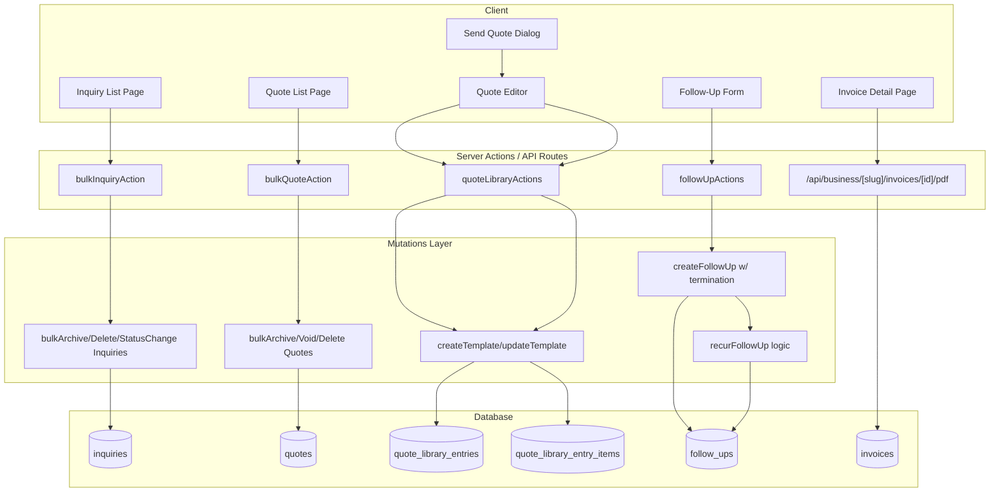

# Design Document: Service Business Essentials

## Overview

Service Business Essentials delivers six capabilities that address common workflow gaps for service business owners using Requo: bulk actions for inquiries and quotes, full quote templates, recurring follow-ups with termination conditions, quote preview before sending, and invoice PDF download.

Each feature builds on existing infrastructure:
- Bulk actions extend the proven follow-up bulk pattern (comma-separated IDs, max 50, single transaction) to inquiries and quotes.
- Quote templates extend the existing quote library (`block`/`package` kinds) with a new `template` kind that stores full-quote metadata.
- Recurring follow-ups enhance the existing recurrence schema with a termination condition type.
- Quote preview reuses the existing `QuotePreview` presentational component inside the send flow modal.
- Invoice PDF reuses the existing `PdfReport` utility and `createInvoicePdf` function behind a new authenticated API route.

## Architecture



## Components and Interfaces

### 1. Bulk Actions for Inquiries

**New Components:**
- `InquiryBulkActions` — toolbar component (mirrors `FollowUpBulkActions` pattern)
- `InquiryBulkStatusDialog` — status picker overlay for bulk status change

**New Server Actions:**
- `bulkArchiveInquiriesAction(prevState, formData)` → `InquiryBulkActionState`
- `bulkDeleteInquiriesAction(prevState, formData)` → `InquiryBulkActionState`
- `bulkChangeInquiryStatusAction(prevState, formData)` → `InquiryBulkActionState`

**New Schemas:**
- `inquiryBulkActionSchema` — validates `inquiryIds: string[]` (min 1, max 50)
- `inquiryBulkStatusChangeSchema` — extends with `targetStatus` enum

**New Mutations:**
- `bulkArchiveInquiriesForBusiness({ businessId, inquiryIds, actorUserId })`
- `bulkDeleteInquiriesForBusiness({ businessId, inquiryIds, actorUserId })`
- `bulkChangeInquiryStatusForBusiness({ businessId, inquiryIds, actorUserId, targetStatus })`

### 2. Bulk Actions for Quotes

**New Components:**
- `QuoteBulkActions` — toolbar component

**New Server Actions:**
- `bulkArchiveQuotesAction(prevState, formData)` → `QuoteBulkActionState`
- `bulkVoidQuotesAction(prevState, formData)` → `QuoteBulkActionState`
- `bulkDeleteQuotesAction(prevState, formData)` → `QuoteBulkActionState`

**New Schemas:**
- `quoteBulkActionSchema` — validates `quoteIds: string[]` (min 1, max 50)

**New Mutations:**
- `bulkArchiveQuotesForBusiness({ businessId, quoteIds, actorUserId })`
- `bulkVoidQuotesForBusiness({ businessId, quoteIds, actorUserId })`
- `bulkDeleteDraftQuotesForBusiness({ businessId, quoteIds, actorUserId })`

### 3. Full Quote Templates

**Schema Changes:**
- Extend `quoteLibraryEntryKindEnum` to include `"template"`
- Add columns to `quote_library_entries`: `title`, `notes`, `terms`, `validityDays`

**Modified Components:**
- Quote library form — add template-specific fields when kind is `template`
- Quote editor — "Apply Template" action that replaces all fields

**New Server Actions:**
- `saveQuoteAsTemplateAction(quoteId)` → `QuoteLibraryActionState`

**Modified Schemas:**
- `quoteLibraryEntrySchema` — extend to handle `template` kind with additional fields

### 4. Recurring Follow-Ups with Termination Conditions

**Schema Changes:**
- Add `terminationCondition` column to `follow_ups` table (enum: `count`, `terminal_status`)

**Modified Components:**
- Follow-up create/edit form — termination condition selector

**Modified Mutations:**
- `createFollowUpForBusiness` — store termination condition
- `completeFollowUpForBusiness` — check termination before creating next occurrence
- New: `checkAndTerminateRecurringFollowUps(businessId, inquiryId?, quoteId?, newStatus)` — called when inquiry/quote status changes

### 5. Quote Preview Before Sending

**Modified Components:**
- `SendQuoteDialog` — add "Preview" tab/button that renders `QuotePreview` in a scrollable panel within the overlay

**No new server actions needed** — preview uses client-side data already available in the send flow.

### 6. Invoice PDF Download

**New API Route:**
- `app/api/business/[slug]/invoices/[id]/pdf/route.ts` — GET handler

**Modified Components:**
- Invoice detail page — "Download PDF" button triggering browser download

## Data Models

### Schema Changes

#### 1. Extend `quote_library_entry_kind` enum

```sql
ALTER TYPE quote_library_entry_kind ADD VALUE 'template';
```

#### 2. Add template-specific columns to `quote_library_entries`

```sql
ALTER TABLE quote_library_entries
  ADD COLUMN title text,
  ADD COLUMN notes text,
  ADD COLUMN terms text,
  ADD COLUMN validity_days integer;

ALTER TABLE quote_library_entries
  ADD CONSTRAINT quote_library_entries_validity_days_range
  CHECK (validity_days IS NULL OR (validity_days >= 1 AND validity_days <= 365));
```

#### 3. Add termination condition to `follow_ups`

```sql
CREATE TYPE follow_up_termination_condition AS ENUM ('count', 'terminal_status');

ALTER TABLE follow_ups
  ADD COLUMN termination_condition follow_up_termination_condition;
```

### Drizzle Schema Updates

```typescript
// lib/db/schema/quote-library.ts — additions
export const quoteLibraryEntryKindEnum = pgEnum("quote_library_entry_kind", [
  "block",
  "package",
  "template",  // NEW
]);

// New columns on quoteLibraryEntries:
title: text("title"),                    // template display title
notes: text("notes"),                    // default quote notes
terms: text("terms"),                    // default quote terms
validityDays: integer("validity_days"),  // default validity in days (1-365)
```

```typescript
// lib/db/schema/follow-ups.ts — additions
export const followUpTerminationConditionEnum = pgEnum(
  "follow_up_termination_condition",
  ["count", "terminal_status"]
);

// New column on followUps:
terminationCondition: followUpTerminationConditionEnum("termination_condition"),
```

### Type Definitions

```typescript
// features/quotes/types.ts — update
export const quoteLibraryEntryKinds = ["block", "package", "template"] as const;

// features/follow-ups/types.ts — additions
export const followUpTerminationConditions = ["count", "terminal_status"] as const;
export type FollowUpTerminationCondition = (typeof followUpTerminationConditions)[number];

// Bulk action state types
export type InquiryBulkActionState = {
  success?: string;
  error?: string;
  affected?: number;
  skipped?: number;
};

export type QuoteBulkActionState = {
  success?: string;
  error?: string;
  affected?: number;
  skipped?: number;
};
```

---

## Low-Level Design

### Bulk Action Server Action Pattern (Inquiries)

```typescript
// features/inquiries/actions.ts

const inquiryBulkActionSchema = z.object({
  inquiryIds: z.array(z.string().min(1))
    .min(1, "Select at least one inquiry.")
    .max(50, "Cannot bulk-update more than 50 inquiries at once."),
});

const inquiryBulkStatusTargets = [
  "new", "quoted", "waiting", "won", "lost"
] as const;

const inquiryBulkStatusChangeSchema = inquiryBulkActionSchema.extend({
  targetStatus: z.enum(inquiryBulkStatusTargets),
});

export async function bulkArchiveInquiriesAction(
  _prevState: InquiryBulkActionState,
  formData: FormData,
): Promise<InquiryBulkActionState> {
  const ownerAccess = await getWorkspaceBusinessActionContext();
  if (!ownerAccess.ok) return { error: ownerAccess.error };

  const { user, businessContext } = ownerAccess;
  const rawIds = formData.get("inquiryIds") as string;
  const parsed = inquiryBulkActionSchema.safeParse({
    inquiryIds: rawIds ? rawIds.split(",").filter(Boolean) : [],
  });

  if (!parsed.success) {
    return { error: parsed.error.issues[0]?.message ?? "Invalid input." };
  }

  const result = await bulkArchiveInquiriesForBusiness({
    businessId: businessContext.business.id,
    inquiryIds: parsed.data.inquiryIds,
    actorUserId: user.id,
  });

  updateCacheTags(getBusinessInquiryListCacheTags(businessContext.business.id));

  return {
    success: `${result.affected} inquiry${result.affected !== 1 ? "ies" : ""} archived.`,
    affected: result.affected,
    skipped: result.skipped,
  };
}
```

### Bulk Mutation Pattern (Single Transaction)

```typescript
// features/inquiries/mutations.ts

export async function bulkArchiveInquiriesForBusiness({
  businessId,
  inquiryIds,
  actorUserId,
}: {
  businessId: string;
  inquiryIds: string[];
  actorUserId: string;
}): Promise<{ affected: number; skipped: number }> {
  const now = new Date();

  const result = await db
    .update(inquiries)
    .set({
      archivedAt: now,
      archivedBy: actorUserId,
      updatedAt: now,
    })
    .where(
      and(
        eq(inquiries.businessId, businessId),
        inArray(inquiries.id, inquiryIds),
        isNull(inquiries.archivedAt),
        isNull(inquiries.deletedAt),
      ),
    )
    .returning({ id: inquiries.id });

  return {
    affected: result.length,
    skipped: inquiryIds.length - result.length,
  };
}

export async function bulkDeleteInquiriesForBusiness({
  businessId,
  inquiryIds,
  actorUserId,
}: {
  businessId: string;
  inquiryIds: string[];
  actorUserId: string;
}): Promise<{ affected: number; skipped: number }> {
  const now = new Date();

  const result = await db
    .update(inquiries)
    .set({
      deletedAt: now,
      deletedBy: actorUserId,
      updatedAt: now,
    })
    .where(
      and(
        eq(inquiries.businessId, businessId),
        inArray(inquiries.id, inquiryIds),
        isNull(inquiries.deletedAt),
      ),
    )
    .returning({ id: inquiries.id });

  return {
    affected: result.length,
    skipped: inquiryIds.length - result.length,
  };
}

export async function bulkChangeInquiryStatusForBusiness({
  businessId,
  inquiryIds,
  actorUserId,
  targetStatus,
}: {
  businessId: string;
  inquiryIds: string[];
  actorUserId: string;
  targetStatus: "new" | "quoted" | "waiting" | "won" | "lost";
}): Promise<{ affected: number; skipped: number }> {
  const now = new Date();

  // Only update non-archived, non-deleted inquiries
  const result = await db
    .update(inquiries)
    .set({
      status: targetStatus,
      updatedAt: now,
    })
    .where(
      and(
        eq(inquiries.businessId, businessId),
        inArray(inquiries.id, inquiryIds),
        isNull(inquiries.archivedAt),
        isNull(inquiries.deletedAt),
      ),
    )
    .returning({ id: inquiries.id });

  return {
    affected: result.length,
    skipped: inquiryIds.length - result.length,
  };
}
```

### Quote Bulk Void (Eligibility Filtering)

```typescript
// features/quotes/mutations.ts

export async function bulkVoidQuotesForBusiness({
  businessId,
  quoteIds,
  actorUserId,
}: {
  businessId: string;
  quoteIds: string[];
  actorUserId: string;
}): Promise<{ affected: number; skipped: number }> {
  const now = new Date();

  // Only "sent" quotes can be voided
  const result = await db
    .update(quotes)
    .set({
      status: "voided",
      voidedAt: now,
      voidedBy: actorUserId,
      updatedAt: now,
    })
    .where(
      and(
        eq(quotes.businessId, businessId),
        inArray(quotes.id, quoteIds),
        eq(quotes.status, "sent"),
        isNull(quotes.deletedAt),
      ),
    )
    .returning({ id: quotes.id });

  return {
    affected: result.length,
    skipped: quoteIds.length - result.length,
  };
}

export async function bulkDeleteDraftQuotesForBusiness({
  businessId,
  quoteIds,
  actorUserId,
}: {
  businessId: string;
  quoteIds: string[];
  actorUserId: string;
}): Promise<{ affected: number; skipped: number }> {
  const now = new Date();

  // Only draft, non-archived quotes can be deleted
  const result = await db
    .update(quotes)
    .set({
      deletedAt: now,
      deletedBy: actorUserId,
      updatedAt: now,
    })
    .where(
      and(
        eq(quotes.businessId, businessId),
        inArray(quotes.id, quoteIds),
        eq(quotes.status, "draft"),
        isNull(quotes.archivedAt),
        isNull(quotes.deletedAt),
      ),
    )
    .returning({ id: quotes.id });

  return {
    affected: result.length,
    skipped: quoteIds.length - result.length,
  };
}
```

### Quote Template — Save As Template

```typescript
// features/quotes/quote-library-actions.ts

export async function saveQuoteAsTemplateAction(
  quoteId: string,
): Promise<QuoteLibraryActionState> {
  const ownerAccess = await getOperationalBusinessActionContext();
  if (!ownerAccess.ok) return { error: ownerAccess.error };

  const { user, businessContext } = ownerAccess;

  if (!hasFeatureAccess(businessContext.business.plan, "quoteLibrary")) {
    return { error: "Upgrade to Pro to save quote templates." };
  }

  // Fetch quote with items
  const quote = await getQuoteWithItemsForBusiness({
    businessId: businessContext.business.id,
    quoteId,
  });

  if (!quote) return { error: "That quote could not be found." };

  // Calculate validity days from validUntil
  const validUntilDate = new Date(quote.validUntil);
  const createdDate = new Date(quote.createdAt);
  const validityDays = Math.max(1, Math.min(365,
    Math.ceil((validUntilDate.getTime() - createdDate.getTime()) / (1000 * 60 * 60 * 24))
  ));

  await createQuoteLibraryEntryForBusiness({
    businessId: businessContext.business.id,
    actorUserId: user.id,
    currency: businessContext.business.defaultCurrency,
    entry: {
      kind: "template",
      name: quote.title.slice(0, 100),
      title: quote.title,
      notes: quote.notes ?? undefined,
      terms: quote.terms ?? undefined,
      validityDays,
      items: quote.items.map((item) => ({
        id: crypto.randomUUID(),
        description: item.description,
        quantity: item.quantity,
        unitPriceInCents: item.unitPriceInCents,
      })),
    },
  });

  updateCacheTags(getBusinessPricingCacheTags(businessContext.business.id));
  return { success: "Quote saved as template." };
}
```

### Quote Template — Apply to Quote Editor

```typescript
// features/quotes/utils.ts

export type QuoteTemplateData = {
  title: string;
  notes: string | null;
  terms: string | null;
  validityDays: number;
  items: Array<{
    id: string;
    description: string;
    quantity: number;
    unitPriceInCents: number;
  }>;
};

/**
 * Transforms a quote library template entry into data ready
 * to apply to the quote editor form state.
 */
export function applyTemplateToQuoteForm(
  template: QuoteTemplateData,
): {
  title: string;
  notes: string;
  terms: string;
  validUntil: string; // ISO date string
  items: Array<{
    id: string;
    description: string;
    quantity: number;
    unitPriceInCents: number;
    lineTotalInCents: number;
  }>;
} {
  const validUntil = new Date();
  validUntil.setDate(validUntil.getDate() + template.validityDays);

  return {
    title: template.title,
    notes: template.notes ?? "",
    terms: template.terms ?? "",
    validUntil: validUntil.toISOString().split("T")[0],
    items: template.items.map((item) => ({
      id: item.id,
      description: item.description,
      quantity: item.quantity,
      unitPriceInCents: item.unitPriceInCents,
      lineTotalInCents: item.quantity * item.unitPriceInCents,
    })),
  };
}
```

### Recurring Follow-Up Termination Logic

```typescript
// features/follow-ups/mutations.ts

async function shouldTerminateRecurrence(
  followUp: {
    recurrence: string;
    recurrenceLimit: number | null;
    recurrenceCount: number;
    terminationCondition: string | null;
    inquiryId: string | null;
    quoteId: string | null;
  },
  businessId: string,
): Promise<boolean> {
  // Count-based termination
  if (
    followUp.terminationCondition === "count" &&
    followUp.recurrenceLimit !== null &&
    followUp.recurrenceCount >= followUp.recurrenceLimit
  ) {
    return true;
  }

  // Terminal status termination
  if (followUp.terminationCondition === "terminal_status") {
    if (followUp.inquiryId) {
      const inquiry = await db.query.inquiries.findFirst({
        where: and(
          eq(inquiries.id, followUp.inquiryId),
          eq(inquiries.businessId, businessId),
        ),
        columns: { status: true },
      });
      if (inquiry && isTerminalInquiryStatus(inquiry.status)) return true;
    }
    if (followUp.quoteId) {
      const quote = await db.query.quotes.findFirst({
        where: and(
          eq(quotes.id, followUp.quoteId),
          eq(quotes.businessId, businessId),
        ),
        columns: { status: true },
      });
      if (quote && isTerminalQuoteStatus(quote.status)) return true;
    }
  }

  return false;
}

function isTerminalInquiryStatus(status: string): boolean {
  return ["won", "lost", "archived"].includes(status);
}

function isTerminalQuoteStatus(status: string): boolean {
  return ["accepted", "rejected", "expired", "voided"].includes(status);
}
```

### Quote Preview in Send Flow

The preview is rendered client-side using data already available in the `SendQuoteDialog`. The implementation adds a "Preview" toggle within the existing `ResponsiveOverlay`:

```typescript
// features/quotes/components/send-quote-dialog.tsx — additions

// Add to SendQuoteDialogProps:
previewData?: {
  businessName: string;
  businessLogoStoragePath: string | null;
  businessSlug: string;
  quoteNumber: string;
  title: string;
  customerName: string;
  customerEmail: string | null;
  currency: string;
  validUntil: string;
  notes: string | null;
  terms: string | null;
  items: QuotePreviewItem[];
  subtotalInCents: number;
  discountInCents: number;
  taxInCents: number;
  taxLabel: string | null;
  totalInCents: number;
  version: number;
  showWatermark: boolean;
};

// Inside the dialog, add a preview panel state:
const [showPreview, setShowPreview] = useState(false);

// When showPreview is true, render QuotePreview in a scrollable container
// with pointer-events-none on interactive elements and user-select-none
```

### Invoice PDF API Route

```typescript
// app/api/business/[slug]/invoices/[id]/pdf/route.ts

import { getWorkspaceBusinessActionContext } from "@/lib/db/business-access";
import { getInvoiceWithItemsForBusiness } from "@/features/invoices/queries";
import { createInvoicePdf, getInvoicePdfFileName } from "@/features/invoices/pdf";
import type { InvoiceDocumentData } from "@/features/invoices/pdf";

export async function GET(
  _request: Request,
  { params }: { params: Promise<{ slug: string; id: string }> },
) {
  const { id: invoiceId } = await params;

  const access = await getWorkspaceBusinessActionContext();
  if (!access.ok) {
    return new Response(JSON.stringify({ error: "Not found" }), {
      status: 404,
      headers: { "Content-Type": "application/json" },
    });
  }

  const { businessContext } = access;

  const invoice = await getInvoiceWithItemsForBusiness({
    businessId: businessContext.business.id,
    invoiceId,
  });

  if (!invoice) {
    return new Response(JSON.stringify({ error: "Not found" }), {
      status: 404,
      headers: { "Content-Type": "application/json" },
    });
  }

  const documentData: InvoiceDocumentData = {
    invoiceNumber: invoice.invoiceNumber,
    title: invoice.title,
    businessName: businessContext.business.name,
    businessEmail: businessContext.business.contactEmail ?? null,
    customerName: invoice.customerName,
    customerEmail: invoice.customerEmail,
    currency: invoice.currency,
    subtotalInCents: invoice.subtotalInCents,
    discountInCents: invoice.discountInCents,
    taxInCents: invoice.taxInCents,
    taxLabel: invoice.taxLabel,
    totalInCents: invoice.totalInCents,
    dueAt: invoice.dueAt?.toISOString() ?? null,
    issuedAt: invoice.issuedAt?.toISOString() ?? null,
    notes: invoice.notes?.slice(0, 600) ?? null,
    terms: invoice.terms?.slice(0, 600) ?? null,
    items: invoice.items.map((item) => ({
      description: item.description,
      quantity: item.quantity,
      unitPriceInCents: item.unitPriceInCents,
      lineTotalInCents: item.lineTotalInCents,
    })),
  };

  const pdfBytes = await createInvoicePdf(documentData);
  const fileName = getInvoicePdfFileName(documentData);

  return new Response(pdfBytes, {
    status: 200,
    headers: {
      "Content-Type": "application/pdf",
      "Content-Disposition": `attachment; filename="${fileName}"`,
      "Cache-Control": "private, no-store",
    },
  });
}
```

### Selection State Management (Client)

Both inquiry and quote list pages use the same selection hook pattern:

```typescript
// hooks/use-bulk-selection.ts

export function useBulkSelection<T extends { id: string }>(
  items: T[],
  maxSelection = 50,
) {
  const [selectedIds, setSelectedIds] = useState<Set<string>>(new Set());

  const toggle = (id: string) => {
    setSelectedIds((prev) => {
      const next = new Set(prev);
      if (next.has(id)) {
        next.delete(id);
      } else if (next.size < maxSelection) {
        next.add(id);
      }
      return next;
    });
  };

  const selectAll = (ids: string[]) => {
    setSelectedIds(new Set(ids.slice(0, maxSelection)));
  };

  const deselectAll = () => setSelectedIds(new Set());

  const isAtLimit = selectedIds.size >= maxSelection;

  return {
    selectedIds,
    selectedCount: selectedIds.size,
    isSelected: (id: string) => selectedIds.has(id),
    toggle,
    selectAll,
    deselectAll,
    isAtLimit,
    serializedIds: Array.from(selectedIds).join(","),
  };
}
```

## Correctness Properties

*A property is a characteristic or behavior that should hold true across all valid executions of a system — essentially, a formal statement about what the system should do. Properties serve as the bridge between human-readable specifications and machine-verifiable correctness guarantees.*

### Property 1: Bulk inquiry action eligibility and completeness

*For any* set of inquiry IDs (1–50) belonging to a business, and any bulk action (archive, delete, or status change), the mutation SHALL modify only eligible items (non-archived/non-deleted for status change, non-deleted for archive, non-already-deleted for delete), and the sum of affected + skipped SHALL equal the total number of IDs submitted.

**Validates: Requirements 1.3, 1.5, 1.7**

### Property 2: Bulk quote action eligibility and completeness

*For any* set of quote IDs (1–50) belonging to a business, and any bulk action (archive, void, or delete), the mutation SHALL modify only eligible items (any non-deleted for archive, only "sent" for void, only "draft" non-archived for delete), and the sum of affected + skipped SHALL equal the total number of IDs submitted.

**Validates: Requirements 2.3, 2.4, 2.5, 2.7**

### Property 3: Quote template round-trip

*For any* valid quote (with title, notes, terms, validity period, and 1–25 line items), saving it as a template and then applying that template to a new quote SHALL produce a quote whose title, notes, terms, and line item descriptions/quantities/unit prices match the original quote's values.

**Validates: Requirements 3.2, 3.3, 3.5**

### Property 4: Recurrence due date calculation

*For any* recurring follow-up with a recurrence interval (daily, every_3_days, weekly, biweekly, monthly) and an unmet termination condition, completing or skipping the follow-up SHALL create a new occurrence whose due date equals the previous occurrence's due date plus exactly the recurrence interval duration.

**Validates: Requirements 4.2**

### Property 5: Terminal status stops recurrence

*For any* recurring follow-up with termination condition "terminal_status" linked to an inquiry or quote, when the linked item transitions to a terminal status (won/lost/archived for inquiries; accepted/rejected/expired/voided for quotes), the system SHALL not generate any further occurrences and SHALL skip any pending occurrence in the series.

**Validates: Requirements 4.3**

### Property 6: Count-based termination stops recurrence

*For any* recurring follow-up with termination condition "count" and a recurrence limit N, once the recurrence count reaches N, completing or skipping the follow-up SHALL not create a new occurrence.

**Validates: Requirements 4.4**

### Property 7: PDF generation produces valid output for any invoice

*For any* valid invoice document data (with 1+ line items, valid currency, and non-negative monetary amounts), the `createInvoicePdf` function SHALL produce a non-empty byte array that begins with the PDF magic bytes (`%PDF`).

**Validates: Requirements 6.2**

### Property 8: PDF filename sanitization

*For any* invoice number string (including special characters, spaces, slashes, and unicode), the `getInvoicePdfFileName` function SHALL produce a filename that ends with ".pdf", contains no path separators (/ or \), and is non-empty.

**Validates: Requirements 6.3**

## Error Handling

### Bulk Actions (Inquiries & Quotes)

| Error Condition | Handling |
|---|---|
| User not authenticated / no business access | Return `{ error: "..." }` from action context check |
| Empty ID array | Schema validation rejects (min 1) |
| ID array exceeds 50 | Schema validation rejects (max 50) |
| All items ineligible | Return success with affected=0, skipped=N |
| Partial eligibility | Complete eligible items, return affected + skipped counts |
| Database error | Catch, log, return generic error message |
| Concurrent modification (item archived between selection and action) | Handled gracefully — WHERE clause filters out ineligible items |

### Quote Templates

| Error Condition | Handling |
|---|---|
| Template name too long (>100 chars) | Schema validation rejects |
| Validity days out of range | Schema validation rejects (1–365) |
| Too many line items (>25) | Schema validation rejects |
| Plan doesn't include quoteLibrary | Return paywall error |
| Source quote not found (save as template) | Return "quote not found" error |

### Recurring Follow-Ups

| Error Condition | Handling |
|---|---|
| terminal_status condition without linked item | Schema validation rejects with descriptive error |
| Recurrence limit out of range (not 1–100) | Schema validation rejects |
| Linked item deleted before termination check | Treat as terminated (fail-safe) |
| Race condition: two completions at once | Database constraint prevents duplicate child follow-ups via parentFollowUpId + recurrenceCount |

### Invoice PDF Download

| Error Condition | Handling |
|---|---|
| Not authenticated | Return 404 (no information leak) |
| Wrong business | Return 404 (no information leak) |
| Invoice not found | Return 404 with generic "not found" message |
| Plan doesn't include PDF feature | Return 403 with paywall info (or 404 depending on plan-gate strategy) |
| PDF generation fails (pdf-lib error) | Catch, log, return 500 with generic error |
| Invoice has no line items | Generate PDF with empty table (graceful) |

## Testing Strategy

### Unit Tests

Focus on pure logic and validation:

- **Bulk action schemas**: Validate min/max array lengths, valid status enums
- **Template application logic**: `applyTemplateToQuoteForm` produces correct output
- **Termination condition checks**: `shouldTerminateRecurrence` returns correct boolean for various states
- **Due date calculation**: Recurrence interval arithmetic for all interval types
- **PDF filename sanitization**: `getInvoicePdfFileName` handles edge cases
- **Selection hook**: `useBulkSelection` respects max limit, toggle/selectAll/deselectAll behavior

### Property-Based Tests

Using `fast-check` (already available in the project's test infrastructure). Each property test runs minimum 100 iterations.

- **Property 1**: Generate random inquiry sets with mixed states, run bulk mutations, verify eligibility invariants
- **Property 2**: Generate random quote sets with mixed statuses, run bulk mutations, verify eligibility invariants
- **Property 3**: Generate random quote data, save as template, apply template, verify round-trip
- **Property 4**: Generate random recurrence intervals and due dates, verify next due date calculation
- **Property 5**: Generate random follow-ups with terminal_status condition, transition linked items, verify termination
- **Property 6**: Generate follow-ups at various recurrence counts, verify termination at limit
- **Property 7**: Generate random invoice data, verify PDF output starts with `%PDF`
- **Property 8**: Generate random invoice number strings, verify filename invariants

Tag format: `Feature: service-business-essentials, Property {N}: {description}`

### Integration Tests

- Bulk archive/delete/status-change with business scoping (verify cross-business isolation)
- Quote template CRUD with plan entitlement checks
- Recurring follow-up lifecycle (create → complete → verify next occurrence)
- Invoice PDF route authentication and authorization
- Invoice PDF route response headers (Content-Type, Content-Disposition)

### Component Tests

- `InquiryBulkActions` toolbar visibility based on selection state
- `QuoteBulkActions` toolbar visibility and action buttons
- `SendQuoteDialog` preview toggle renders `QuotePreview`
- Invoice detail "Download PDF" button presence and href

