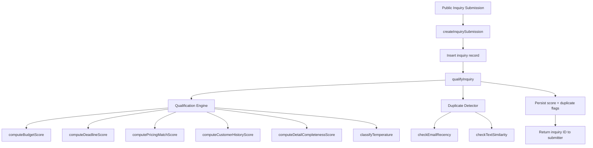

# Design Document: Smart Inquiry Qualification

## Overview

Smart Inquiry Qualification adds rule-based lead scoring and duplicate detection to the Requo inquiry workflow. When an inquiry is submitted, the system computes a composite qualification score (0–100) from five weighted signals, classifies the inquiry temperature (hot/warm/cold), and checks for potential duplicates by email recency and text similarity. Results are persisted on the inquiry record and surfaced in the existing inquiry list and detail pages.

The design prioritizes:
- **Pure computation** — scoring and similarity logic are pure functions with no external API calls, enabling fast execution and straightforward testing.
- **Graceful degradation** — missing data yields 0 points for that signal; errors in scoring/detection do not block inquiry creation.
- **Minimal schema impact** — new columns on the existing `inquiries` table plus one small `inquiry_duplicates` table.
- **Performance** — scoring within 500ms, duplicate detection within 300ms, achieved through indexed queries and in-memory computation.

## Architecture



The qualification pipeline runs synchronously after the inquiry insert within the same request. It is wrapped in a try/catch so that failures do not prevent inquiry creation.

### Module Placement

Following the repo convention (`features/` owns product logic):

- `features/inquiries/qualification/` — new directory containing:
  - `scoring.ts` — pure scoring functions (budget, deadline, pricing match, customer history, detail completeness, temperature classification)
  - `duplicate-detection.ts` — pure duplicate detection logic (token overlap, email recency check, text similarity check)
  - `qualify-inquiry.ts` — orchestrator that calls scoring + detection, persists results
  - `types.ts` — types for scoring signals, qualification results, duplicate flags
  - `queries.ts` — database queries for customer history lookup, recent inquiries lookup

## Components and Interfaces

### Qualification Engine

```typescript
// features/inquiries/qualification/types.ts

export type ScoringSignal = 
  | "budget_presence"
  | "deadline_urgency"
  | "pricing_match"
  | "customer_history"
  | "detail_completeness";

export type Temperature = "hot" | "warm" | "cold";

export type SignalScore = {
  signal: ScoringSignal;
  points: number;
  maxPoints: number;
  reason: string | null; // null when data is missing
};

export type QualificationResult = {
  compositeScore: number;
  temperature: Temperature;
  signals: SignalScore[];
};

export type DuplicateFlag = {
  originalInquiryId: string;
  reason: "email_recency" | "text_similarity" | "both";
  tokenOverlap: number | null; // percentage, null for email-only
};

export type QualificationOutput = {
  qualification: QualificationResult | null; // null on error
  duplicate: DuplicateFlag | null;
};
```

### Scoring Functions (Pure)

```typescript
// features/inquiries/qualification/scoring.ts

export function computeBudgetScore(
  budgetText: string | null,
  highBudgetThreshold?: number, // default 5000
): SignalScore;

export function computeDeadlineScore(
  requestedDeadline: string | null, // ISO date string
  submittedAt: Date,
): SignalScore;

export function computePricingMatchScore(
  serviceCategory: string,
  details: string,
  quoteLibraryEntries: QuoteLibraryMatchInput[],
): SignalScore;

export function computeCustomerHistoryScore(
  customerHistory: CustomerHistoryInput | null,
): SignalScore;

export function computeDetailCompletenessScore(
  inquiry: DetailCompletenessInput,
): SignalScore;

export function classifyTemperature(compositeScore: number): Temperature;

export function computeCompositeScore(signals: SignalScore[]): number;
```

### Duplicate Detection Functions (Pure)

```typescript
// features/inquiries/qualification/duplicate-detection.ts

export function computeTokenOverlap(textA: string, textB: string): number;

export function findEmailRecencyDuplicate(
  customerEmail: string | null,
  recentInquiries: RecentInquiryInput[],
  submittedAt: Date,
  windowDays?: number, // default 7
): string | null; // returns matching inquiry ID or null

export function findTextSimilarityDuplicate(
  details: string,
  customerEmail: string | null,
  recentInquiries: RecentInquiryInput[],
  submittedAt: Date,
  windowDays?: number, // default 30
  overlapThreshold?: number, // default 0.8
): { inquiryId: string; overlap: number } | null;
```

### Orchestrator

```typescript
// features/inquiries/qualification/qualify-inquiry.ts

export async function qualifyInquiry(input: {
  inquiryId: string;
  businessId: string;
  inquiry: InquiryQualificationInput;
}): Promise<QualificationOutput>;
```

This function:
1. Fetches quote library entries via `getQuoteLibraryForBusiness(businessId)`
2. Fetches customer history (previous inquiries + linked quotes for same email)
3. Fetches recent inquiries from same email (for duplicate detection)
4. Calls all five scoring functions
5. Computes composite score and temperature
6. Runs duplicate detection (email recency + text similarity)
7. Persists results to the database
8. Returns the output (or null qualification on error)

### UI Components

```typescript
// features/inquiries/components/temperature-badge.tsx
export function TemperatureBadge({ temperature }: { temperature: Temperature | null }): JSX.Element | null;

// features/inquiries/components/qualification-breakdown.tsx
export function QualificationBreakdown({ signals, compositeScore, temperature }: QualificationBreakdownProps): JSX.Element;

// features/inquiries/components/duplicate-warning-banner.tsx
export function DuplicateWarningBanner({ duplicate, businessSlug, onDismiss }: DuplicateWarningBannerProps): JSX.Element;
```

## Data Models

### Schema Changes

#### `inquiries` table — new columns

| Column | Type | Nullable | Default | Description |
|--------|------|----------|---------|-------------|
| `qualification_score` | `integer` | yes | `null` | Composite score 0–100 |
| `qualification_temperature` | `text` (enum) | yes | `null` | "hot", "warm", or "cold" |
| `qualification_signals` | `jsonb` | yes | `null` | Array of SignalScore objects |
| `qualified_at` | `timestamp with time zone` | yes | `null` | When scoring completed |

New index: `inquiries_business_qualification_score_idx` on `(business_id, qualification_score)` for sort-by-score queries.

#### New `inquiry_duplicates` table

| Column | Type | Nullable | Default | Description |
|--------|------|----------|---------|-------------|
| `id` | `text` | no | — | Primary key |
| `business_id` | `text` | no | — | FK → businesses.id |
| `inquiry_id` | `text` | no | — | FK → inquiries.id (the flagged inquiry) |
| `original_inquiry_id` | `text` | no | — | FK → inquiries.id (the original) |
| `reason` | `text` | no | — | "email_recency", "text_similarity", or "both" |
| `token_overlap` | `integer` | yes | `null` | Overlap percentage (0–100), null for email-only |
| `dismissed_at` | `timestamp with time zone` | yes | `null` | When owner dismissed the warning |
| `dismissed_by` | `text` | yes | `null` | FK → user.id |
| `created_at` | `timestamp with time zone` | no | `now()` | — |

Indexes:
- `inquiry_duplicates_business_id_idx` on `(business_id)`
- `inquiry_duplicates_inquiry_id_idx` on `(inquiry_id)` — unique, one duplicate flag per inquiry
- `inquiry_duplicates_original_inquiry_id_idx` on `(original_inquiry_id)`

#### New enum: `qualification_temperature`

Values: `"hot"`, `"warm"`, `"cold"`

### Query Additions

```typescript
// features/inquiries/qualification/queries.ts

/** Fetch customer history for scoring */
export async function getCustomerHistoryForScoring(input: {
  businessId: string;
  customerEmail: string;
  excludeInquiryId: string;
}): Promise<CustomerHistoryInput>;

/** Fetch recent inquiries from same email for duplicate detection */
export async function getRecentInquiriesForDuplicateCheck(input: {
  businessId: string;
  customerEmail: string;
  excludeInquiryId: string;
  windowDays: number;
}): Promise<RecentInquiryInput[]>;
```

### Integration Point

The `createInquirySubmission` function in `features/inquiries/mutations.ts` will be modified to call `qualifyInquiry` after the transaction commits (or within the transaction if performance allows). The call is wrapped in try/catch to ensure inquiry creation succeeds even if qualification fails.

```typescript
// After successful inquiry insert:
try {
  await qualifyInquiry({
    inquiryId,
    businessId: business.id,
    inquiry: { /* fields from submission */ },
  });
} catch (error) {
  console.error("Inquiry qualification failed:", error);
  // Inquiry is still created successfully
}
```

## Correctness Properties

*A property is a characteristic or behavior that should hold true across all valid executions of a system — essentially, a formal statement about what the system should do. Properties serve as the bridge between human-readable specifications and machine-verifiable correctness guarantees.*

### Property 1: Score bounds and composition invariant

*For any* valid inquiry input (with any combination of present/missing fields), the composite score SHALL equal the sum of the five individual signal scores, each signal score SHALL be within [0, maxPoints] for its signal type (budget ≤ 25, deadline ≤ 25, pricing_match ≤ 20, customer_history ≤ 15, detail_completeness ≤ 15), and the composite score SHALL be within [0, 100].

**Validates: Requirements 1.1, 1.2, 1.5**

### Property 2: Temperature classification

*For any* composite score in [0, 100], the temperature classification SHALL be "hot" when score ≥ 70, "warm" when 40 ≤ score ≤ 69, and "cold" when score < 40.

**Validates: Requirements 1.3**

### Property 3: Budget scoring formula

*For any* budget text input, the budget_presence score SHALL be: 0 when null/empty, 5 when non-numeric text is present, and 5 + min(20, 20 × (parsedAmount / threshold)) when a numeric value is parseable — always capped at 25.

**Validates: Requirements 2.1, 2.2, 2.3**

### Property 4: Deadline urgency step function

*For any* submission date and requested deadline, the deadline_urgency score SHALL be: 0 when deadline is null, 25 when ≤ 7 days away, 20 when 8–14 days, 15 when 15–30 days, 8 when 31–60 days, and 3 when > 60 days.

**Validates: Requirements 3.1, 3.2, 3.3, 3.4, 3.5, 3.6**

### Property 5: Pricing match scoring

*For any* inquiry service category, details text, and quote library entries, the pricing_match score SHALL be max(category_match_score, text_overlap_score) capped at 20, where category_match_score is 15 when a case-insensitive name match exists, and text_overlap_score is proportional to the highest token overlap above 30% (between 5 and 20 points). When the library is empty, the score SHALL be 0.

**Validates: Requirements 4.1, 4.2, 4.3, 4.4**

### Property 6: Customer history scoring

*For any* customer email and business history, the customer_history score SHALL be: 15 when a previous inquiry with a linked quote exists, 8 when a previous inquiry exists but without a linked quote, and 0 when no previous inquiry exists or email is null.

**Validates: Requirements 5.1, 5.2, 5.3, 5.4**

### Property 7: Detail completeness scoring

*For any* inquiry with fields (customerName, customerEmail, serviceCategory, requestedDeadline, budgetText, details, subject), the detail_completeness score SHALL equal floor((completeFieldCount / 7) × 15), where a field is "complete" when non-null, non-empty after trimming, and meeting its minimum length threshold (50 chars for details).

**Validates: Requirements 6.1, 6.2, 6.3**

### Property 8: Token overlap computation

*For any* two non-empty text strings, the token overlap SHALL equal (|intersection of token sets| / |smaller token set|) × 100, where tokens are produced by lowercasing and splitting on whitespace. The result SHALL be symmetric with respect to argument order.

**Validates: Requirements 10.3**

### Property 9: Email recency duplicate detection

*For any* inquiry with a non-null customer email and a set of existing inquiries, the email recency check SHALL flag a duplicate if and only if an inquiry from the same email exists within the preceding 7 calendar days. When email is null, no flag SHALL be raised.

**Validates: Requirements 9.1, 9.2, 9.3**

### Property 10: Text similarity duplicate detection

*For any* inquiry with non-null customer email and details text, and a set of existing inquiries from the same email within 30 days, the text similarity check SHALL flag a duplicate if and only if the token overlap with any existing inquiry's details exceeds 80%. When multiple matches exist, the most recent SHALL be referenced.

**Validates: Requirements 10.1, 10.2, 10.4**

## Error Handling

| Scenario | Behavior |
|----------|----------|
| Scoring function throws | Catch at orchestrator level, persist `null` qualification, log error |
| Duplicate detection throws | Catch at orchestrator level, persist no duplicate flag, log error |
| Quote library query fails | Assign 0 for pricing_match signal, continue with other signals |
| Customer history query fails | Assign 0 for customer_history signal, continue with other signals |
| Budget text contains unexpected format | Treat as non-numeric text (5 points) |
| Token overlap on empty details | Return 0% overlap, no duplicate flag |
| Database write for qualification fails | Log error, inquiry remains with null score |
| Dismiss duplicate warning fails | Return error to client, warning remains visible |

All errors are logged via `console.error` with structured context (inquiryId, businessId, signal name) for monitoring. The inquiry creation flow never fails due to qualification errors.

## Testing Strategy

### Unit Tests (Vitest)

Pure scoring functions are the primary unit test targets:

- `computeBudgetScore` — specific examples: null input, "$500", "around 3000", "flexible", "$10000"
- `computeDeadlineScore` — boundary examples: exactly 7 days, 8 days, 14 days, 15 days, 30 days, 31 days, 60 days, 61 days, null
- `computePricingMatchScore` — examples with exact category match, partial overlap, no match, empty library
- `computeCustomerHistoryScore` — examples for each tier
- `computeDetailCompletenessScore` — examples with 0, 3, 7 complete fields
- `classifyTemperature` — boundary examples: 39, 40, 69, 70
- `computeTokenOverlap` — examples with known overlap percentages
- `findEmailRecencyDuplicate` — examples at boundary (6 days, 7 days, 8 days)
- `findTextSimilarityDuplicate` — examples with 79%, 80%, 81% overlap

### Property-Based Tests (fast-check)

Each correctness property maps to a single property-based test with minimum 100 iterations:

- **Property 1**: Generate random inquiry inputs → verify score bounds and composition
- **Property 2**: Generate random scores [0, 100] → verify temperature classification
- **Property 3**: Generate random budget strings (null, empty, numeric, text) → verify formula
- **Property 4**: Generate random date pairs → verify step function
- **Property 5**: Generate random library entries and inquiry text → verify max-cap logic
- **Property 6**: Generate random customer history scenarios → verify tier assignment
- **Property 7**: Generate random field presence combinations → verify linear scaling
- **Property 8**: Generate random text pairs → verify overlap formula and symmetry
- **Property 9**: Generate random inquiry sets with varying dates → verify 7-day window
- **Property 10**: Generate random text pairs with controlled overlap → verify 80% threshold

Tag format: `Feature: smart-inquiry-qualification, Property {N}: {description}`

Library: **fast-check** (already available in the project's test dependencies or easily added)

Configuration: Each property test runs with `{ numRuns: 100 }` minimum.

### Integration Tests

- Inquiry submission creates score and temperature on the record
- Inquiry submission with duplicate email within 7 days creates duplicate flag
- Inquiry submission with similar text within 30 days creates duplicate flag
- Scoring failure does not prevent inquiry creation
- Duplicate detection failure does not prevent inquiry creation
- Dismiss duplicate warning persists dismissal
- Sort-by-score query returns correctly ordered results

### Component Tests

- `TemperatureBadge` renders correct color/text for each temperature
- `QualificationBreakdown` displays all signals with correct formatting
- `DuplicateWarningBanner` shows reason and link, handles dismiss
